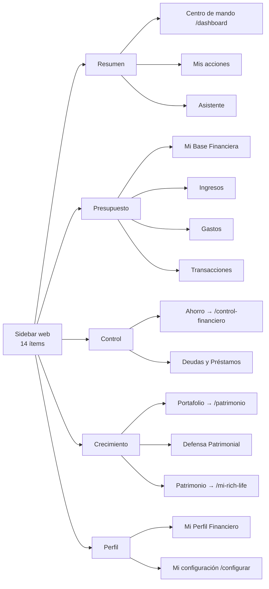

# CARTERA+ · Rediseño UX — Estado actual

_Extraído del blueprint maestro (16-sep-2026). Fuente viva: https://claude.ai/code/artifact/0e037de8-78ec-44fd-b4ef-3ea701eea331_

## 1. Executive diagnosis

CARTERA+ tiene la profundidad funcional de un producto de 160 000 líneas de TypeScript (10 módulos, 19 rutas de app web más 14 públicas y de auth, 23 rutas móviles, 136 migraciones), pero su superficie fue creciendo módulo por módulo y hoy expone tres vocabularios distintos, cuatro sistemas de filtro incompatibles y una capa de gráficos que no cumple la promesa «premium». Nada de esto exige reescribir la app: exige una capa de presentación coherente sobre un backend que ya está bien construido.

**Lo que se verificó en el repo (rama `main`, commit `cf697468`, 16-sep-2026):**

| # | Problema estructural | Evidencia | Impacto |
| --- | --- | --- | --- |
| 1 | **Tres vocabularios compiten por el mismo modelo mental.** El sidebar agrupa en Resumen · Presupuesto · Control · Crecimiento · Perfil; el riel de etapas de Mis acciones usa Estabilidad → Protección mínima → Sin deuda cara → Crecimiento inicial → Crecimiento estructurado; la landing vende Control → Base → Crecimiento → Libertad. | `src/lib/constants/nav.ts`, `modules/actions/components/stage-rail.tsx`, landing | El usuario nunca recibe un solo mapa de «dónde estoy y qué sigue». |
| 2 | **Los nombres del menú no coinciden con las rutas ni entre web y móvil.** «Ahorro» → `/control-financiero`; «Patrimonio» → `/mi-rich-life`; «Portafolio de inversiones» → `/patrimonio`; «Defensa Patrimonial» → `/patrimonio/proteccion`. En móvil las mismas pantallas se llaman `/m/metas`, `/m/patrimonio`, `/m/inversiones`, `/m/proteccion` y existe `/m/libertad`, sin equivalente web. | `nav.ts` (14 ítems / 5 grupos) vs `m/components/mobile-menu.tsx` (16 ítems / 6 grupos, lista duplicada a mano) | Dos modelos de navegación que ya divergieron («Mercado e indicadores» solo en móvil; «Asistente» ausente del menú móvil). |
| 3 | **La «próxima mejor acción» vive en cinco lugares.** Franja Norte del panel («próxima mejor decisión»), tarjeta en Ahorro, tarjeta en Patrimonio (Rich Life), tarjeta en Crecimiento del portafolio (`growth-view.tsx`) y el módulo Mis acciones, que según su propio comentario «es el único lugar donde viven las recomendaciones». Las alertas se reparten entre la campana (Observations), «Perspectivas de My Agent C+», «Alertas» en Ahorro y las tarjetas del Ritmo. | `dashboard-view.tsx`, `control-dashboard.tsx`, `rich-life-dashboard.tsx`, `actions-view.tsx` | KPIs y consejos duplicados con pesos visuales iguales; el panel abre con una alerta falsa conocida (tarjeta BAC en ₡0). |
| 4 | **Cuatro sistemas de filtro que no se hablan.** `?period=YYYY-MM` (selector de mes, 17 meses atrás), `?range=1m/3m/6m/ytd/all` (solo Gastos), `?cat=` (Transacciones), `?asOf` (frascos), `?tab=` (Mis acciones) y un `base-tabs.tsx` de pestañas por `#hash` que ya nadie importa (código muerto). No hay periodo global, ni persistencia al navegar, ni indicador de «qué datos estoy viendo». | `period-selector.tsx`, `expense-range-control.tsx`, `transactions-browser.tsx`, `base-tabs.tsx` | Cada pantalla responde a un «cuándo» distinto; comparar módulos exige recordar el estado de cada uno. |
| 5 | **Los gráficos son tres wrappers de Recharts sin interacción real.** `PerformanceChart` (área), `PremiumLineChart` y `DonutChart`: `isAnimationActive={false}` en todos, sin crosshair sincronizado, sin brush ni zoom, sin drill-down, tooltip nativo con `contentStyle`, sin comparación de periodo. Además 37 archivos dibujan SVG a mano (barras, escaleras, termómetros), cada uno con su propio estilo. | `src/components/charts/*` (7 archivos, 611 líneas), `grep <svg` en módulos | «Alta tecnología» prometida, sparklines estáticos entregados. |
| 6 | **Los gráficos no son accesibles.** Los wrappers de área y línea envuelven el SVG en `aria-hidden="true"` con un `role="img"` genérico («Gráfico de área: rendimiento»); en ninguno de los tres se activa `accessibilityLayer` de Recharts 3, así que no hay navegación por teclado ni lectura de valores. | `area-chart.tsx` líneas 100-102 | Un usuario con lector de pantalla no recibe ningún dato de ningún gráfico. |
| 7 | **La búsqueda ⌘K es decorativa.** El topbar muestra un campo «Buscar cuentas, inversiones…» con un `kbd ⌘K`, pero no hay paleta de comandos ni handler de teclado. | `topbar.tsx` líneas 41-44; `grep metaKey` solo en el chat | Un control visible que no hace nada erosiona la confianza en el resto. |
| 8 | **El panel principal es una pila de siete bloques con el mismo peso.** Saludo → Observaciones → SetupHub → Norte → 4 pilares → Salud + donut de composición → Perspectivas. La composición de gastos (donut) pertenece a Gastos, no al Home; el hub de configuración sigue apareciendo después de completar. | `dashboard/page.tsx`, `dashboard-view.tsx` | Falla la prueba de 5 segundos: no hay un dato principal ni una jerarquía. |
| 9 | **Integridad financiera con grietas conocidas.** Portafolio: invertido ₡2 703 880, valor ₡2 818 015, pero «rendimiento YTD +57 %». Rich Life no dibuja la serie histórica aunque `net_worth_snapshots` tiene 12 puntos. | Inventario de la cuenta demo (1-sep-2026) | Un gráfico premium sobre una cifra incorrecta empeora el problema. |
| 10 | **Design system sólido pero monolítico.** Tokens bien definidos (paleta cálida, Sora/Manrope/Space Mono, radios, elevaciones, colores semánticos por dominio `--c-income … --c-networth`), pero en un `globals.css` de 7 614 líneas por clases, con la lección de colisiones con Tailwind aprendida tres veces. | `src/app/globals.css` | Cada pantalla nueva reinventa tarjetas y encabezados; no existen tokens de gráfico. |

**Lo que está bien y hay que proteger:** la arquitectura por módulos con barrel exports, la transacción como hecho único (`linked-transaction-service`), el motor de insights con auto-resolución, el Priority Engine de deudas, el Rich Life engine puro y testeado, los 309 archivos de test, el streaming con Suspense y skeletons, la carga diferida de Recharts, y la identidad visual cálida (crema + verde `#378451`) que ya distingue a la marca del «SaaS azul» genérico.

**Conclusión ejecutiva:** el problema no es de funcionalidad ni de datos, es de **arquitectura de presentación**: un solo modelo mental, un solo sistema de filtros, un solo sistema de gráficos y un solo lugar para las recomendaciones. La sección 6 propone el modelo, la 14 la tecnología y la 24 el orden de ejecución.

## 2. Current product map

Stack verificado: Next.js 16.3.4 (App Router, RSC), React 19.2.8, TypeScript strict, Tailwind v4 + `globals.css` por clases, Supabase (auth, Postgres, RLS), Gemini como IA, Recharts 3.10, Motion 12, Radix UI 1.6, Capacitor 7 para la app móvil (`/m`), Stripe, Sentry, Upstash Redis. Diez módulos en `src/modules/` (financial-base 24 707 líneas, wealth 19 730, control 10 895, personal-profile 6 426, setup 3 317, account 3 056, dashboard 3 006, rich-life 2 634, actions 2 529, assistant 845).

| Ruta | Pantalla | Job del usuario | Datos principales | Acciones | Visualizaciones | Filtros | Depende de | Issues UX / técnicos |
| --- | --- | --- | --- | --- | --- | --- | --- | --- |
| `/dashboard` | Centro de mando | ¿Cómo estoy hoy? | `getDashboardData` (BaseSummary, HealthScore, PanelVM, insights) | Ir a configurar, links a pilares | Donut composición (Recharts), barras SVG de salud, franja Norte | Ninguno (mes en curso implícito) | Todos los módulos | 7 bloques sin jerarquía; alerta falsa; donut fuera de lugar; SetupHub persistente |
| `/mis-acciones` | Mis acciones | ¿Qué hago este mes? | Acciones priorizadas, decisión de excedente, etapas | Marcar hecha, elegir decisión, comparador de deuda | Riel de 5 etapas (SVG), tarjetas | `?tab=mes\|decisiones\|progreso` | control, wealth, rich-life | Buen concepto; sus etapas no coinciden con el menú ni con la landing |
| `/asistente` | My Agent C+ | Preguntar y registrar por chat | Conversación, propuestas de transacción | Confirmar propuesta (ReceiptConfirmCard) | Ninguna | — | assistant, financial-base | Sin entrada contextual desde tarjetas; sin gráficos en respuesta |
| `/mi-base-financiera` | Mi Base Financiera | ¿Cómo cerró el mes vs plan? | `loadBaseView`: presupuesto vs real, flujo libre, liquidez | Copiar mes anterior, registrar ingreso, importar CSV, transferir | A: ingresos real vs presup. (área) · B: gastos real vs presup. · C: flujo libre (línea) · D/E donuts · Top 10 | `?period=YYYY-MM` | financial-base | 8 métricas iguales (Ingresos presup., reales, Gastos presup., reales, Flujo, % flujo libre, Ratio, Presión); nombre «Base» no describe un resumen de flujo |
| `/ingresos` | Ingresos | ¿Cuánto entra y de dónde? | Fuentes de ingreso, histórico | Registrar, recurrentes | Histórico (área), composición por fuente (donut), Top 10 | `?period`, `income-range-filter` | financial-base | Sin esperado vs real por fuente, sin calendario, sin concentración |
| `/gastos` | Gastos (frascos) | ¿Dónde se va el dinero? | Frascos/sobres (6 grupos + 4 vinculados), rango, ritmo, ociosos | Nuevo sobre, editar presupuesto (modal 3 avisos), pago vinculado, escanear recibo | Histórico (área), categorías (donut), barras de frascos, RitmoPanel | `?range=1m\|3m\|6m\|ytd\|all`, `?asOf` | financial-base, control, wealth | La pantalla más rica y la más densa; sin drill-down frasco → transacción; sin comercios; sin anomalías |
| `/transacciones` | Transacciones | Revisar y clasificar | Lista, por revisar (correo), por clasificar, conciliación | Clasificar, vincular 1-tap, editar, borrar, reglas | Ninguna | `?cat=`, búsqueda texto | financial-base, ingestion | Sin totales del filtro, sin filtro por miembro/sobre/comercio, sin atajos de teclado |
| `/control-financiero` | Ahorro | ¿Avanzan mis metas? | Score de control, metas, plan 30 días, alertas | Aportar, retirar, gastar de meta | Barras SVG de progreso | — | control | Nombre «Ahorro» vs ruta `control-financiero`; duplica «próxima mejor acción» |
| `/deudas`, `/deudas/[id]` | Deudas y Préstamos | ¿Cuándo quedo libre y a qué costo? | Deudas, pagos, estrategia avalancha/bola de nieve, calculadora | Pagar, abonar extra, simular | Curva de saldo (área), comparador | — | control | La mejor pantalla hoy; sin curva por deuda superpuesta ni escenarios interactivos |
| `/patrimonio` | Portafolio de inversiones | ¿Cómo rinden mis inversiones? | Holdings, precios vivos, dividendos, aportes DCA, snapshots | Agregar holding, aporte, alertas de precio, calculadora compuesta | Valor (área), asignación (donut), FundMonitor | Periodo del snapshot | wealth, market-data | +57 % contradictorio; la ruta se llama «patrimonio» pero es portafolio |
| `/patrimonio/proteccion` | Defensa Patrimonial | ¿Estoy protegido? | Pólizas, fondos de emergencia/paz, exposición | Agregar póliza, definir fondos | Barras SVG de cobertura | — | wealth | Sin vencimientos ni renovaciones en primer plano |
| `/patrimonio/indicadores` | Mercado e indicadores | ¿Qué pasa afuera? | Indicadores BCCR/mercado | — | 3 áreas + «Qué significa para ti» | — | economic-indicators | No está en el menú web |
| `/mi-rich-life` | Patrimonio (Rich Life) | ¿Me hago más rico? | Activos, pasivos, patrimonio neto, 14 indicadores, score, escalera | Registrar activo/pasivo, definir estilo de vida | Donuts activos/pasivos, termómetro, escalera de hitos | — | rich-life, wealth, control | No muestra la serie histórica; nombre interno «Rich Life» vs menú «Patrimonio» |
| `/mi-perfil-financiero` | Perfil financiero | Definir mi ADN financiero, hogar | Perfil, miembros, invitaciones | Wizard, invitar | «Tu lectura» | — | personal-profile | Mezcla identidad, hogar y diagnóstico |
| `/configurar`, `/configurar/[wizard]` | Mi configuración | Armar el sistema (4 asistentes) | Progreso derivado del dato | Wizards | Tarjetas 0/4 | — | setup | Correcto como onboarding; no debe vivir en el menú permanente |
| `/configuracion`, `/suscripcion` | Cuenta | Plan, moneda, TZ, correo, exportar | account | Cambiar plan, exportar XLSX | — | — | account, billing | Dos rutas para «configuración» (`/configurar` vs `/configuracion`) |
| `/m/*` (23 rutas, 17 de app) | App móvil Capacitor | Todo lo anterior en teléfono | Mismos servicios | Mismas acciones | Versiones propias | Propios | Todos | Menú duplicado a mano; `/m/libertad` y `/m/indicadores` sin par web |

**Funcionalidades que existen y no se ven en el menú:** ingesta por correo (`/api/ingest/*`, bandeja Por revisar), reglas de categorización (`rules-panel`), conciliación del mes, brecha DCA (`aporte_pendiente`), alertas de precio, exportación XLSX, referidos, memoria conductual (`memory-panel`), cambio de moneda de visualización (topbar), tema claro/oscuro, hogar con miembros e invitaciones.

**Estados:** 15 archivos `loading.tsx`/`error.tsx`, `EmptyState`/`ChartEmpty`/skeletons en 119 usos. Cubre carga, vacío y error; **no** cubre datos parciales («score con datos incompletos»), vacío por filtro ni sin conexión.

**Roles:** hogar con `owner` / `adult` / `dependents`; sin filtro por miembro en ninguna pantalla.

## 3. Current navigation map

El sidebar web tiene 14 destinos en 5 grupos; el menú móvil (`/m`) tiene 16 en 6 grupos, mantenido como una segunda lista escrita a mano; la barra inferior del web responsivo muestra 6. Tres listas, ninguna derivada de la otra.

Lectura: el grupo «Presupuesto» contiene el flujo de dinero completo (no solo presupuesto); «Control» junta metas y deudas bajo un nombre que la app también usa para el score; «Crecimiento» pone la protección entre inversiones y patrimonio.

| Superficie | Destinos | Grupos | Diferencias con el sidebar web |
| --- | --- | --- | --- |
| Sidebar web (`nav.ts`) | 14 | 5 | — |
| Barra inferior web responsivo (`BOTTOM_NAV`) | 6 | — | Centro de mando · Asistente · Base · Ahorro · Portafolio · Patrimonio; sin Gastos ni Transacciones, las dos pantallas de uso diario |
| Menú móvil `/m` (`mobile-menu.tsx`) | 16 | 6 | Agrega «Mercado e indicadores» y «Ajustes de la cuenta»; quita «Asistente»; «Inicio» en vez de «Centro de mando»; se abre con ☰ o swipe desde el borde |
| Topbar web | búsqueda ⌘K (inactiva), moneda, campana, ajustes, tema | — | La campana es hoy el único «centro de acciones» transversal |

**Navegación contextual existente:** pestañas por `?tab=` en Mis acciones (el componente `base-tabs.tsx` de pestañas por hash existe pero no se usa), deep-links `?new=holding|debt|policy|goal` desde los frascos vinculados, `?cat=` de frasco a transacciones, breadcrumb «Resumen / Panel» en el topbar. No hay breadcrumbs reales, ni recientes, ni favoritos, ni atajos.

