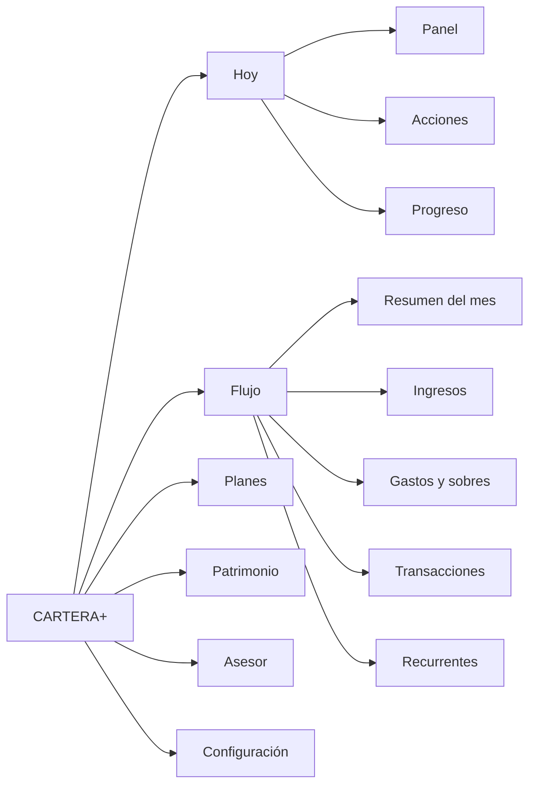

# CARTERA+ · Rediseño UX — Arquitectura de información

_Extraído del blueprint maestro (16-sep-2026). Fuente viva: https://claude.ai/code/artifact/0e037de8-78ec-44fd-b4ef-3ea701eea331_

## 4. User mental model analysis

Una persona no piensa su dinero en módulos de software ni en etapas de un programa: piensa en **cuatro preguntas recurrentes**, en este orden de frecuencia: «¿cómo voy?» (diario), «¿en qué se me fue?» (semanal), «¿avanzo en lo que me propuse?» (mensual) y «¿cuánto tengo y hacia dónde va?» (trimestral). CARTERA+ debe organizarse alrededor de esas preguntas, y usar el viaje ORDEN → CONTROL → CRECIMIENTO → LIBERTAD como **indicador de progreso**, no como menú.

**Por qué el viaje no debe ser el menú.** Si el sidebar se llamara Orden / Control / Crecimiento / Libertad, la pantalla de deudas tendría que vivir en «Control» aunque el usuario ya esté en «Crecimiento», y el usuario nuevo no sabría que «Orden» contiene sus gastos. Los referentes que mejor funcionan (Copilot, Monarch, Stripe) nombran los destinos por el **objeto** que contienen (Transactions, Recurring, Goals, Investments), y comunican el progreso con estados y widgets, no con la estructura. El riel de etapas que ya existe en Mis acciones es exactamente el lugar correcto para el viaje.

**Los cuatro núcleos del modelo mental y lo que cada uno contiene:**

| Núcleo | Pregunta | Frecuencia | Objetos que agrupa | Estado hoy en CARTERA+ |
| --- | --- | --- | --- | --- |
| **Hoy** | ¿Cómo voy y qué debo hacer? | Diario | Panel, acciones pendientes, alertas, asesor | Repartido en Centro de mando, Mis acciones, campana y Asistente |
| **Flujo** | ¿Cuánto entra, cuánto sale y en qué? | Semanal | Ingresos, gastos/sobres, transacciones, recurrentes, presupuesto vs real | Grupo «Presupuesto» con 4 destinos y «Base» como resumen sin nombre claro |
| **Planes** | ¿Avanzo en lo que me propuse? | Mensual | Metas de ahorro, deudas, fondos de emergencia y paz | Grupo «Control»; los fondos viven en Defensa |
| **Patrimonio** | ¿Cuánto tengo, cómo rinde, qué tan protegido y qué tan cerca de la libertad? | Trimestral | Patrimonio neto, inversiones, protección, libertad, indicadores externos | Grupo «Crecimiento» con nombres cruzados |

**Principios que se derivan (y gobiernan las secciones 5-11):**

1. **Un núcleo, una pantalla de resumen, N pestañas de detalle.** Cada núcleo abre con un resumen que responde su pregunta en 5 segundos y ofrece las pestañas de detalle. Así el sidebar baja de 14 a 5 destinos sin perder ninguna pantalla.
2. **Las recomendaciones tienen un solo hogar.** «Tu próxima mejor acción» se calcula una vez y se muestra en Hoy; los módulos muestran solo la acción de su dominio como enlace a ese hogar.
3. **El tiempo es global; la dimensión es local.** El periodo (mes o rango) se elige una vez y viaja con el usuario; categoría, sobre, comercio, cuenta y miembro se eligen en cada pantalla y se muestran siempre como chips visibles.
4. **Cada cifra viene con su comparación y su explicación.** Contra el periodo anterior, contra el presupuesto o contra la meta; y un «por qué» a un clic (tooltip o drill-down), nunca un párrafo inline.
5. **Del qué al por qué en un paso.** Todo gráfico agregado baja a su lista de transacciones u objetos con un clic o un toque.
6. **El viaje es visible, no estructural.** Un solo riel de etapas (el de Mis acciones) reemplaza los tres vocabularios y aparece en Hoy y en el perfil.

**Comportamiento financiero que el modelo debe respetar** (de la investigación, sección 19): encuadre sin juicio («gastaste 20 % más en restaurantes», no «dejá de gastar»), un valor principal por pantalla, divulgación progresiva, y estados explícitos en metas y deudas (al día / adelantado / en riesgo) que convierten el progreso en acción. Esto coincide con la regla de tono de la marca: la carencia es de criterio, no de carácter.

## 5. Information architecture options

Se evaluaron tres arquitecturas contra ocho criterios. La opción C (núcleos por pregunta) gana en discoverability y escalabilidad; la A (viaje) es la más fiel a la marca pero la peor para encontrar cosas; la B (objetos planos, propuesta en el brief) es la más usada en la industria pero deja 8 grupos y 18 destinos.

**Opción A — El viaje como menú (ORDEN · CONTROL · CRECIMIENTO · LIBERTAD)**

- Orden: Transacciones, Ingresos, Gastos, Presupuesto · Control: Metas, Deudas, Fondo de emergencia · Crecimiento: Inversiones, Patrimonio, Protección · Libertad: Rich Life, Escenarios · + Hoy y Asesor fuera del viaje.
- Modelo mental: «avanzo por etapas». Ventaja: coherencia total con la landing y la promesa. Desventajas: nombres abstractos para el usuario nuevo (¿dónde están mis deudas?), un usuario en «Crecimiento» sigue necesitando «Orden» a diario, y agregar un módulo (p. ej. impuestos) obliga a decidir a qué etapa pertenece.

**Opción B — Objetos planos (el candidato del brief)**

- Home · Movimiento del dinero (Ingresos, Gastos, Transacciones, Recurrencias) · Planificación (Presupuesto, Sobres, Metas, Ahorro) · Obligaciones (Deudas) · Crecimiento (Inversiones, Patrimonio) · Protección (Seguros) · Futuro (Libertad) · Acciones (Alertas, Recomendaciones, Pendientes).
- Modelo mental: «cada cosa en su cajón», el estándar de Monarch/Copilot. Ventaja: nada queda escondido. Desventajas: 8 grupos y \~18 destinos es más de lo que hay hoy; «Obligaciones» y «Protección» son grupos de un solo ítem; Sobres y Gastos son la misma pantalla en CARTERA+ (los frascos son la vista de gastos); Presupuesto y Ahorro se separan de Gastos y Metas aunque comparten datos.

**Opción C — Núcleos por pregunta con pestañas (recomendada)**

- Hoy · Flujo · Planes · Patrimonio · Asesor, y Configuración al pie. Cada núcleo abre en un resumen y despliega pestañas (ver sección 6).
- Modelo mental: «cuatro preguntas, cuatro lugares». Ventaja: 5 destinos visibles, dos niveles como máximo, cada pantalla actual conserva su lugar, y una función nueva se agrega como pestaña sin tocar el sidebar. Desventaja: exige que cada resumen sea bueno (si el resumen de Flujo es débil, el usuario tiene un clic más para llegar a Gastos); se mitiga con pestañas visibles al entrar y con la paleta ⌘K.

| Criterio | A · Viaje | B · Objetos planos | C · Núcleos + pestañas |
| --- | --- | --- | --- |
| Modelo mental | Etapas del programa | Objetos financieros | Preguntas del usuario |
| Destinos de primer nivel | 4 + 2 = 6 | 8 grupos / \~18 ítems | 5 + Configuración |
| Niveles | 2 | 2 (grupo → ítem) | 2 (núcleo → pestaña) |
| Esfuerzo cognitivo inicial | Alto (nombres abstractos) | Bajo | Bajo |
| Discoverability | Baja | Alta | Alta (con pestañas visibles) |
| Escalabilidad | Baja | Media (sidebar crece) | Alta (pestañas crecen) |
| Coherencia con la marca | Total | Neutra | Alta si el riel del viaje vive en Hoy |
| Costo de migración | Alto (renombrar todo) | Medio | Bajo (reagrupar rutas existentes) |
| Riesgo principal | Usuario perdido | Sidebar largo | Resúmenes débiles |

**Decisión propuesta:** C, con dos préstamos: de A, el riel del viaje como indicador de progreso en Hoy; de B, «Recurrentes» como pestaña nueva en Flujo y un centro de acciones único.

## 6. Recommended information architecture

Cinco núcleos, cada uno con un resumen y sus pestañas; ninguna pantalla actual desaparece, solo cambia de lugar y de nombre. Las rutas actuales se conservan en la fase 1 (solo cambia el menú); la consolidación de URLs con redirecciones 301 es un paso posterior (sección 23).

| Núcleo | Pestaña | Pantalla actual que absorbe | Ruta hoy | Nota |
| --- | --- | --- | --- | --- |
| **Hoy** | Panel | Centro de mando | `/dashboard` | Se rediseña (sección 10) |
| Hoy | Acciones | Mis acciones · mes + decisiones | `/mis-acciones` | Único hogar de recomendaciones y alertas |
| Hoy | Progreso | Mis acciones · progreso + riel de etapas + Salud/Score de control | `/mis-acciones?tab=progreso` | El viaje ORDEN → LIBERTAD vive aquí |
| **Flujo** | Resumen del mes | Mi Base Financiera | `/mi-base-financiera` | Presupuesto vs real, flujo libre, liquidez |
| Flujo | Ingresos | Ingresos | `/ingresos` |  |
| Flujo | Gastos y sobres | Gastos (frascos) | `/gastos` | Presupuesto por sobre vive aquí, no en una pantalla aparte |
| Flujo | Transacciones | Transacciones + Por revisar + Conciliación | `/transacciones` | Bandeja de revisión con contador en el menú |
| Flujo | Recurrentes | **Nueva**: cobros y pagos recurrentes con estado y calendario | — | Datos ya existen en `budget_items` recurrentes, deudas y aportes DCA |
| **Planes** | Metas | Ahorro (control) | `/control-financiero` | Renombrar: el usuario busca «metas», como en móvil (`/m/metas`) |
| Planes | Deudas | Deudas y Préstamos | `/deudas` |  |
| Planes | Fondos | Fondo de emergencia y fondo de paz (hoy en Defensa) | `/patrimonio/proteccion#fondos` | Son metas de colchón; conceptualmente son planes |
| **Patrimonio** | Resumen | Patrimonio / Rich Life | `/mi-rich-life` | Patrimonio neto, activos vs pasivos, serie histórica |
| Patrimonio | Inversiones | Portafolio de inversiones | `/patrimonio` | Ruta futura `/patrimonio/inversiones` |
| Patrimonio | Protección | Defensa Patrimonial (pólizas y exposición) | `/patrimonio/proteccion` |  |
| Patrimonio | Libertad | Termómetro, escalera de hitos, escenarios | hoy dentro de `/mi-rich-life`; `/m/libertad` en móvil | Se separa como pestaña con supuestos visibles |
| Patrimonio | Indicadores | Mercado e indicadores | `/patrimonio/indicadores` | Entra al menú web |
| **Asesor** | Chat | My Agent C+ | `/asistente` | Con entrada contextual desde cualquier tarjeta |
| **Configuración** (pie) | Perfil financiero · Hogar · Cuenta y plan · Asistentes de configuración · Correo e importación · Categorías y reglas | `/mi-perfil-financiero`, `/configuracion`, `/configurar`, `/suscripcion` | Sale del menú principal; «Mi configuración» (wizards) queda como tarjeta de Hoy hasta completar y luego aquí |  |

**Reglas de la arquitectura:**

- **Un solo modelo de navegación en código.** `nav.ts` describe núcleos y pestañas con sus rutas web y `/m`; el sidebar, la barra inferior y el menú móvil se derivan de él. Elimina la lista duplicada de `mobile-menu.tsx`.
- **Las pestañas viven en la URL** (`?tab=` o subruta), nunca en `#hash`, para que un enlace compartido y el botón atrás funcionen.
- **Dos niveles máximo.** Detalle de una deuda, un holding o una meta es una vista de detalle (drawer o página hija), no un tercer nivel del menú.
- **Los contadores se derivan del dato:** «Acciones» muestra pendientes, «Transacciones» muestra por revisar, igual que `navBadges` hoy.

