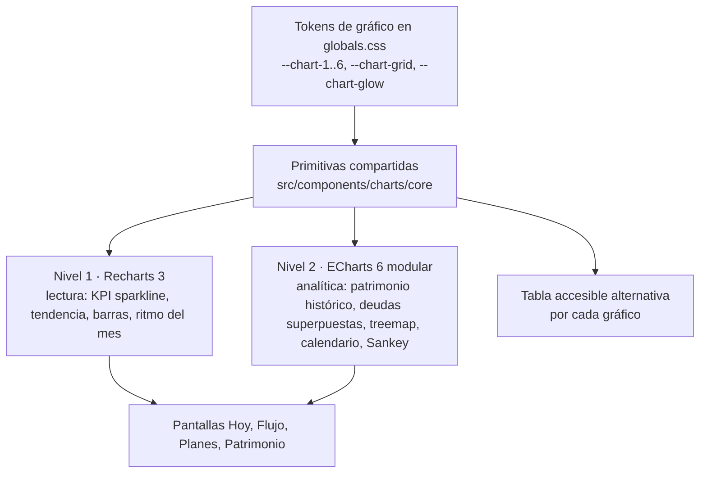

# CARTERA+ · Rediseño UX — Sistema de visualización

_Extraído del blueprint maestro (16-sep-2026). Fuente viva: https://claude.ai/code/artifact/0e037de8-78ec-44fd-b4ef-3ea701eea331_

## 12. Data visualization research

Se verificaron 17 librerías contra el registro de npm y sus páginas oficiales al 16-sep-2026. Ninguna «nueva» de 2025-2026 tiene tracción verificable; el mercado se consolidó en cuatro opciones serias para React: Recharts 3, Apache ECharts 6, visx 4 y Highcharts 13 (comercial). Tres quedaron descartadas por mantenimiento (Nivo sin release desde mayo 2025, Tremor sin publicar desde enero 2025, react-countup desde 2024) y tres por licencia o costo (Highcharts EULA, AG Charts Enterprise, ApexCharts > USD 2 M de ingresos).

| Librería | Versión | Último release | Licencia | Render | Bundle gz | Veredicto |
| --- | --- | --- | --- | --- | --- | --- |
| [Recharts](https://github.com/recharts/recharts/releases) | 3.10.1 | 2026-07-25 | MIT | SVG | 111 kB (área+ejes+tooltip+brush, medido) | **Mantener** para lectura; ya instalado |
| [Apache ECharts](https://echarts.apache.org/handbook/en/basics/release-note/v6-feature/) | 6.1.0 | 2026-05-19 | Apache-2.0 | Canvas/SVG + SSR a string | 198 kB modular (línea+grid+tooltip+dataZoom+markLine+aria) | **Agregar** para analítica |
| [visx](https://github.com/airbnb/visx/releases) | 4.0.0 | 2026-06-11 (19 meses sin release antes) | MIT | SVG | 20,5 kB primitivas / 61 kB xychart | Fallback para 1-2 gráficos héroe |
| [Highcharts](https://www.highcharts.com/blog/news/our-new-eula-makes-free-usage-clearer/) | 13.0.2 | 2026-08-27 | Comercial (SaaS) | SVG | no verificado | Mejor a11y del mercado; descartada por licencia |
| D3 | 7.9.0 | 2024-03-12 | ISC | DIY | 92 kB completo | Solo como dependencia de escalas/curvas |
| Nivo | 0.99.0 | 2025-05-23 | MIT | SVG/Canvas | no verificado | Descartada: sin releases |
| Plotly.js | 4.1.1 | 2026-09-14 | MIT | SVG/WebGL | 1,40 MB | Descartada: peso |
| uPlot | 1.6.32 | 2025-03-14 | MIT | Canvas | 21,9 kB | Descartada: sin tooltips/a11y, un mantenedor |
| Chart.js + react-chartjs-2 | 4.5.1 / 5.3.1 | 2025-10 | MIT | Canvas | 68 kB | Descartada: a11y y theming pobres |
| Observable Plot | 0.6.17 | 2025-02-14 | ISC | SVG | 128 kB | Descartada: sin integración React |
| Tremor / shadcn chart | 3.18.7 / CLI 4.21 | 2025-01 / 2026-09 | Apache / MIT | Recharts | = Recharts | shadcn `chart` es la envoltura recomendada de Recharts |
| AG Charts Community | 14.2.0 | 2026-09-16 | MIT + Enterprise | Canvas | no verificado | Descartada: crosshair, zoom, Sankey y treemap son Enterprise |
| MUI X Charts | 9.13.0 | 2026-09-04 | MIT + Pro | SVG | no verificado | No: trae el sistema MUI |
| Vega-Lite + react-vega | 6.4.3 / 8.0.0 | 2026-04 / 2025-08 | BSD-3 | Canvas/SVG | pesado | No |
| ApexCharts | 7.4.0 | 2026-09-15 | Comercial > USD 2 M | SVG | — | No |
| LightningChart / SciChart | 9.0 / 5.2 | 2026-08 / 2026-09 | Comercial (desde USD 2 750) | WebGL | — | No aplica |

**Hechos que pesan en la decisión:**

- **Recharts 3** trae `accessibilityLayer` activado por defecto (navegación con flechas, `role="application"`), tooltip en portal, `syncId` que sincroniza también el `Brush`, hooks `useActiveTooltipDataPoints`, animaciones personalizables (3.9) y theming experimental (3.11 canary). Tiene Sankey, Treemap y Sunburst; **no** tiene heatmap-calendario ni zoom con rueda/pinch. Arrastra redux-toolkit e immer.
- **ECharts 6** estrena tema por tokens, cambio de tema en caliente sin destruir la instancia, dark mode que escucha el sistema, `dataZoom` con pinch nativo, `connect` entre instancias, `emphasis`/`blur` para atenuar series, `universalTransition`, `sampling: 'lttb'` para volumen, y trae calendar, Sankey, treemap y sunburst con drill-down. SSR a string SVG (`renderToSVGString`) sirve para correos y PDF. Debilidades: no lee CSS variables solo, la navegación por teclado no está documentada, y `tooltip.formatter` con HTML exige escapar los nombres de comercios (XSS).
- **visx 4** da control total del SVG con 20 kB, pero toda la accesibilidad, el teclado y el enlace entre gráficos son trabajo propio, y su ritmo de releases es esporádico.
- **Highcharts** puntuó mejor en accesibilidad (módulo con teclado, lector de pantalla y sonificación), pero su EULA exige licencia comercial para cualquier uso de negocio y una SaaS pública requiere el tier SaaS (Core: USD 366 por puesto; precio SaaS no verificado). Solo se justificaría si la a11y AA de gráficos fuera contractual.
- **Next.js 16:** Recharts y visx renderizan en SSR (basta un Client Component hoja con altura fija para evitar CLS); ECharts necesita `next/dynamic` con `ssr: false` dentro de un Client Component. El análisis de bundle con Turbopack es `npx next experimental-analyze`.
- **Volumen:** las series de finanzas personales rara vez pasan de unos cientos de puntos por pantalla; el caso 10 k+ solo aparece en históricos diarios de precios y se resuelve agregando en el servidor (RSC) y con `lttb` en ECharts.

Fuentes completas: [npm registry](https://registry.npmjs.org/), [bundlephobia](https://bundlephobia.com/), [shadcn chart](https://ui.shadcn.com/docs/components/chart), [ECharts import](https://echarts.apache.org/handbook/en/basics/import/), [ECharts SSR](https://echarts.apache.org/handbook/en/how-to/cross-platform/server/), [Recharts a11y](https://github.com/recharts/recharts/wiki/Recharts-and-accessibility), [Highcharts shop](https://shop.highcharts.com/), [AG Charts community vs enterprise](https://www.ag-grid.com/charts/react/community-vs-enterprise/), [ApexCharts licencia](https://apexcharts.com/blog/new-licencing-model/), [Next 16.3](https://nextjs.org/blog/next-16-3).

## 13. Chart library decision matrix

Puntaje 0-5 por criterio, ponderado a 100. La diferencia entre ECharts (81,0) y el status quo Recharts + SVG propio (80,4) es ruido; lo que las separa es el tipo de gráfico en que cada una gana, y por eso la recomendación de la sección 14 es híbrida. Highcharts gana en bruto (82,8) y pierde por licencia.

Pesos: integración React/Next 10 · techo visual premium 13 · interacción (tooltip, crosshair, zoom, brush, connect, highlight) 14 · rendimiento 10 k+ puntos 8 · bundle 8 · accesibilidad 10 · theming/dark/CSS vars 7 · TypeScript/DX 7 · mantenimiento y comunidad 10 · licencia y costo 8 · simplicidad de ingeniería 5.

| Opción | React/Next | Visual | Interacción | 10k+ | Bundle | A11y | Tema | TS | Mant. | Licencia | Simpl. | **Total** |
| --- | --- | --- | --- | --- | --- | --- | --- | --- | --- | --- | --- | --- |
| Highcharts 13 | 4 | 5 | 5 | 4 | 2 | 5 | 4 | 5 | 5 | 1 | 4 | **82,8** |
| **ECharts 6 modular** | 3 | 5 | 5 | 5 | 2 | 3 | 3 | 4 | 5 | 5 | 3 | **81,0** |
| **Recharts 3 + shadcn chart + SVG propio (status quo mejorado)** | 5 | 4 | 3 | 2 | 3 | 4 | 5 | 4 | 5 | 5 | 5 | **80,4** |
| visx 4 | 5 | 5 | 4 | 3 | 4 | 2 | 5 | 4 | 3 | 5 | 2 | 78,0 |
| MUI X Charts 9 | 5 | 4 | 3 | 3 | 2 | 3 | 3 | 5 | 5 | 4 | 3 | 73,4 |
| Unovis 1.7 | 4 | 4 | 3 | 3 | 3 | 2 | 5 | 4 | 4 | 5 | 4 | 73,0 |
| D3 directo | 2 | 5 | 5 | 3 | 4 | 1 | 5 | 4 | 3 | 5 | 1 | 71,8 |
| AG Charts Community | 4 | 4 | 2 | 4 | 2 | 3 | 4 | 5 | 5 | 3 | 4 | 71,0 |
| Tremor | 5 | 4 | 2 | 2 | 3 | 3 | 4 | 4 | 2 | 5 | 5 | 68,2 |
| Nivo | 5 | 4 | 2 | 3 | 3 | 3 | 4 | 3 | 2 | 5 | 4 | 67,4 |
| Chart.js | 3 | 3 | 3 | 4 | 4 | 1 | 2 | 4 | 3 | 5 | 4 | 63,4 |
| Plotly.js | 3 | 3 | 5 | 4 | 0 | 1 | 2 | 3 | 4 | 5 | 3 | 62,2 |
| Vega-Lite | 3 | 3 | 4 | 3 | 1 | 2 | 3 | 3 | 3 | 5 | 3 | 60,8 |
| uPlot | 2 | 2 | 3 | 5 | 5 | 1 | 2 | 3 | 2 | 5 | 2 | 56,6 |
| Observable Plot | 2 | 3 | 2 | 3 | 3 | 2 | 3 | 3 | 2 | 5 | 4 | 55,4 |

**Disponibilidad de tipos especiales** (los que piden las secciones 10-11):

| Tipo | Recharts 3 | ECharts 6 | visx 4 | Highcharts |
| --- | --- | --- | --- | --- |
| Sankey | Sí | Sí | Sí (`@visx/sankey`) | Módulo |
| Treemap con drill-down | Sí (sin drill nativo) | Sí | Hierarchy (manual) | Sí |
| Heatmap-calendario | **No** | Sí (`calendar`) | Manual | Heatmap |
| Sunburst | Sí | Sí | Manual | Sí |
| Cascada (waterfall) | Barras apiladas manual | Barras con signo | Manual | Sí |
| Zoom/brush con pinch | Solo `Brush` | `dataZoom` inside + slider | `@visx/brush` | Sí |
| Crosshair sincronizado entre gráficos | `syncId` | `connect` / `axisPointer.link` | Manual | Sí |

**Lectura de la matriz:** Recharts gana donde importa la integración (CSS variables de Tailwind, a11y por defecto, costo de cambio cero); ECharts gana donde importa la exploración (zoom, enlace, atenuado de series, volumen, tipos especiales). Ninguna de las dos justifica una migración total: el 70 % de los gráficos de CARTERA+ son de lectura (sparklines, tendencias mensuales, barras de sobres) y el 30 % son analíticos (patrimonio histórico, deudas superpuestas, treemap de gasto, calendario, Sankey).

## 14. Recommended visualization architecture

**Decisión: sistema híbrido de dos niveles sobre una sola capa de tokens y primitivas.** Recharts 3 (ya instalado) para todo gráfico de lectura, elevado a acabado premium; Apache ECharts 6 con importación modular, cargado solo en las rutas analíticas, para los cinco gráficos que Recharts no puede hacer bien. visx queda como fallback documentado para un gráfico héroe si alguna vez hace falta control total; no se instala ahora.

**Nivel 1 — Recharts 3 (lectura, ≈70 % de los gráficos).** Se reemplazan los tres wrappers actuales por una familia en `src/components/charts/core/`:

- `ChartFrame`: contenedor con altura fija por variante (sparkline 56 px, tarjeta 180 px, principal 320/220 px), toolbar opcional (comparar, ver tabla, exportar PNG/CSV), y los cuatro estados con la misma altura (cargando, vacío, error, datos).
- `GradientDefs` y `GlowFilter`: `<linearGradient>` del color de serie con opacidad 0,28 → 0 y `<filter feGaussianBlur>` para el punto activo. Un solo lugar, un solo look.
- `ChartTooltip`: tooltip HTML propio en portal (`Tooltip` de Recharts 3 con `portal`), con fecha, valor en `formatMoney`, delta vs comparación y `tabular-nums`; en móvil se ancla arriba del gráfico y se activa por toque.
- `useSerieActiva`: estado de la serie resaltada (leyenda hover/clic) que atenuá las demás a opacidad 0,3.
- Curvas `type="monotone"`, `strokeWidth` 2, `activeDot` con glow, `animationDuration` 400 ms `ease-out` (hoy está apagada en todo), `accessibilityLayer` activo, `syncId` por pantalla para crosshair compartido, `Brush` de 24 px en gráficos de 12+ meses, `ReferenceLine` punteada para presupuesto/meta.
- Se adopta la convención de `shadcn/ui chart` (`ChartContainer` + `ChartConfig` con `var(--chart-n)`), sin instalar Tremor.

**Nivel 2 — ECharts 6 modular (analítica, ≈30 %).** `src/components/charts/echarts/` con `echarts/core` + solo los módulos usados (LineChart, BarChart, TreemapChart, CalendarComponent, SankeyChart, GridComponent, TooltipComponent, DataZoomComponent, MarkLineComponent, AriaComponent, UniversalTransition, CanvasRenderer):

- `EChart` wrapper cliente: `next/dynamic` con `ssr: false` y skeleton de la misma altura; `ResizeObserver`; `dispose` al desmontar; `animation: false` cuando `prefers-reduced-motion`; tema construido desde `getComputedStyle(document.documentElement)` y reaplicado con `setTheme` al cambiar `data-theme`.
- `tooltip.axisPointer.type = 'cross'` punteado, `tooltip.formatter` con HTML **escapado**, `confine: true`; `dataZoom` inside + slider; `emphasis.focus = 'series'` + `blur` para atenuar; `areaStyle` con `LinearGradient`; `markLine` para metas; `echarts.connect('grupo')` para enlazar patrimonio con su cascada, o deudas con intereses.
- Casos asignados: serie histórica de patrimonio con activos/pasivos apilados y zoom; curvas de deuda superpuestas con escenario; treemap de gasto con drill-down grupo → sobre → categoría; calendario de gasto diario y de cobros; Sankey ingresos → sobres → ahorro/deuda (solo escritorio, como reporte).
- Cada gráfico ECharts lleva una tabla accesible alternativa (`
` «Ver datos») porque su navegación por teclado no está documentada.

**Tokens nuevos en `globals.css`** (claro y oscuro): `--chart-1 … --chart-6` (derivados de `--c-income`, `--c-expense`, `--c-savings`, `--c-debt`, `--c-invest`, `--c-protect`), `--chart-grid`, `--chart-axis`, `--chart-crosshair`, `--chart-glow` (color de serie al 60 %), `--chart-gradient-top` (0,28) y `--chart-gradient-bottom` (0). Reglas de la skill `dataviz`: nunca depender solo del color (patrones o etiquetas para series), contraste ≥ 3:1 en líneas, máximo 6 series por gráfico, series inactivas atenuadas y no ocultas.

**Presupuesto de peso:** ECharts (\~200 kB gz) solo puede aparecer en los chunks de Patrimonio · Resumen, Planes · Deudas, Flujo · Gastos (treemap/calendario) y Flujo · Resumen (Sankey). Criterio de aceptación en CI: `next experimental-analyze` no muestra `echarts` en el chunk cliente de `/dashboard`.

**Por qué no migrar todo a ECharts:** perdería la a11y por defecto y el theming por CSS variables de Recharts en 70 % de los gráficos, sumaría 200 kB al Home y obligaría a reescribir 13 archivos que hoy funcionan. **Por qué no quedarse solo con Recharts:** no tiene calendario, ni zoom con pinch, ni atenuado nativo, ni SSR a imagen para correos, y el SVG se degrada con históricos diarios.

**Dependencias a agregar (3):** `echarts` 6.1, `@number-flow/react` 0.6 (KPIs animados, respeta reduced motion, compatible con CSP estricto), `nuqs` 2.10 (filtros en URL leídos desde RSC). Ya instalados y reutilizados: `recharts` 3.10, `motion` 12 (subir a 13 es opcional; v13 solo quitó `@emotion/is-prop-valid`), `radix-ui` 1.6 (sin migrar a Base UI), `@floating-ui/react` (tooltips), `lucide-react`/`@tabler/icons-react`. Se evalúan en fase de Transacciones: `@tanstack/react-table` 9 + `@tanstack/react-virtual`, `cmdk` 1.1 para la paleta.

## 15. Chart interaction system

Un estándar transversal: toda interacción existe en escritorio (ratón y teclado) y en móvil (toque), y el hover nunca es el único camino a un dato. Se implementa una vez en las primitivas de la sección 14 y se hereda.

| Interacción | Escritorio | Móvil / touch | Teclado | Implementación |
| --- | --- | --- | --- | --- |
| **Hover** → valor exacto | Punto activo con glow + tooltip | Toque mantiene el tooltip; segundo toque en otro punto lo mueve | Flechas ← → recorren puntos (`accessibilityLayer`) | Recharts `activeDot` + `ChartTooltip`; ECharts `emphasis` |
| **Crosshair** | Línea vertical punteada que sigue el cursor y se sincroniza entre gráficos de la pantalla | Igual, al arrastrar el dedo | Igual que hover | `syncId` (R) / `connect` + `axisPointer.link` (E) |
| **Tooltip** | Fecha · valor · delta vs comparación (±₡ y %) · nota («presupuesto ₡X») | Anclado arriba del gráfico, no bajo el dedo | Lectura por `aria-live` del punto activo | Portal, `tabular-nums`, máx. 4 líneas |
| **Clic** → seleccionar | Clic en barra/segmento lo fija y atenuá el resto | Toque largo | Enter | `useSerieActiva` + `blur` (E) |
| **Drill-down** | Clic en segmento → nivel siguiente o lista de transacciones filtradas, con breadcrumb dentro de la tarjeta | Toque → igual | Enter, Esc para volver | Treemap drill (E); navegación con `?cat=` y periodo |
| **Brush** → periodo | Arrastrar en la banda inferior de 24 px | Dos tiradores grandes (44 px) | Shift + flechas | `Brush` (R) / `dataZoom.slider` (E) |
| **Zoom** | Rueda con Ctrl/⌘ solo en gráficos analíticos | Pinch | + / − | `dataZoom.inside` (E); Recharts no lo tiene y no lo simula |
| **Leyenda** | Hover atenuá; clic oculta/muestra; doble clic aísla | Toque | Tab a la leyenda, Enter | Leyenda propia con chips (no la nativa) |
| **Comparar** | Chip «vs mes anterior / año anterior / presupuesto / promedio 3 m» en la toolbar; la serie comparada va punteada y gris | Igual | Tab + Enter | Selector global de comparación (sección 7) |
| **Filtrar** | Chips visibles arriba de la tarjeta; clic en un segmento agrega el chip | Igual | Tab | `nuqs`: `?p`, `?cmp`, `?cat`, `?sobre`, `?comercio`, `?miembro` |
| **Reset** | Botón «Restablecer» aparece solo cuando hay un estado no inicial | Igual | Esc | Un clic vuelve al periodo global y sin chips |
| **Enlazado** | Seleccionar un sobre en el treemap filtra tendencia, comercios y lista en la misma pantalla | Igual | Igual | Estado compartido de pantalla (Zustand efimero) |
| **Ver datos** | Botón «Tabla» en la toolbar alterna gráfico ↔ tabla ordenable | Igual | Tab | Obligatorio en ECharts; recomendado en Recharts |
| **Exportar** | PNG del gráfico y CSV del filtro, solo en gráficos principales | No (o compartir imagen) | — | `getDataURL` (E) / `toDataURL` de SVG (R); evaluar valor real antes de exponerlo |

**Sistema de filtros**

| Filtro | Alcance | Persistencia | Visible como |
| --- | --- | --- | --- |
| Periodo (mes o rango) | **Global** | URL + `localStorage` (última elección) | Selector en la barra superior |
| Comparación | **Global** (por defecto «mes anterior») | URL | Chip junto al periodo |
| Moneda de visualización | **Global** (ya existe) | Perfil | Conmutador en la barra |
| Ocultar montos | **Global** | `localStorage` | Icono de ojo |
| Miembro del hogar | **Global** cuando el hogar tiene > 1 adulto | URL | Chip «Todos / José / Marta» |
| Categoría, sobre, comercio, fuente, cuenta, origen, estado, activo/pasivo | **Local** a la pantalla | URL de esa pantalla; se limpia al cambiar de núcleo | Chips sobre la primera tarjeta |
| Rango de sparkline (1m/3m/6m/YTD/todo) | Local a la tarjeta | Ninguna | Segmented control en la tarjeta |

Regla de oro: **el usuario siempre puede leer qué datos está viendo** en una línea bajo el título («Agosto 2026 · vs julio · Todos · Sobre: Supermercado»), y esa línea es la que se borra con Reset.

