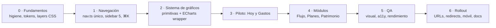

# CARTERA+ · Rediseño UX — Roadmap, migración y prioridades

_Extraído del blueprint maestro (16-sep-2026). Fuente viva: https://claude.ai/code/artifact/0e037de8-78ec-44fd-b4ef-3ea701eea331_

## 23. Migration strategy

Sin big bang: siete fases incrementales, cada una desplegable sola, detrás de dos banderas (`NEXT_PUBLIC_NAV_V2` y `NEXT_PUBLIC_CHARTS_V2`, leídas en servidor) que permiten activar el menú nuevo y los gráficos nuevos por separado y volver atrás en un deploy. Las pantallas viejas y nuevas conviven ruta por ruta hasta que la nueva es aceptada.

| Fase | Entregable | Bandera | Reversible con | Toca lógica |
| --- | --- | --- | --- | --- |
| 0 · Fundamentos | `.gitignore` y rotación de clave; merge del fix de deuda; `globals.css` en `@layer`/archivos sin cambio visual; tokens de gráfico y motion; `format.ts` como único formateador; `nuqs`; `@axe-core/playwright`; `docs/cartera-plus-redesign/` | — | Revert del PR | No |
| 1 · Navegación | `nav.ts` con núcleos y pestañas (web + `/m`); sidebar de 5 con riel; barra superior con periodo global; `Tabs` en URL; paleta ⌘K (`cmdk`); barra inferior de 5 y FAB | `NAV_V2` | Bandera | No (solo enlaces) |
| 2 · Sistema de gráficos | `charts/core` (ChartFrame, GradientDefs, GlowFilter, ChartTooltip, useSerieActiva, Legend), `charts/echarts` (EChart wrapper + tema), `KpiHero`, `KpiCard`, `BreakdownCard`, `InsightList`, `ActionStrip`, `SectionHeader`; página interna `/dev/ui`; los 3 wrappers viejos delegan en los nuevos | `CHARTS_V2` | Bandera | No |
| 3 · Piloto | Hoy · Panel y Flujo · Gastos rediseñados con las primitivas; fórmula «Libre para gastar» con tests; treemap y trayectoria del mes | `NAV_V2` + `CHARTS_V2` | Bandera por ruta | Sí: un servicio nuevo (`free-to-spend`) |
| 4 · Módulos | Ingresos, Resumen del mes, Recurrentes (vista compuesta), Transacciones (tabla virtual), Metas (estados), Deudas (curvas), Patrimonio (serie + cascada), Inversiones (TWR verificado), Protección, Libertad (dato/supuesto/proyección), Indicadores | Por ruta | Bandera por ruta | Sí: fórmulas nuevas, cada una con test |
| 5 · QA | Suite `toHaveScreenshot` en 3 anchos y 2 temas; axe en 19 rutas; presupuesto de bundle en CI; VoiceOver/TalkBack; prueba de 5 segundos con 3 usuarios reales | — | — | No |
| 6 · Rollout | Consolidación de URLs (`/flujo/*`, `/planes/*`, `/patrimonio/*`) con 301; borrar código viejo y banderas; `mobile.css` reducido; CLAUDE.md y docs actualizados; anuncio en la app | — | Redirects | No |

**Reglas de convivencia durante la migración**

- Cambios de UI = solo UI (regla del proyecto). Cuando una pantalla necesite una cifra nueva, el servicio se agrega en un PR aparte, con test, antes del PR de UI.
- Cada fase es una rama `feat/redesign-<fase>-<tema>`; un PR por pantalla o primitiva; Conventional Commits; nada a `main` sin PR.
- La cuenta demo (Familia Ramírez) es el juego de datos de aceptación; se resiembra pasado el día 5 del mes para que el mes en curso tenga datos.
- Ninguna pantalla nueva reemplaza a la vieja hasta pasar la prueba de 5 segundos, axe sin violaciones serias, y el presupuesto de peso.
- Las rutas viejas siguen respondiendo hasta la fase 6; los enlaces internos se generan desde `nav.ts`, así que cambiar una URL es cambiar una línea.

## 24. Implementation roadmap

El trabajo se estima en prompts delta a Claude Code (cada uno una rama y un PR revisable en una sesión), no en semanas calendario, porque el ritmo lo fijan Memo y David. Son unos 46 deltas; las fases 0-3 (18 deltas) entregan la app con el menú nuevo, el sistema de gráficos y dos pantallas rediseñadas, y a partir de ahí cada pantalla es de 2 a 4 deltas.

| Fase | Deltas | Contenido de cada delta (rama) | Criterio de salida |
| --- | --- | --- | --- |
| 0 · Fundamentos | 6 | `chore/gitignore-secrets` · merge de `agitated-wescoff` · `refactor/css-layers` (sin cambio visual, verificado con `toHaveScreenshot`) · `feat/tokens-charts-motion` · `chore/nuqs-axe-format` · `docs/redesign-blueprint` | Build verde; capturas idénticas antes/después; docs en el repo |
| 1 · Navegación | 5 | `feat/nav-model` (nav.ts único + banderas) · `feat/sidebar-v2` · `feat/topbar-period` (periodo global + comparación) · `feat/tabs-url` (reemplaza `#hash` y `?tab`) · `feat/command-palette` | Con `NAV_V2=1`: 5 destinos, todas las 24 rutas alcanzables, móvil derivado de nav.ts |
| 2 · Sistema de gráficos | 7 | `feat/charts-core` · `feat/charts-tooltip-crosshair` · `feat/kpi-hero-card` (NumberFlow) · `feat/breakdown-insight-action` · `feat/echarts-wrapper-theme` · `feat/dev-ui-page` · `refactor/charts-wrappers-delegate` | `/dev/ui` muestra las 8 primitivas en claro/oscuro; axe limpio; Recharts con teclado |
| 3 · Piloto | 5 | `feat/free-to-spend-service` (+ tests) · `feat/home-v2` · `feat/gastos-trajectory` · `feat/gastos-treemap-linked` · `feat/gastos-merchants-anomalies` | Prueba de 5 s aprobada por Memo; peso del Home sin echarts; capturas 3 anchos |
| 4 · Módulos | 20 | Ingresos (2) · Resumen del mes + Sankey (2) · Recurrentes (2) · Transacciones tabla virtual + atajos (2) · Metas estados + simulador (2) · Deudas curvas + escenario (2) · Patrimonio serie + cascada (2) · Inversiones diagnóstico +57 % + TWR + aportes vs crecimiento (3) · Protección mapa + vencimientos (1) · Libertad dato/supuesto/proyección (1) · Indicadores + Asesor contextual (1) | Cada pantalla: diseño aprobado → implementada → revisada → aceptada |
| 5 · QA | 2 | `test/visual-regression-suite` · `test/a11y-perf-budgets` | CI bloqueante en a11y serio y presupuesto de peso |
| 6 · Rollout | 3 | `feat/url-consolidation-redirects` · `chore/remove-flags-legacy` · `docs/claude-md-update` | Sin código muerto; CLAUDE.md describe la nueva IA |

**Orden dentro de la fase 4** (por valor y por dependencia): Ingresos y Resumen del mes primero (cierran el núcleo Flujo junto al piloto), luego Deudas y Metas (Planes, alto valor y datos completos), luego Patrimonio y Inversiones (requieren el diagnóstico del +57 %), y al final Recurrentes, Transacciones, Protección, Libertad e Indicadores.

**Paralelismo posible:** David puede llevar la fase 1 (navegación) mientras la fase 2 (gráficos) avanza, porque no comparten archivos; la fase 3 exige ambas terminadas.

**Hitos de decisión con Memo:** (a) aprobar IA + navegación + tecnología (este documento); (b) aprobar `/dev/ui` con las primitivas antes del piloto; (c) aprobar cada pantalla con sus opciones A/B/C; (d) aprobar el corte de URLs antes de la fase 6.

## 25. Prioritization matrix

P0 bloquea todo lo demás; P1 es lo que el usuario nota en la primera semana; P2 completa la promesa; P3 son oportunidades que no condicionan el rediseño.

| Prioridad | Ítem | Por qué aquí |
| --- | --- | --- |
| **P0** | Ignorar y rotar el secreto en `.claude/settings.local.json` | Riesgo de fuga con un `git add .` |
| P0 | Merge del fix de saldo vivo en el panel | La primera pantalla miente hoy |
| P0 | Diagnóstico del +57 % de rendimiento | No se puede dibujar sobre una cifra falsa |
| P0 | `nav.ts` como única fuente (web + `/m`) con banderas | Sin esto, cada cambio de menú se hace dos veces |
| P0 | `globals.css` en capas y tokens de gráfico/motion | Base de todas las primitivas; evita la cuarta colisión |
| P0 | Primitivas: `ChartFrame`, `ChartTooltip`, `KpiHero`, `KpiCard`, `SectionHeader` | Todo lo demás se construye con ellas |
| P0 | Periodo global en la barra superior con `nuqs` | Unifica los cuatro sistemas de filtro |
| **P1** | Sidebar de 5 núcleos + pestañas en URL + barra inferior de 5 | El «flujo mental» que Memo pide |
| P1 | Hoy · Panel con «Libre para gastar» y acciones únicas | La pantalla más vista; falla la prueba de 5 s hoy |
| P1 | Gastos: trayectoria del mes, treemap enlazado, comercios, anomalías | El «bombazo» de ¿dónde se va mi dinero? |
| P1 | Interacción estándar: hover con glow, crosshair sincronizado, tooltip propio, drill-down, animación 400 ms | Lo que hoy separa a la app de «premium» |
| P1 | Recharts con `accessibilityLayer` y tabla alternativa | Hoy los gráficos no existen para lectores de pantalla |
| P1 | Deudas: curvas superpuestas + simulador de abono | Ya es la mejor pantalla; con poco llega a excelente |
| P1 | Metas con estado al día / en riesgo y fecha estimada | Convierte progreso en acción |
| P1 | Patrimonio: serie histórica (bug) + cascada | Los datos ya están; la pantalla no los muestra |
| P1 | Paleta ⌘K real | Reemplaza un control que hoy engaña |
| **P2** | Recurrentes como pestaña con calendario | Alimenta proyección y «próximos compromisos» |
| P2 | Ingresos: esperado vs real por fuente, estabilidad, calendario | Completa Flujo |
| P2 | Transacciones: tabla virtual, totales del filtro, atajos, filtro por miembro | Productividad diaria |
| P2 | ECharts: treemap, calendario, Sankey, zoom | Los cinco gráficos analíticos |
| P2 | Inversiones: TWR + aportes vs crecimiento + concentración | Requiere el P0 del +57 % |
| P2 | Libertad con dato / supuesto / proyección y sensibilidad | Requiere validar fórmulas con Memo |
| P2 | Protección: mapa de cobertura y vencimientos | Valor claro, datos parciales |
| P2 | Drawers de detalle en escritorio; asesor contextual por tarjeta | Reduce clics y saltos |
| P2 | Suite visual + axe + presupuesto de peso en CI | Sostiene la calidad al ritmo de deltas |
| P2 | Consolidación de URLs con 301 | Cierra la migración |
| **P3** | Widgets reordenables en Hoy (orden independiente web/móvil) | Personalización; poco valor hasta tener el Home bien |
| P3 | Reportes guardados y exportación PNG/CSV por gráfico | Usuario avanzado |
| P3 | Resumen semanal por correo desde la campana | Requiere el motor de señales estable |
| P3 | Modo Flex (fijo / no mensual / flexible) como alternativa a sobres | Cambia el modelo de presupuesto |
| P3 | React Compiler, Motion 13, TanStack Table v9 en toda la app | Rendimiento incremental |
| P3 | Benchmark de mercado importado para comparar rendimiento | Dato externo nuevo |
| P3 | Storybook/Chromatic | `/dev/ui` cubre la necesidad hoy |

**Fuera de alcance de este rediseño:** cambios de esquema salvo columnas derivadas explícitas, la landing y FAQs, el flujo de suscripción, la ingesta por correo, y la calidad del asesor IA (tiene su propio workstream).

## 26. Proposed design sequence

Se diseñan y aprueban en este orden, uno a la vez, con el proceso de 12 pasos del brief (propósito → estado actual → problemas → jerarquía → opciones A/B/C → comparación → recomendación → aprobación → implementación → revisión visual → iteración → aceptación). Las opciones se presentan como **páginas HTML interactivas (Artifacts) con los datos reales de la cuenta demo**, en escritorio y móvil, para que Memo diga «esta sí», «esta no» o «A con el gráfico de B».

| Orden | Qué se diseña | Por qué en este punto | Depende de |
| --- | --- | --- | --- |
| 1 | **Shell y navegación**: sidebar de 5, barra superior con periodo global, barra inferior móvil, riel del viaje, ⌘K | Es el marco de todo; se aprueba una vez | Este blueprint |
| 2 | **Lenguaje de gráficos** (`/dev/ui`): las 8 primitivas con estados, claro/oscuro, hover/crosshair/tooltip/brush, un ejemplo Recharts y uno ECharts | Define el «premium» antes de aplicarlo a una pantalla | 1 |
| 3 | **Hoy · Panel** | Primera pantalla del usuario; ejercita KpiHero, señales y acciones únicas | 1, 2 |
| 4 | **Flujo · Gastos y sobres** | La pregunta más frecuente; ejercita treemap, trayectoria, drill-down enlazado, sobres | 2 |
| 5 | **Planes · Deudas** | Mejor relación valor/esfuerzo; datos completos; curvas superpuestas y escenarios | 2 |
| 6 | **Flujo · Resumen del mes** e **Ingresos** | Cierran Flujo; Sankey y esperado vs real | 4 |
| 7 | **Planes · Metas** y **Fondos** | Estados y simulador | 2 |
| 8 | **Patrimonio · Resumen** | Serie histórica y cascada | 2 y diagnóstico +57 % |
| 9 | **Patrimonio · Inversiones** | TWR verificado, aportes vs crecimiento | 8 |
| 10 | **Flujo · Transacciones** y **Recurrentes** | Tabla virtual, bandeja, calendario | 4 |
| 11 | **Patrimonio · Protección**, **Libertad**, **Indicadores** | Menor frecuencia de uso; Libertad exige validar fórmulas | 8 |
| 12 | **Hoy · Acciones y Progreso**, **Asesor contextual** | Integran señales de todos los módulos ya rediseñados | 3-11 |
| 13 | **App móvil `/m`** pantalla por pantalla | Hereda primitivas; solo adapta layout | Cada pantalla web |

**Formato de cada entrega de diseño:** un Artifact por pantalla con tres pestañas (A evolutiva, B data-first, C future-forward), conmutador escritorio/móvil y claro/oscuro, datos de la Familia Ramírez, y una tabla de comparación (comprensión, jerarquía, interacción, escalabilidad, complejidad, móvil, esfuerzo, rendimiento) con recomendación. Memo aprueba en el propio Artifact o en este documento; la decisión se registra en `docs/cartera-plus-redesign/10-decisions.md` y no se vuelve a discutir.

## 27. First screen to design

**Recomendación: el shell (navegación + barra de periodo) y el panel Hoy, diseñados juntos en el primer ciclo, con Gastos inmediatamente después.** No una pantalla de módulo primero, por cuatro razones:

1. **El shell es la decisión que todas las demás heredan.** Sidebar de 5, pestañas, periodo global y ⌘K aparecen en las 19 pantallas; aprobarlos en el primer ciclo evita rediseñar cada pantalla dos veces. Es además el punto exacto del malestar de Memo («el menú no hace un flujo mental»).
2. **Hoy es la pantalla que más falla la prueba de 5 segundos y la que más se ve.** Hoy tiene siete bloques sin jerarquía y una alerta falsa; con `KpiHero`, señales y acciones únicas se convierte en la demostración de todo el sistema (jerarquía, tooltip, comparación, drill-down, NumberFlow) con el menor número de gráficos.
3. **Hoy fuerza la decisión más importante del producto**: qué es el número principal («Libre para gastar») y dónde viven las recomendaciones. Esa decisión reordena Ahorro, Rich Life y Mis acciones, así que conviene tomarla antes de tocar esos módulos.
4. **Gastos es el segundo, no el primero, porque es la pantalla más densa** (frascos, rango, ritmo, ociosos, vinculados): diseñarla sin el lenguaje de gráficos aprobado en `/dev/ui` produciría opciones que Memo no podría comparar en igualdad. Con el shell y las primitivas aprobadas, Gastos es donde el «bombazo» de ¿dónde se va mi dinero? se vuelve real, y donde se validan treemap, trayectoria y drill-down enlazado.

**Qué se entrega en el primer ciclo de diseño (tres Artifacts):**

- **Shell A/B/C**: A evolutiva (sidebar agrupado en 5 con las etiquetas actuales renombradas), B data-first (sidebar plano de 5 + pestañas bajo el título + periodo en la barra), C future-forward (sidebar colapsable de iconos con riel del viaje y paleta ⌘K como navegación primaria). Escritorio y móvil.
- **`/dev/ui`**: las 8 primitivas en claro y oscuro con datos de la demo, incluyendo el gráfico de ritmo del mes en Recharts y la serie de patrimonio en ECharts, para aprobar el look premium (curvas, degradado, glow, crosshair, tooltip) una sola vez.
- **Hoy A/B/C** sobre el shell recomendado: A evolutiva (Norte + pilares reordenados con KpiHero), B data-first (titular + fila de 3 KPIs + gráfico de ritmo + señales + acciones), C future-forward (titular a pantalla completa con gráfico integrado, señales como feed y acciones como tarjetas apiladas).

**Criterio para aprobar Hoy:** un usuario que nunca vio la app, en 5 segundos, dice cuánto puede gastar, si va bien o mal este mes, y qué es lo primero que debería hacer.

