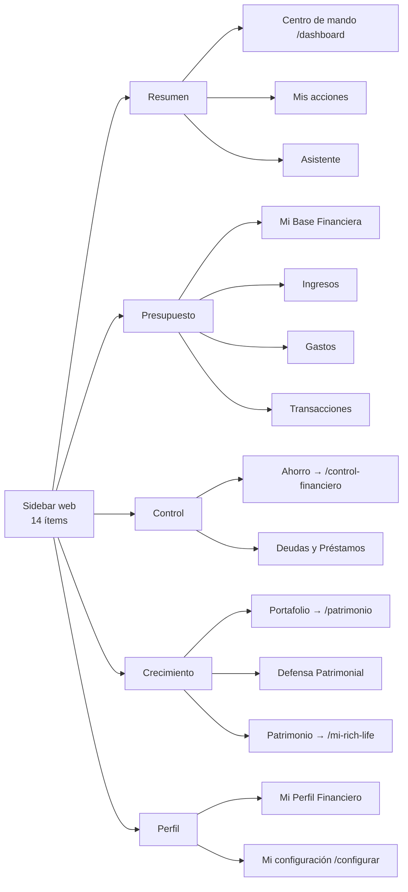
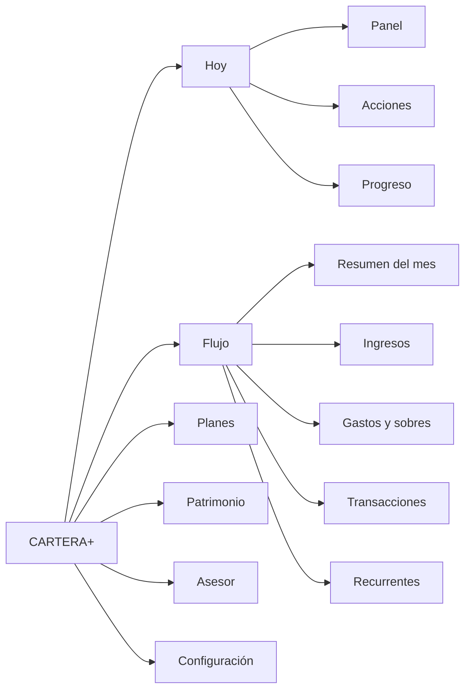
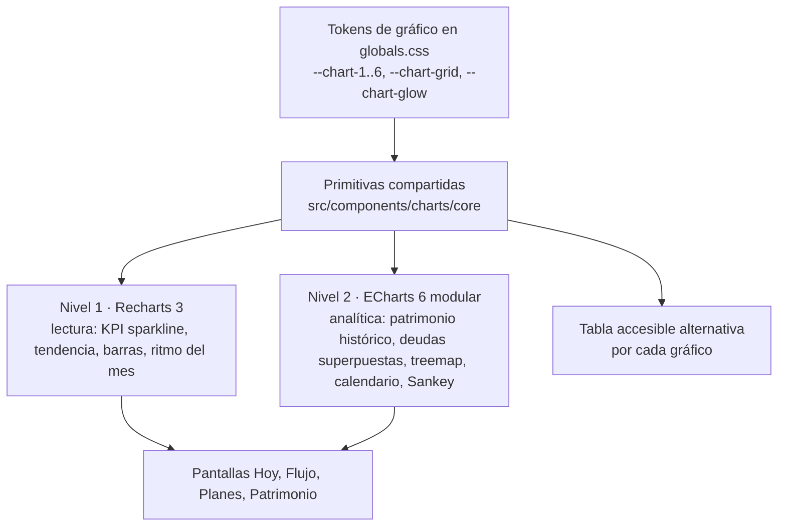
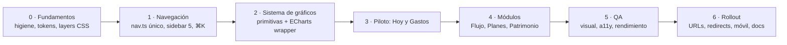

# CARTERA+ — Blueprint de rediseño UX y visualización

2026-09-16 · Memo (con Elsa)

Fase 1: INVESTIGAR → ENTENDER → AUDITAR → COMPARAR → DISEÑAR → PROPONER → PLANIFICAR. Sin cambios a producción.

## 1. Executive diagnosis

CARTERA+ tiene la profundidad funcional de un producto de 160 000 líneas de TypeScript (10 módulos, 19 rutas de app web más 14 públicas y de auth, 23 rutas móviles, 136 migraciones), pero su superficie fue creciendo módulo por módulo y hoy expone tres vocabularios distintos, cuatro sistemas de filtro incompatibles y una capa de gráficos que no cumple la promesa «premium». Nada de esto exige reescribir la app: exige una capa de presentación coherente sobre un backend que ya está bien construido.

**Lo que se verificó en el repo (rama `main`, commit `cf697468`, 16-sep-2026):**

| # | Problema estructural | Evidencia | Impacto |
| --- | --- | --- | --- |
| 1 | **Tres vocabularios compiten por el mismo modelo mental.** El sidebar agrupa en Resumen · Presupuesto · Control · Crecimiento · Perfil; el riel de etapas de Mis acciones usa Estabilidad → Protección mínima → Sin deuda cara → Crecimiento inicial → Crecimiento estructurado; la landing vende Control → Base → Crecimiento → Libertad. | `src/lib/constants/nav.ts`, `modules/actions/components/stage-rail.tsx`, landing | El usuario nunca recibe un solo mapa de «dónde estoy y qué sigue». |
| 2 | **Los nombres del menú no coinciden con las rutas ni entre web y móvil.** «Ahorro» → `/control-financiero`; «Patrimonio» → `/mi-rich-life`; «Portafolio de inversiones» → `/patrimonio`; «Defensa Patrimonial» → `/patrimonio/proteccion`. En móvil las mismas pantallas se llaman `/m/metas`, `/m/patrimonio`, `/m/inversiones`, `/m/proteccion` y existe `/m/libertad`, sin equivalente web. | `nav.ts` (14 ítems / 5 grupos) vs `m/components/mobile-menu.tsx` (16 ítems / 6 grupos, lista duplicada a mano) | Dos modelos de navegación que ya divergieron («Mercado e indicadores» solo en móvil; «Asistente» ausente del menú móvil). |
| 3 | **La «próxima mejor acción» vive en cinco lugares.** Franja Norte del panel («próxima mejor decisión»), tarjeta en Ahorro, tarjeta en Patrimonio (Rich Life), tarjeta en Crecimiento del portafolio (`growth-view.tsx`) y el módulo Mis acciones, que según su propio comentario «es el único lugar donde viven las recomendaciones». Las alertas se reparten entre la campana (Observations), «Perspectivas de My Agent C+», «Alertas» en Ahorro y las tarjetas del Ritmo. | `dashboard-view.tsx`, `control-dashboard.tsx`, `rich-life-dashboard.tsx`, `actions-view.tsx` | KPIs y consejos duplicados con pesos visuales iguales; el panel abre con una alerta falsa conocida (tarjeta BAC en ₡0). |
| 4 | **Cuatro sistemas de filtro que no se hablan.** `?period=YYYY-MM` (selector de mes, 17 meses atrás), `?range=1m/3m/6m/ytd/all` (solo Gastos), `?cat=` (Transacciones), `?asOf` (frascos), `?tab=` (Mis acciones) y un `base-tabs.tsx` de pestañas por `#hash` que ya nadie importa (código muerto). No hay periodo global, ni persistencia al navegar, ni indicador de «qué datos estoy viendo». | `period-selector.tsx`, `expense-range-control.tsx`, `transactions-browser.tsx`, `base-tabs.tsx` | Cada pantalla responde a un «cuándo» distinto; comparar módulos exige recordar el estado de cada uno. |
| 5 | **Los gráficos son tres wrappers de Recharts sin interacción real.** `PerformanceChart` (área), `PremiumLineChart` y `DonutChart`: `isAnimationActive={false}` en todos, sin crosshair sincronizado, sin brush ni zoom, sin drill-down, tooltip nativo con `contentStyle`, sin comparación de periodo. Además 37 archivos dibujan SVG a mano (barras, escaleras, termómetros), cada uno con su propio estilo. | `src/components/charts/*` (7 archivos, 611 líneas), `grep <svg` en módulos | «Alta tecnología» prometida, sparklines estáticos entregados. |
| 6 | **Los gráficos no son accesibles.** Los wrappers de área y línea envuelven el SVG en `aria-hidden="true"` con un `role="img"` genérico («Gráfico de área: rendimiento»); en ninguno de los tres se activa `accessibilityLayer` de Recharts 3, así que no hay navegación por teclado ni lectura de valores. | `area-chart.tsx` líneas 100-102 | Un usuario con lector de pantalla no recibe ningún dato de ningún gráfico. |
| 7 | **La búsqueda ⌘K es decorativa.** El topbar muestra un campo «Buscar cuentas, inversiones…» con un `kbd ⌘K`, pero no hay paleta de comandos ni handler de teclado. | `topbar.tsx` líneas 41-44; `grep metaKey` solo en el chat | Un control visible que no hace nada erosiona la confianza en el resto. |
| 8 | **El panel principal es una pila de siete bloques con el mismo peso.** Saludo → Observaciones → SetupHub → Norte → 4 pilares → Salud + donut de composición → Perspectivas. La composición de gastos (donut) pertenece a Gastos, no al Home; el hub de configuración sigue apareciendo después de completar. | `dashboard/page.tsx`, `dashboard-view.tsx` | Falla la prueba de 5 segundos: no hay un dato principal ni una jerarquía. |
| 9 | **Integridad financiera con grietas conocidas.** Portafolio: invertido ₡2 703 880, valor ₡2 818 015, pero «rendimiento YTD +57 %». Rich Life no dibuja la serie histórica aunque `net_worth_snapshots` tiene 12 puntos. | Inventario de la cuenta demo (1-sep-2026) | Un gráfico premium sobre una cifra incorrecta empeora el problema. |
| 10 | **Design system sólido pero monolítico.** Tokens bien definidos (paleta cálida, Sora/Manrope/Space Mono, radios, elevaciones, colores semánticos por dominio `--c-income … --c-networth`), pero en un `globals.css` de 7 614 líneas por clases, con la lección de colisiones con Tailwind aprendida tres veces. | `src/app/globals.css` | Cada pantalla nueva reinventa tarjetas y encabezados; no existen tokens de gráfico. |

**Lo que está bien y hay que proteger:** la arquitectura por módulos con barrel exports, la transacción como hecho único (`linked-transaction-service`), el motor de insights con auto-resolución, el Priority Engine de deudas, el Rich Life engine puro y testeado, los 309 archivos de test, el streaming con Suspense y skeletons, la carga diferida de Recharts, y la identidad visual cálida (crema + verde `#378451`) que ya distingue a la marca del «SaaS azul» genérico.

**Conclusión ejecutiva:** el problema no es de funcionalidad ni de datos, es de **arquitectura de presentación**: un solo modelo mental, un solo sistema de filtros, un solo sistema de gráficos y un solo lugar para las recomendaciones. La sección 6 propone el modelo, la 14 la tecnología y la 24 el orden de ejecución.

## 2. Current product map

Stack verificado: Next.js 16.3.4 (App Router, RSC), React 19.2.8, TypeScript strict, Tailwind v4 + `globals.css` por clases, Supabase (auth, Postgres, RLS), Gemini como IA, Recharts 3.10, Motion 12, Radix UI 1.6, Capacitor 7 para la app móvil (`/m`), Stripe, Sentry, Upstash Redis. Diez módulos en `src/modules/` (financial-base 24 707 líneas, wealth 19 730, control 10 895, personal-profile 6 426, setup 3 317, account 3 056, dashboard 3 006, rich-life 2 634, actions 2 529, assistant 845).

| Ruta | Pantalla | Job del usuario | Datos principales | Acciones | Visualizaciones | Filtros | Depende de | Issues UX / técnicos |
| --- | --- | --- | --- | --- | --- | --- | --- | --- |
| `/dashboard` | Centro de mando | ¿Cómo estoy hoy? | `getDashboardData` (BaseSummary, HealthScore, PanelVM, insights) | Ir a configurar, links a pilares | Donut composición (Recharts), barras SVG de salud, franja Norte | Ninguno (mes en curso implícito) | Todos los módulos | 7 bloques sin jerarquía; alerta falsa; donut fuera de lugar; SetupHub persistente |
| `/mis-acciones` | Mis acciones | ¿Qué hago este mes? | Acciones priorizadas, decisión de excedente, etapas | Marcar hecha, elegir decisión, comparador de deuda | Riel de 5 etapas (SVG), tarjetas | `?tab=mes\|decisiones\|progreso` | control, wealth, rich-life | Buen concepto; sus etapas no coinciden con el menú ni con la landing |
| `/asistente` | My Agent C+ | Preguntar y registrar por chat | Conversación, propuestas de transacción | Confirmar propuesta (ReceiptConfirmCard) | Ninguna | — | assistant, financial-base | Sin entrada contextual desde tarjetas; sin gráficos en respuesta |
| `/mi-base-financiera` | Mi Base Financiera | ¿Cómo cerró el mes vs plan? | `loadBaseView`: presupuesto vs real, flujo libre, liquidez | Copiar mes anterior, registrar ingreso, importar CSV, transferir | A: ingresos real vs presup. (área) · B: gastos real vs presup. · C: flujo libre (línea) · D/E donuts · Top 10 | `?period=YYYY-MM` | financial-base | 8 métricas iguales (Ingresos presup., reales, Gastos presup., reales, Flujo, % flujo libre, Ratio, Presión); nombre «Base» no describe un resumen de flujo |
| `/ingresos` | Ingresos | ¿Cuánto entra y de dónde? | Fuentes de ingreso, histórico | Registrar, recurrentes | Histórico (área), composición por fuente (donut), Top 10 | `?period`, `income-range-filter` | financial-base | Sin esperado vs real por fuente, sin calendario, sin concentración |
| `/gastos` | Gastos (frascos) | ¿Dónde se va el dinero? | Frascos/sobres (6 grupos + 4 vinculados), rango, ritmo, ociosos | Nuevo sobre, editar presupuesto (modal 3 avisos), pago vinculado, escanear recibo | Histórico (área), categorías (donut), barras de frascos, RitmoPanel | `?range=1m\|3m\|6m\|ytd\|all`, `?asOf` | financial-base, control, wealth | La pantalla más rica y la más densa; sin drill-down frasco → transacción; sin comercios; sin anomalías |
| `/transacciones` | Transacciones | Revisar y clasificar | Lista, por revisar (correo), por clasificar, conciliación | Clasificar, vincular 1-tap, editar, borrar, reglas | Ninguna | `?cat=`, búsqueda texto | financial-base, ingestion | Sin totales del filtro, sin filtro por miembro/sobre/comercio, sin atajos de teclado |
| `/control-financiero` | Ahorro | ¿Avanzan mis metas? | Score de control, metas, plan 30 días, alertas | Aportar, retirar, gastar de meta | Barras SVG de progreso | — | control | Nombre «Ahorro» vs ruta `control-financiero`; duplica «próxima mejor acción» |
| `/deudas`, `/deudas/[id]` | Deudas y Préstamos | ¿Cuándo quedo libre y a qué costo? | Deudas, pagos, estrategia avalancha/bola de nieve, calculadora | Pagar, abonar extra, simular | Curva de saldo (área), comparador | — | control | La mejor pantalla hoy; sin curva por deuda superpuesta ni escenarios interactivos |
| `/patrimonio` | Portafolio de inversiones | ¿Cómo rinden mis inversiones? | Holdings, precios vivos, dividendos, aportes DCA, snapshots | Agregar holding, aporte, alertas de precio, calculadora compuesta | Valor (área), asignación (donut), FundMonitor | Periodo del snapshot | wealth, market-data | +57 % contradictorio; la ruta se llama «patrimonio» pero es portafolio |
| `/patrimonio/proteccion` | Defensa Patrimonial | ¿Estoy protegido? | Pólizas, fondos de emergencia/paz, exposición | Agregar póliza, definir fondos | Barras SVG de cobertura | — | wealth | Sin vencimientos ni renovaciones en primer plano |
| `/patrimonio/indicadores` | Mercado e indicadores | ¿Qué pasa afuera? | Indicadores BCCR/mercado | — | 3 áreas + «Qué significa para ti» | — | economic-indicators | No está en el menú web |
| `/mi-rich-life` | Patrimonio (Rich Life) | ¿Me hago más rico? | Activos, pasivos, patrimonio neto, 14 indicadores, score, escalera | Registrar activo/pasivo, definir estilo de vida | Donuts activos/pasivos, termómetro, escalera de hitos | — | rich-life, wealth, control | No muestra la serie histórica; nombre interno «Rich Life» vs menú «Patrimonio» |
| `/mi-perfil-financiero` | Perfil financiero | Definir mi ADN financiero, hogar | Perfil, miembros, invitaciones | Wizard, invitar | «Tu lectura» | — | personal-profile | Mezcla identidad, hogar y diagnóstico |
| `/configurar`, `/configurar/[wizard]` | Mi configuración | Armar el sistema (4 asistentes) | Progreso derivado del dato | Wizards | Tarjetas 0/4 | — | setup | Correcto como onboarding; no debe vivir en el menú permanente |
| `/configuracion`, `/suscripcion` | Cuenta | Plan, moneda, TZ, correo, exportar | account | Cambiar plan, exportar XLSX | — | — | account, billing | Dos rutas para «configuración» (`/configurar` vs `/configuracion`) |
| `/m/*` (23 rutas, 17 de app) | App móvil Capacitor | Todo lo anterior en teléfono | Mismos servicios | Mismas acciones | Versiones propias | Propios | Todos | Menú duplicado a mano; `/m/libertad` y `/m/indicadores` sin par web |

**Funcionalidades que existen y no se ven en el menú:** ingesta por correo (`/api/ingest/*`, bandeja Por revisar), reglas de categorización (`rules-panel`), conciliación del mes, brecha DCA (`aporte_pendiente`), alertas de precio, exportación XLSX, referidos, memoria conductual (`memory-panel`), cambio de moneda de visualización (topbar), tema claro/oscuro, hogar con miembros e invitaciones.

**Estados:** 15 archivos `loading.tsx`/`error.tsx`, `EmptyState`/`ChartEmpty`/skeletons en 119 usos. Cubre carga, vacío y error; **no** cubre datos parciales («score con datos incompletos»), vacío por filtro ni sin conexión.

**Roles:** hogar con `owner` / `adult` / `dependents`; sin filtro por miembro en ninguna pantalla.

## 3. Current navigation map

El sidebar web tiene 14 destinos en 5 grupos; el menú móvil (`/m`) tiene 16 en 6 grupos, mantenido como una segunda lista escrita a mano; la barra inferior del web responsivo muestra 6. Tres listas, ninguna derivada de la otra.

Lectura: el grupo «Presupuesto» contiene el flujo de dinero completo (no solo presupuesto); «Control» junta metas y deudas bajo un nombre que la app también usa para el score; «Crecimiento» pone la protección entre inversiones y patrimonio.

| Superficie | Destinos | Grupos | Diferencias con el sidebar web |
| --- | --- | --- | --- |
| Sidebar web (`nav.ts`) | 14 | 5 | — |
| Barra inferior web responsivo (`BOTTOM_NAV`) | 6 | — | Centro de mando · Asistente · Base · Ahorro · Portafolio · Patrimonio; sin Gastos ni Transacciones, las dos pantallas de uso diario |
| Menú móvil `/m` (`mobile-menu.tsx`) | 16 | 6 | Agrega «Mercado e indicadores» y «Ajustes de la cuenta»; quita «Asistente»; «Inicio» en vez de «Centro de mando»; se abre con ☰ o swipe desde el borde |
| Topbar web | búsqueda ⌘K (inactiva), moneda, campana, ajustes, tema | — | La campana es hoy el único «centro de acciones» transversal |

**Navegación contextual existente:** pestañas por `?tab=` en Mis acciones (el componente `base-tabs.tsx` de pestañas por hash existe pero no se usa), deep-links `?new=holding|debt|policy|goal` desde los frascos vinculados, `?cat=` de frasco a transacciones, breadcrumb «Resumen / Panel» en el topbar. No hay breadcrumbs reales, ni recientes, ni favoritos, ni atajos.

## 4. User mental model analysis

Una persona no piensa su dinero en módulos de software ni en etapas de un programa: piensa en **cuatro preguntas recurrentes**, en este orden de frecuencia: «¿cómo voy?» (diario), «¿en qué se me fue?» (semanal), «¿avanzo en lo que me propuse?» (mensual) y «¿cuánto tengo y hacia dónde va?» (trimestral). CARTERA+ debe organizarse alrededor de esas preguntas, y usar el viaje ORDEN → CONTROL → CRECIMIENTO → LIBERTAD como **indicador de progreso**, no como menú.

**Por qué el viaje no debe ser el menú.** Si el sidebar se llamara Orden / Control / Crecimiento / Libertad, la pantalla de deudas tendría que vivir en «Control» aunque el usuario ya esté en «Crecimiento», y el usuario nuevo no sabría que «Orden» contiene sus gastos. Los referentes que mejor funcionan (Copilot, Monarch, Stripe) nombran los destinos por el **objeto** que contienen (Transactions, Recurring, Goals, Investments), y comunican el progreso con estados y widgets, no con la estructura. El riel de etapas que ya existe en Mis acciones es exactamente el lugar correcto para el viaje.

**Los cuatro núcleos del modelo mental y lo que cada uno contiene:**

| Núcleo | Pregunta | Frecuencia | Objetos que agrupa | Estado hoy en CARTERA+ |
| --- | --- | --- | --- | --- |
| **Hoy** | ¿Cómo voy y qué debo hacer? | Diario | Panel, acciones pendientes, alertas, asesor | Repartido en Centro de mando, Mis acciones, campana y Asistente |
| **Flujo** | ¿Cuánto entra, cuánto sale y en qué? | Semanal | Ingresos, gastos/sobres, transacciones, recurrentes, presupuesto vs real | Grupo «Presupuesto» con 4 destinos y «Base» como resumen sin nombre claro |
| **Planes** | ¿Avanzo en lo que me propuse? | Mensual | Metas de ahorro, deudas, fondos de emergencia y paz | Grupo «Control»; los fondos viven en Defensa |
| **Patrimonio** | ¿Cuánto tengo, cómo rinde, qué tan protegido y qué tan cerca de la libertad? | Trimestral | Patrimonio neto, inversiones, protección, libertad, indicadores externos | Grupo «Crecimiento» con nombres cruzados |

**Principios que se derivan (y gobiernan las secciones 5-11):**

1. **Un núcleo, una pantalla de resumen, N pestañas de detalle.** Cada núcleo abre con un resumen que responde su pregunta en 5 segundos y ofrece las pestañas de detalle. Así el sidebar baja de 14 a 5 destinos sin perder ninguna pantalla.
2. **Las recomendaciones tienen un solo hogar.** «Tu próxima mejor acción» se calcula una vez y se muestra en Hoy; los módulos muestran solo la acción de su dominio como enlace a ese hogar.
3. **El tiempo es global; la dimensión es local.** El periodo (mes o rango) se elige una vez y viaja con el usuario; categoría, sobre, comercio, cuenta y miembro se eligen en cada pantalla y se muestran siempre como chips visibles.
4. **Cada cifra viene con su comparación y su explicación.** Contra el periodo anterior, contra el presupuesto o contra la meta; y un «por qué» a un clic (tooltip o drill-down), nunca un párrafo inline.
5. **Del qué al por qué en un paso.** Todo gráfico agregado baja a su lista de transacciones u objetos con un clic o un toque.
6. **El viaje es visible, no estructural.** Un solo riel de etapas (el de Mis acciones) reemplaza los tres vocabularios y aparece en Hoy y en el perfil.

**Comportamiento financiero que el modelo debe respetar** (de la investigación, sección 19): encuadre sin juicio («gastaste 20 % más en restaurantes», no «dejá de gastar»), un valor principal por pantalla, divulgación progresiva, y estados explícitos en metas y deudas (al día / adelantado / en riesgo) que convierten el progreso en acción. Esto coincide con la regla de tono de la marca: la carencia es de criterio, no de carácter.

## 5. Information architecture options

Se evaluaron tres arquitecturas contra ocho criterios. La opción C (núcleos por pregunta) gana en discoverability y escalabilidad; la A (viaje) es la más fiel a la marca pero la peor para encontrar cosas; la B (objetos planos, propuesta en el brief) es la más usada en la industria pero deja 8 grupos y 18 destinos.

**Opción A — El viaje como menú (ORDEN · CONTROL · CRECIMIENTO · LIBERTAD)**

- Orden: Transacciones, Ingresos, Gastos, Presupuesto · Control: Metas, Deudas, Fondo de emergencia · Crecimiento: Inversiones, Patrimonio, Protección · Libertad: Rich Life, Escenarios · + Hoy y Asesor fuera del viaje.
- Modelo mental: «avanzo por etapas». Ventaja: coherencia total con la landing y la promesa. Desventajas: nombres abstractos para el usuario nuevo (¿dónde están mis deudas?), un usuario en «Crecimiento» sigue necesitando «Orden» a diario, y agregar un módulo (p. ej. impuestos) obliga a decidir a qué etapa pertenece.

**Opción B — Objetos planos (el candidato del brief)**

- Home · Movimiento del dinero (Ingresos, Gastos, Transacciones, Recurrencias) · Planificación (Presupuesto, Sobres, Metas, Ahorro) · Obligaciones (Deudas) · Crecimiento (Inversiones, Patrimonio) · Protección (Seguros) · Futuro (Libertad) · Acciones (Alertas, Recomendaciones, Pendientes).
- Modelo mental: «cada cosa en su cajón», el estándar de Monarch/Copilot. Ventaja: nada queda escondido. Desventajas: 8 grupos y \~18 destinos es más de lo que hay hoy; «Obligaciones» y «Protección» son grupos de un solo ítem; Sobres y Gastos son la misma pantalla en CARTERA+ (los frascos son la vista de gastos); Presupuesto y Ahorro se separan de Gastos y Metas aunque comparten datos.

**Opción C — Núcleos por pregunta con pestañas (recomendada)**

- Hoy · Flujo · Planes · Patrimonio · Asesor, y Configuración al pie. Cada núcleo abre en un resumen y despliega pestañas (ver sección 6).
- Modelo mental: «cuatro preguntas, cuatro lugares». Ventaja: 5 destinos visibles, dos niveles como máximo, cada pantalla actual conserva su lugar, y una función nueva se agrega como pestaña sin tocar el sidebar. Desventaja: exige que cada resumen sea bueno (si el resumen de Flujo es débil, el usuario tiene un clic más para llegar a Gastos); se mitiga con pestañas visibles al entrar y con la paleta ⌘K.

| Criterio | A · Viaje | B · Objetos planos | C · Núcleos + pestañas |
| --- | --- | --- | --- |
| Modelo mental | Etapas del programa | Objetos financieros | Preguntas del usuario |
| Destinos de primer nivel | 4 + 2 = 6 | 8 grupos / \~18 ítems | 5 + Configuración |
| Niveles | 2 | 2 (grupo → ítem) | 2 (núcleo → pestaña) |
| Esfuerzo cognitivo inicial | Alto (nombres abstractos) | Bajo | Bajo |
| Discoverability | Baja | Alta | Alta (con pestañas visibles) |
| Escalabilidad | Baja | Media (sidebar crece) | Alta (pestañas crecen) |
| Coherencia con la marca | Total | Neutra | Alta si el riel del viaje vive en Hoy |
| Costo de migración | Alto (renombrar todo) | Medio | Bajo (reagrupar rutas existentes) |
| Riesgo principal | Usuario perdido | Sidebar largo | Resúmenes débiles |

**Decisión propuesta:** C, con dos préstamos: de A, el riel del viaje como indicador de progreso en Hoy; de B, «Recurrentes» como pestaña nueva en Flujo y un centro de acciones único.

## 6. Recommended information architecture

Cinco núcleos, cada uno con un resumen y sus pestañas; ninguna pantalla actual desaparece, solo cambia de lugar y de nombre. Las rutas actuales se conservan en la fase 1 (solo cambia el menú); la consolidación de URLs con redirecciones 301 es un paso posterior (sección 23).

| Núcleo | Pestaña | Pantalla actual que absorbe | Ruta hoy | Nota |
| --- | --- | --- | --- | --- |
| **Hoy** | Panel | Centro de mando | `/dashboard` | Se rediseña (sección 10) |
| Hoy | Acciones | Mis acciones · mes + decisiones | `/mis-acciones` | Único hogar de recomendaciones y alertas |
| Hoy | Progreso | Mis acciones · progreso + riel de etapas + Salud/Score de control | `/mis-acciones?tab=progreso` | El viaje ORDEN → LIBERTAD vive aquí |
| **Flujo** | Resumen del mes | Mi Base Financiera | `/mi-base-financiera` | Presupuesto vs real, flujo libre, liquidez |
| Flujo | Ingresos | Ingresos | `/ingresos` |  |
| Flujo | Gastos y sobres | Gastos (frascos) | `/gastos` | Presupuesto por sobre vive aquí, no en una pantalla aparte |
| Flujo | Transacciones | Transacciones + Por revisar + Conciliación | `/transacciones` | Bandeja de revisión con contador en el menú |
| Flujo | Recurrentes | **Nueva**: cobros y pagos recurrentes con estado y calendario | — | Datos ya existen en `budget_items` recurrentes, deudas y aportes DCA |
| **Planes** | Metas | Ahorro (control) | `/control-financiero` | Renombrar: el usuario busca «metas», como en móvil (`/m/metas`) |
| Planes | Deudas | Deudas y Préstamos | `/deudas` |  |
| Planes | Fondos | Fondo de emergencia y fondo de paz (hoy en Defensa) | `/patrimonio/proteccion#fondos` | Son metas de colchón; conceptualmente son planes |
| **Patrimonio** | Resumen | Patrimonio / Rich Life | `/mi-rich-life` | Patrimonio neto, activos vs pasivos, serie histórica |
| Patrimonio | Inversiones | Portafolio de inversiones | `/patrimonio` | Ruta futura `/patrimonio/inversiones` |
| Patrimonio | Protección | Defensa Patrimonial (pólizas y exposición) | `/patrimonio/proteccion` |  |
| Patrimonio | Libertad | Termómetro, escalera de hitos, escenarios | hoy dentro de `/mi-rich-life`; `/m/libertad` en móvil | Se separa como pestaña con supuestos visibles |
| Patrimonio | Indicadores | Mercado e indicadores | `/patrimonio/indicadores` | Entra al menú web |
| **Asesor** | Chat | My Agent C+ | `/asistente` | Con entrada contextual desde cualquier tarjeta |
| **Configuración** (pie) | Perfil financiero · Hogar · Cuenta y plan · Asistentes de configuración · Correo e importación · Categorías y reglas | `/mi-perfil-financiero`, `/configuracion`, `/configurar`, `/suscripcion` | Sale del menú principal; «Mi configuración» (wizards) queda como tarjeta de Hoy hasta completar y luego aquí |  |

**Reglas de la arquitectura:**

- **Un solo modelo de navegación en código.** `nav.ts` describe núcleos y pestañas con sus rutas web y `/m`; el sidebar, la barra inferior y el menú móvil se derivan de él. Elimina la lista duplicada de `mobile-menu.tsx`.
- **Las pestañas viven en la URL** (`?tab=` o subruta), nunca en `#hash`, para que un enlace compartido y el botón atrás funcionen.
- **Dos niveles máximo.** Detalle de una deuda, un holding o una meta es una vista de detalle (drawer o página hija), no un tercer nivel del menú.
- **Los contadores se derivan del dato:** «Acciones» muestra pendientes, «Transacciones» muestra por revisar, igual que `navBadges` hoy.

## 7. Navigation proposal

La navegación se reparte en tres capas: **global** (sidebar de 5 + barra superior), **de núcleo** (pestañas bajo el título) y **contextual** (drill-down, enlaces cruzados, paleta ⌘K). Todo lo que no es una de esas tres capas se elimina.

**Sidebar web (escritorio y tablet ≥ 1024 px)**

| Ítem | Icono | Contador | Destino |
| --- | --- | --- | --- |
| Hoy | casa | acciones pendientes | `/dashboard` |
| Flujo | flechas | transacciones por revisar | `/mi-base-financiera` (resumen) |
| Planes | bandera | metas en riesgo | `/control-financiero` |
| Patrimonio | edificio/columna | — | `/mi-rich-life` |
| Asesor | isotipo C+ | — | `/asistente` |
| (pie) Configuración · usuario · salir | engrane | — | `/configuracion` |

- Ancho 248 px (se conserva `--sidebar-w`), colapsable a 64 px con solo iconos (tooltip con el nombre); el estado colapsado se recuerda por navegador.
- Sin subgrupos ni etiquetas de sección: 5 ítems planos. Las pestañas del núcleo activo pueden desplegarse debajo del ítem cuando el sidebar está expandido (patrón Linear), pero es opcional; la barra de pestañas de la página es la fuente de verdad.
- El riel del viaje (Estabilidad → … → Crecimiento estructurado) aparece como una franja compacta al pie del sidebar: etapa actual y siguiente hito. Enlaza a Hoy → Progreso.

**Barra superior**

- Izquierda: título del núcleo y breadcrumb real (Flujo / Gastos / Supermercado) generado desde `nav.ts`.
- Centro: **selector de periodo global** (mes con flechas ‹ ›, o rango 3m / 6m / 12m / año / personalizado) con chip de comparación («vs mes anterior»). Es el único control de tiempo de la app; persiste en URL (`?p=2026-09` o `?p=2026-04..2026-09`) y en `localStorage` para la próxima visita.
- Derecha: búsqueda / paleta ⌘K (real), moneda de visualización, ocultar montos (ojo), campana, tema, avatar.

**Paleta de comandos ⌘K / Ctrl K** (`cmdk`, base de `Command` en shadcn): ir a cualquier pantalla o pestaña; buscar transacciones, holdings, deudas, metas y sobres por nombre; acciones rápidas («Registrar gasto», «Registrar ingreso», «Aportar a meta», «Preguntar al asesor»); cambiar periodo («ir a agosto»). Sustituye el campo decorativo actual.

**Móvil (app `/m` y web < 768 px)**

- Barra inferior de 5: Hoy · Flujo · Planes · Patrimonio · Asesor. El isotipo C+ del Asesor en disco blanco, como manda la regla de marca.
- Botón flotante «+» sobre la barra (registrar gasto / ingreso / escanear recibo), que ya existe como `quick-add-buttons` en Flujo y pasa a ser global.
- Las pestañas del núcleo van como segmented control horizontal bajo el título, con scroll.
- El menú ☰ desaparece: todo es alcanzable con barra + pestañas + avatar (Configuración). Se mantiene el swipe desde el borde solo para «atrás».
- El selector de periodo va bajo el título, no arriba (Copilot lo hace así en iOS por alcance del pulgar).

**Navegación contextual (la que más reduce clics):**

- Cada KPI enlaza a su pestaña con el periodo activo.
- Cada segmento de gráfico enlaza a Transacciones con `?cat=`, `?sobre=`, `?comercio=` y el periodo.
- Cada objeto (deuda, meta, holding, póliza) abre en un drawer lateral en escritorio y en una página hija en móvil.
- Cada tarjeta lleva un icono de destello que abre el Asesor con el contexto de esa tarjeta («¿por qué subió mi gasto en transporte?»).
- Breadcrumb y botón «atrás» consistentes porque las pestañas viven en la URL.

**Qué se elimina:** los grupos Resumen/Presupuesto/Control/Crecimiento/Perfil, la lista `MENU` duplicada del móvil, el campo de búsqueda sin función, el ítem permanente «Mi configuración» (pasa a Configuración y a la tarjeta de Hoy mientras falte algo), y las pestañas por `#hash`.

## 8. Screen inventory

Después de la reorganización existen 19 pantallas de producto (17 hoy más Recurrentes y Libertad como pantallas propias), 6 vistas de detalle y 6 pantallas de cuenta/configuración. Cada una lleva su pregunta, su dato principal y su tipo de plantilla, para que ninguna se diseñe desde cero.

| # | Pantalla | Existe para responder… | Dato principal | Plantilla | Origen |
| --- | --- | --- | --- | --- | --- |
| 1 | Hoy · Panel | ¿Cómo voy hoy y qué hago? | Libre para gastar + veredicto patrimonial | Historia (sección 10) | Rediseño |
| 2 | Hoy · Acciones | ¿Qué acciones y decisiones tengo pendientes? | N.º de acciones y su impacto | Bandeja | Mis acciones |
| 3 | Hoy · Progreso | ¿En qué etapa estoy y qué me falta? | Etapa actual del viaje | Riel + score | Mis acciones + Salud |
| 4 | Flujo · Resumen del mes | ¿Cerré el mes como lo planeé? | Flujo libre real vs presupuestado | Dashboard analítico | Mi Base Financiera |
| 5 | Flujo · Ingresos | ¿Cuánto entró, de dónde y qué tan estable? | Ingreso del periodo vs esperado | Dashboard analítico | Ingresos |
| 6 | Flujo · Gastos y sobres | ¿Dónde se va el dinero y cuánto queda por sobre? | Gasto del periodo vs presupuesto | Dashboard analítico + lista de sobres | Gastos |
| 7 | Flujo · Transacciones | ¿Qué movimientos hubo y cuáles faltan por revisar? | Total del filtro activo | Tabla con bandeja | Transacciones |
| 8 | Flujo · Recurrentes | ¿Qué se cobra y se paga solo, y cuándo? | Compromisos próximos 30 días | Calendario + lista | **Nueva** |
| 9 | Planes · Metas | ¿Avanzo al ritmo necesario? | Metas al día / en riesgo | Tarjetas con estado | Ahorro |
| 10 | Planes · Deudas | ¿Cuándo quedo libre y cuánto me cuesta? | Fecha libre de deudas + intereses | Dashboard analítico | Deudas |
| 11 | Planes · Fondos | ¿Cuántos meses de colchón tengo? | Meses cubiertos | Medidor + metas | Defensa (fondos) |
| 12 | Patrimonio · Resumen | ¿Me estoy haciendo más rico? | Patrimonio neto y su variación | Dashboard analítico | Rich Life |
| 13 | Patrimonio · Inversiones | ¿Cómo rinden y cómo están repartidas? | Valor actual, aportes vs crecimiento | Dashboard analítico | Portafolio |
| 14 | Patrimonio · Protección | ¿Qué tengo cubierto y qué vence? | Cobertura y próximo vencimiento | Mapa de cobertura | Defensa (pólizas) |
| 15 | Patrimonio · Libertad | ¿Qué tan cerca estoy y qué la acerca? | % del capital objetivo | Escenarios con supuestos | Rich Life (termómetro, escalera) + `/m/libertad` |
| 16 | Patrimonio · Indicadores | ¿Qué pasa afuera y qué me afecta? | Tipo de cambio, tasas, inflación | Series + lectura | Indicadores |
| 17 | Asesor | Preguntar, registrar, decidir | Conversación | Chat con tarjetas | Asistente |
| 18 | Sin plan / reanudar | Volver a activar el plan | — | Muro | `/suscripcion`, `/m/sin-plan` |
| 19 | Bienvenida | Primer día | — | Onboarding | `/bienvenida` |

**Vistas de detalle (drawer en escritorio, página hija en móvil):** deuda (`/deudas/[id]`), holding (hoy `holding-detail-modal`), meta (hoy `goal-detail-button`), sobre (hoy `jar-*-modal`), póliza, transacción (edición y vínculo).

**Cuenta y configuración:** Perfil financiero y ADN, Hogar (miembros e invitaciones), Cuenta y plan (facturación, moneda, zona horaria, notificaciones, exportar, eliminar), Asistentes de configuración (4 wizards), Correo e importación (dirección de ingesta, tarjetas, reglas), Categorías y sobres (gestor de categorías).

**Estados obligatorios por pantalla** (definidos una vez en la plantilla, no por pantalla): cargando (skeleton de la misma altura), vacío por primera vez (enseña el siguiente paso), vacío por filtro («no hay movimientos en abril con este filtro» + limpiar), datos parciales (etiqueta «con datos incompletos» en scores y proyecciones), error (reintentar), sin conexión (móvil), conjunto grande (virtualización en Transacciones).

## 9. Dashboard strategy

Todo dashboard de CARTERA+ cuenta la misma historia en el mismo orden: **qué pasa → por qué → dónde → cómo cambia → qué investigar → qué hacer**. Se materializa en una plantilla única de seis franjas con altura y jerarquía fijas, para que el usuario aprenda a leer una pantalla y sepa leer todas.

| Franja | Pregunta | Componente compartido | Peso visual | Regla |
| --- | --- | --- | --- | --- |
| 1 · Titular | ¿Qué pasa? | `KpiHero`: un número grande (36-44 px, `tabular-nums`, animado con NumberFlow), su comparación (± vs periodo anterior o vs plan) y una frase de lectura sin juicio | Máximo | **Un solo KPI principal por pantalla** |
| 2 · Contexto | ¿Por qué? | `KpiRow`: 3-4 `KpiCard` secundarias (número 20-24 px + delta + sparkline opcional) | Medio | Sin tarjetas dentro de tarjetas; misma altura |
| 3 · Explicación | ¿Dónde y cómo cambia? | `ChartCard` principal (altura fija 320 px escritorio / 220 px móvil) con toolbar: comparar, ver tabla, exportar | Alto | Hover + crosshair + clic → drill-down |
| 4 · Desglose | ¿Dónde exactamente? | `BreakdownCard`: barras ordenadas o treemap con el % del total; clic filtra las demás tarjetas (interacción enlazada) | Medio | Nunca una dona como único desglose |
| 5 · Señales | ¿Qué investigar? | `InsightList`: 1-3 hallazgos determinísticos con cifra, causa y enlace a la evidencia | Medio | Verificables y trazables, nunca alarmistas |
| 6 · Acción | ¿Qué hacer? | `ActionStrip`: la acción del dominio (aportar, ajustar sobre, pagar extra) + «preguntar al asesor» | Medio | Enlaza al hogar único de acciones |

**Qué responde cada dashboard (el KPI titular y las tres preguntas que siguen):**

| Dashboard | KPI titular | Comparación | Preguntas 2-4 |
| --- | --- | --- | --- |
| Hoy · Panel | Libre para gastar este mes | vs ritmo ideal del mes | ¿Me hago más rico? · ¿Qué debo hacer? · ¿Qué viene? |
| Flujo · Resumen | Flujo libre del periodo | vs presupuestado y vs periodo anterior | ¿Ingresos y gastos vs plan? · ¿Liquidez? · ¿Tendencia 12 meses? |
| Flujo · Ingresos | Ingreso del periodo | vs esperado (fuentes recurrentes) | ¿De dónde? · ¿Qué tan estable? · ¿Cuándo entra? |
| Flujo · Gastos | Gasto del periodo | vs presupuesto y vs promedio 3 meses | ¿En qué sobres? · ¿Qué comercios? · ¿Qué cambió o es anómalo? |
| Flujo · Recurrentes | Compromisos de los próximos 30 días | vs mes anterior | ¿Qué ya se pagó? · ¿Qué falta? · ¿Qué subió? |
| Planes · Metas | Aporte necesario este mes | vs aportado | ¿Cuáles van al día? · ¿Cuándo llego? · ¿Qué pasa si aporto más? |
| Planes · Deudas | Fecha libre de deudas | vs plan mínimo | ¿Cuánto pago en intereses? · ¿Cuál ataco primero? · ¿Qué ahorro con un abono extra? |
| Patrimonio · Resumen | Patrimonio neto | vs cierre del mes anterior y hace 12 meses | ¿Activos vs pasivos? · ¿Qué lo movió? · ¿Composición y concentración? |
| Patrimonio · Inversiones | Valor actual | vs capital aportado | ¿Rendimiento (TWR)? · ¿Asignación? · ¿Aportes vs crecimiento? |
| Patrimonio · Protección | Meses de colchón + cobertura | vs objetivo | ¿Qué pólizas? · ¿Qué vence? · ¿Qué riesgo queda sin cubrir? |
| Patrimonio · Libertad | % del capital objetivo | vs hace 12 meses | ¿Cuántos años faltan? · ¿Qué supuestos? · ¿Qué palanca acerca más? |

**Prueba de 5 segundos** (se aplica a cada prototipo antes de aprobarlo): el usuario debe poder decir dónde está (título + pestaña), qué pasa (titular), cuál es el dato importante (solo hay uno grande), si va bien o mal (color + delta + frase) y qué puede explorar (gráfico con affordance de clic). Si hay que leer más de tres números para responder, la jerarquía falla.

**Formato financiero único:** `Intl.NumberFormat('es-CR')` (₡1 234 567, coma decimal, espacio duro como separador), USD con símbolo estrecho, `notation: 'compact'` en ejes (₡1,2 M), `signDisplay: 'exceptZero'` en deltas, y `font-variant-numeric: tabular-nums` en toda cifra. Se centraliza en `src/lib/format.ts` (ya existe) y se prohibe formatear a mano.

## 10. Dashboard master proposal

El panel Hoy responde una sola pregunta en el titular, «¿cuánto puedo gastar sin desviarme?», y debajo las tres que la explican: si me hago más rico, qué debo hacer y qué viene. Pasa de siete bloques iguales a seis franjas con jerarquía; la composición de gastos, el hub de configuración completado y las perspectivas genéricas salen del Home.

| Franja | Contenido | Fuente de datos (existe) | Interacción |
| --- | --- | --- | --- |
| 1 · Titular | **Libre para gastar este mes**: ₡ grande + frase («vas ₡ 42 000 por encima del ritmo ideal») + mini gráfico ritmo ideal vs real (línea punteada vs sólida, día de hoy marcado) | `BaseSummary` (ingresos y gastos del mes), `budget_items` recurrentes, `debt_payments` y aportes planificados | Hover en el gráfico muestra el día; clic → Flujo · Gastos; tooltip «?» con la fórmula |
| 2 · Contexto | 3 tarjetas: **Patrimonio neto** (± vs cierre anterior, con veredicto honesto «en curso» si no hay dos meses cerrados) · **Flujo del mes** (ingresos − gastos reales, vs plan) · **Compromisos próximos 14 días** (monto y cantidad) | `RichLifeIndicators.closedWealthDelta`, `BaseSummary`, recurrentes | Cada tarjeta enlaza a su núcleo con el periodo activo |
| 3 · Acciones | **Tu próxima mejor acción** (una, con su porqué y su impacto en ₡) + hasta 2 pendientes más + contador «ver las N acciones» | Motor de Mis acciones (`getSurplusDecision`, Priority Engine, insights) | Hacer / posponer / preguntar al asesor; enlaza a Hoy · Acciones |
| 4 · Señales | 1-3 **cambios relevantes** del periodo: anomalía, sobre en riesgo («78 % usado, 52 % del mes»), ingreso variable mayor, aporte pendiente | `src/lib/insights` (campana) con severidad | Cada señal lleva a su evidencia (transacciones filtradas o el sobre) |
| 5 · Viaje | Franja compacta del riel: etapa actual, siguiente hito y % del capital de libertad | `stage-rail` + Rich Life score | Enlaza a Hoy · Progreso |
| 6 · Registro | Acceso rápido: registrar gasto · ingreso · escanear · «por revisar (N)» | `quick-add`, `ingest_proposals` | Abre el composer o Transacciones |

**Fórmula del titular (documentada para `financial_integrity`):**

- `libre_para_gastar = ingreso_esperado_mes − gasto_real_a_hoy − compromisos_pendientes_mes`
- `ingreso_esperado_mes` = suma de `budget_items` de ingreso del periodo (recurrentes agendados por `ensureRecurringIncome`), o el ingreso real si ya superó lo esperado.
- `compromisos_pendientes_mes` = cuotas de deuda no pagadas del mes + aportes DCA/metas planificados no ejecutados + líneas de sobres fijos (`source_kind ≠ 'manual'` y recurrentes) aún sin transacción.
- Supuestos visibles en el tooltip: ingresos quincenales hacen que el ritmo ideal no sea lineal, por lo que la línea ideal se construye con las fechas de cobro esperadas cuando existen y con una recta cuando no.
- Casos borde: mes recién abierto (día 1-2) → se muestra el número con etiqueta «mes recién iniciado» y sin veredicto; sin presupuesto → el titular pasa a «Flujo del mes» y la señal invita a repartir el presupuesto.

**Qué se evaluó y NO va en el Home:** savings rate y ratio gasto/ingreso (van en Flujo · Resumen), presupuesto consumido por sobre (Gastos), proyección al cierre (Flujo · Resumen, aunque el titular ya la implica), objetivos individuales (Planes), detalle de deuda (Planes), inversiones y rendimiento (Patrimonio), alertas de precio (Patrimonio · Inversiones), composición de gastos por naturaleza (Gastos), Salud financiera con sus 6 barras (Hoy · Progreso). El criterio: el Home muestra lo que cambia cada día y lo que exige una decisión; todo lo demás vive a un clic.

**Móvil:** mismas seis franjas en una columna; el titular ocupa la primera pantalla completa con el gráfico de ritmo; el registro rápido es el botón flotante.

**Corrección previa obligatoria:** el diagnóstico de deuda del panel lee el ancla (`debts.balance`) en vez del saldo vivo (`recomputeFromPayments`), lo que produce la alerta falsa de la tarjeta BAC. La rama `claude/agitated-wescoff-65711d` ya lo corrige; debe mergearse antes del rediseño del Home.

## 11. Module-by-module analysis

Cada módulo se describe con las preguntas que debe responder, los KPIs y visualizaciones que las responden, lo que ya existe en datos, lo que falta, y las fórmulas que hay que documentar antes de dibujar. Convención de librerías: **R** = Recharts 3 (gráficos de lectura), **E** = ECharts 6 modular (gráficos analíticos), **S** = SVG propio del design system (barras de progreso, medidores).

### Ingresos (Income Intelligence)

- **Responde:** ¿cuánto entró? ¿vs lo esperado? ¿de dónde? ¿qué tan concentrado y estable? ¿cuándo entra? ¿qué fue extraordinario? ¿cómo viene el próximo mes?
- **Titular:** ingreso del periodo vs esperado (fuentes recurrentes agendadas). **Secundarios:** recurrente vs variable, n.º de fuentes y % de la principal (concentración), promedio 6 meses, estabilidad (coeficiente de variación 6-12 meses, mostrado como «estable / variable / irregular»).
- **Visualizaciones:** barras mensuales apiladas por fuente 12-24 meses con línea de esperado (E, con brush para elegir rango) · barras horizontales ordenadas por fuente con % (R) · calendario del mes con días de cobro esperados y reales (E `calendar`) · YoY solo cuando existan ≥ 13 meses.
- **Existe:** `income_sources`, `budget_items` de ingreso por periodo, `ensureRecurringIncome`, histórico y donut por fuente. **Falta:** esperado vs real por fuente, calendario, clasificación extraordinario (regla: > 2× el promedio de esa fuente o fuente sin recurrencia), forecast (media móvil 3 meses de lo variable + recurrentes agendados; etiquetado «estimación»).
- **Drill-down:** fuente → transacciones de ingreso con `?fuente=`.

### Gastos y sobres (Spending Intelligence + Budget Control)

- **Responde:** ¿cuánto gasté? ¿más o menos que antes? ¿por encima del presupuesto? ¿en qué sobres? ¿qué comercios? ¿qué es fijo y qué variable? ¿qué cambió o es anómalo? ¿cuánto me queda por sobre? ¿voy al ritmo?
- **Titular:** gasto del periodo vs presupuesto, con proyección al cierre (`gasto_a_hoy / días_transcurridos × días_del_mes`, ajustada por recurrentes pendientes). **Secundarios:** promedio diario, fijo vs variable (naturaleza, ya existe `expenseByNature`), sobres en riesgo (usado % > día del mes % + 15 pts), mayor gasto individual.
- **Visualizaciones:** trayectoria acumulada ideal vs real del mes con marca de hoy (R, el gráfico que más importa) · treemap o barras ordenadas por sobre/categoría con % del total (E treemap con drill-down grupo → sobre → categoría) · tendencia 12 meses apilada por grupo (E) · top comercios (R barras) · heatmap-calendario de gasto diario (E, opcional en escritorio) · lista de sobres con barra «queda» y estado de color + texto (S, evolución de `jar-row`).
- **Presupuesto como control center dentro de la misma pantalla:** presupuestado · real · comprometido (recurrentes no pagados) · disponible · proyectado, por sobre y total; rollover solo para sobres marcados anuales (marchamo, seguros, aguinaldo). Conexión presupuesto → sobre → categoría → transacción en un clic por nivel.
- **Existe:** frascos con 6 grupos + 4 vinculados, `?range`, `RitmoPanel`, `sobre-ocioso`, top 10, donut, `merchantOrSource` en transacciones. **Falta:** trayectoria del mes, comercios agregados, anomalías (regla: transacción > media + 2σ de su categoría en 6 meses, o categoría > 1,3× su promedio 3 meses), interacción enlazada (clic en sobre filtra tendencia y comercios).

### Transacciones

- **Responde:** ¿qué movimientos hubo con este filtro y cuánto suman? ¿qué falta por revisar o clasificar?
- **Diseño:** bandeja «Por revisar (N)» arriba con atajos (J/K mover, C categoría, R revisado, X seleccionar), totales del filtro (gasto, ingreso, neto) siempre visibles, chips de filtro (periodo global + categoría, sobre, comercio, miembro, origen, monto), tabla virtualizada (TanStack Table v9 + Virtual) con agrupación por día, edición en drawer. Sin gráfico principal: un sparkline del filtro es suficiente.

### Recurrentes (nuevo)

- **Responde:** ¿qué se cobra y se paga solo? ¿cuándo? ¿qué ya pasó y qué falta? ¿qué subió?
- **Fuente:** `budget_items` recurrentes (ingresos y sobres fijos), cuotas de `debts`, aportes DCA de holdings, aportes recurrentes de metas, pólizas con prima. No hace falta tabla nueva: es una vista compuesta con estado pagado / por pagar / inactivo, calendario 30 días (E `calendar` o lista por día) y alimenta la proyección del mes.

### Metas (Planes · Ahorro)

- **Responde:** ¿cuánto llevo y cuánto falta? ¿voy al ritmo? ¿cuándo llego? ¿qué aporte necesito? ¿qué pasa si aporto más?
- **Por meta:** estado **al día / adelantada / en riesgo** (`aporte_mensual_actual` vs `aporte_necesario = (objetivo − acumulado) / meses_restantes`), fecha estimada al ritmo actual (promedio 3 meses de aportes), diferencia contra plan, hitos 25/50/75/100.
- **Visualizaciones:** anillo de progreso con estado (S) · línea acumulado real vs plan lineal (R) · simulador «+₡X al mes» que recalcula la fecha en vivo (input + R). Sin confeti ni medallas: tono adulto.
- **Existe:** metas con `recurrence`, `priority`, `status`, aportes vinculados, retiros. **Falta:** el estado calculado, la fecha estimada y el simulador.

### Deudas (Debt Control Center)

- **Responde:** ¿cuánto debo y a quién? ¿cuándo quedo libre? ¿cuánto pago en intereses? ¿cuál ataco primero? ¿qué ahorro con un abono extra?
- **Titular:** fecha libre de deudas con la estrategia activa. **Secundarios:** deuda total, cuota mensual total, tasa media ponderada, intereses restantes, ratio cuota/ingreso (existe, 32 % en la demo).
- **Visualizaciones:** una curva de saldo por deuda superpuestas con línea sólida (plan actual) y punteada (mínimo o escenario), crosshair compartido (E, `connect` con el gráfico de intereses acumulados) · comparador avalancha vs bola de nieve con la diferencia en ₡ y meses (existe) · desglose principal vs interés por cuota en el detalle (R barras apiladas) · simulador de abono extra mensual o único.
- **Existe:** casi todo (Priority Engine, calculadora, pagos con principal/interés, `recomputeFromPayments`). **Falta:** curvas superpuestas, escenario interactivo, y usar el saldo vivo en el panel. Toda proyección con nota «simulación con la tasa actual; no es asesoría».

### Inversiones (Investment Intelligence)

- **Responde:** ¿cuánto vale? ¿cuánto puse? ¿cuánto gané? ¿cuánto es aporte y cuánto crecimiento? ¿cómo está repartido y qué tan concentrado? ¿qué dividendos recibí?
- **Titular:** valor actual con estimación en vivo marcada (línea discontinua si el precio está en caché). **Secundarios:** capital aportado, ganancia no realizada (₡ y %), **TWR del periodo** con tooltip, dividendos 12 meses.
- **Fórmulas a documentar antes de mostrar:** retorno simple = (valor − aportes) / aportes; TWR = producto de (1 + rᵢ) por subperiodo entre flujos, con `portfolio_snapshots` diarios y `investment_transactions`; benchmark solo si se importa una serie de referencia (no existe hoy). **El +57 % YTD de la demo es un bug que hay que diagnosticar antes de cualquier gráfico nuevo:** probablemente compara contra un snapshot inicial incompleto.
- **Visualizaciones:** valor vs aportes acumulados (área + línea, E con dataZoom y selector 1m/3m/YTD/1a/todo) · barras aporte vs crecimiento por mes (R) · asignación por clase y por holding en barras ordenadas (R) con concentración «tu mayor posición es el 62 %» · tabla de holdings con sparkline y «desde compra».

### Protección

- **Responde:** ¿qué tengo cubierto? ¿cuánto pago en primas? ¿qué vence y cuándo? ¿qué riesgo queda sin cubrir?
- **Diseño:** mapa de cobertura por tipo (vida, salud, vehículo, hogar, otros) con estado cubierto / parcial / sin información, línea de tiempo de vencimientos 12 meses, prima mensual total como parte de Recurrentes, alertas 30/60 días antes de vencer. Fondos de emergencia y paz pasan a Planes · Fondos. Nota fija: «CARTERA+ organiza tu protección; no sustituye a un asesor de seguros».

### Patrimonio · Resumen (Wealth Overview)

- **Responde:** ¿cuánto tengo neto? ¿me hago más rico? ¿qué lo movió? ¿cómo está compuesto?
- **Titular:** patrimonio neto con variación vs cierre anterior y vs 12 meses, y el veredicto honesto de `closedWealthDelta` (dos meses cerrados o «en curso»). **Secundarios:** activos, pasivos, ratio A/P, meses de colchón.
- **Visualizaciones:** serie histórica de `net_worth_snapshots` con activos y pasivos apilados y la línea neta encima, brush para rango (E) · cascada «qué movió el patrimonio este mes» (ahorro, mercado, pago de deuda, nuevos activos) (E barras con signo) · composición por clase de activo y de pasivo en barras ordenadas (R) con drill a cuenta/activo/deuda.
- **Existe:** 12 snapshots, indicadores, composición. **Falta:** dibujar la serie (bug conocido), la cascada de contribución (derivable de la diferencia entre `breakdown` de snapshots consecutivos).

### Libertad

- **Significado actual (verificado):** el Rich Life engine calcula 14 indicadores y un score de 8 dimensiones ponderadas; la «escalera» muestra Seguridad (capital = gasto de referencia × meses) e Independencia (capital objetivo, en la demo ₡145 602 000 al 3 %). El termómetro compara ingreso pasivo con gasto de referencia.
- **Propuesta:** una pantalla con tres columnas claramente rotuladas **DATO REAL** (patrimonio, ahorro mensual, gasto de referencia) · **SUPUESTO** (rendimiento real, inflación, tasa de retiro; editables, con valores por defecto visibles) · **PROYECCIÓN** (años a Seguridad e Independencia, con banda de sensibilidad ±2 pts de rendimiento). Gráfico: capital proyectado vs objetivo con banda (E, línea + área de rango) y marcadores de hitos. Runway = liquidez / gasto de referencia. Nada se rediseña hasta validar las fórmulas del engine con Memo (sección 28).

### Indicadores, Asesor y Acciones

- **Indicadores:** series de tipo de cambio, tasas e inflación con «qué significa para ti»; entra al menú web; gráficos R con crosshair.
- **Asesor:** entrada contextual desde cada tarjeta (el prompt lleva el contexto del KPI), respuestas con mini gráfico cuando la pregunta es numérica, y las propuestas siguen pasando por `ReceiptConfirmCard`.
- **Acciones:** bandeja única con prioridad, impacto en ₡, «por qué» y evidencia; los módulos dejan de renderizar sus propias tarjetas de «próxima mejor acción» y muestran solo un enlace a la acción de su dominio.

## 12. Data visualization research

Se verificaron 17 librerías contra el registro de npm y sus páginas oficiales al 16-sep-2026. Ninguna «nueva» de 2025-2026 tiene tracción verificable; el mercado se consolidó en cuatro opciones serias para React: Recharts 3, Apache ECharts 6, visx 4 y Highcharts 13 (comercial). Tres quedaron descartadas por mantenimiento (Nivo sin release desde mayo 2025, Tremor sin publicar desde enero 2025, react-countup desde 2024) y tres por licencia o costo (Highcharts EULA, AG Charts Enterprise, ApexCharts > USD 2 M de ingresos).

| Librería | Versión | Último release | Licencia | Render | Bundle gz | Veredicto |
| --- | --- | --- | --- | --- | --- | --- |
| [Recharts](https://github.com/recharts/recharts/releases) | 3.10.1 | 2026-07-25 | MIT | SVG | 111 kB (área+ejes+tooltip+brush, medido) | **Mantener** para lectura; ya instalado |
| [Apache ECharts](https://echarts.apache.org/handbook/en/basics/release-note/v6-feature/) | 6.1.0 | 2026-05-19 | Apache-2.0 | Canvas/SVG + SSR a string | 198 kB modular (línea+grid+tooltip+dataZoom+markLine+aria) | **Agregar** para analítica |
| [visx](https://github.com/airbnb/visx/releases) | 4.0.0 | 2026-06-11 (19 meses sin release antes) | MIT | SVG | 20,5 kB primitivas / 61 kB xychart | Fallback para 1-2 gráficos héroe |
| [Highcharts](https://www.highcharts.com/blog/news/our-new-eula-makes-free-usage-clearer/) | 13.0.2 | 2026-08-27 | Comercial (SaaS) | SVG | no verificado | Mejor a11y del mercado; descartada por licencia |
| D3 | 7.9.0 | 2024-03-12 | ISC | DIY | 92 kB completo | Solo como dependencia de escalas/curvas |
| Nivo | 0.99.0 | 2025-05-23 | MIT | SVG/Canvas | no verificado | Descartada: sin releases |
| Plotly.js | 4.1.1 | 2026-09-14 | MIT | SVG/WebGL | 1,40 MB | Descartada: peso |
| uPlot | 1.6.32 | 2025-03-14 | MIT | Canvas | 21,9 kB | Descartada: sin tooltips/a11y, un mantenedor |
| Chart.js + react-chartjs-2 | 4.5.1 / 5.3.1 | 2025-10 | MIT | Canvas | 68 kB | Descartada: a11y y theming pobres |
| Observable Plot | 0.6.17 | 2025-02-14 | ISC | SVG | 128 kB | Descartada: sin integración React |
| Tremor / shadcn chart | 3.18.7 / CLI 4.21 | 2025-01 / 2026-09 | Apache / MIT | Recharts | = Recharts | shadcn `chart` es la envoltura recomendada de Recharts |
| AG Charts Community | 14.2.0 | 2026-09-16 | MIT + Enterprise | Canvas | no verificado | Descartada: crosshair, zoom, Sankey y treemap son Enterprise |
| MUI X Charts | 9.13.0 | 2026-09-04 | MIT + Pro | SVG | no verificado | No: trae el sistema MUI |
| Vega-Lite + react-vega | 6.4.3 / 8.0.0 | 2026-04 / 2025-08 | BSD-3 | Canvas/SVG | pesado | No |
| ApexCharts | 7.4.0 | 2026-09-15 | Comercial > USD 2 M | SVG | — | No |
| LightningChart / SciChart | 9.0 / 5.2 | 2026-08 / 2026-09 | Comercial (desde USD 2 750) | WebGL | — | No aplica |

**Hechos que pesan en la decisión:**

- **Recharts 3** trae `accessibilityLayer` activado por defecto (navegación con flechas, `role="application"`), tooltip en portal, `syncId` que sincroniza también el `Brush`, hooks `useActiveTooltipDataPoints`, animaciones personalizables (3.9) y theming experimental (3.11 canary). Tiene Sankey, Treemap y Sunburst; **no** tiene heatmap-calendario ni zoom con rueda/pinch. Arrastra redux-toolkit e immer.
- **ECharts 6** estrena tema por tokens, cambio de tema en caliente sin destruir la instancia, dark mode que escucha el sistema, `dataZoom` con pinch nativo, `connect` entre instancias, `emphasis`/`blur` para atenuar series, `universalTransition`, `sampling: 'lttb'` para volumen, y trae calendar, Sankey, treemap y sunburst con drill-down. SSR a string SVG (`renderToSVGString`) sirve para correos y PDF. Debilidades: no lee CSS variables solo, la navegación por teclado no está documentada, y `tooltip.formatter` con HTML exige escapar los nombres de comercios (XSS).
- **visx 4** da control total del SVG con 20 kB, pero toda la accesibilidad, el teclado y el enlace entre gráficos son trabajo propio, y su ritmo de releases es esporádico.
- **Highcharts** puntuó mejor en accesibilidad (módulo con teclado, lector de pantalla y sonificación), pero su EULA exige licencia comercial para cualquier uso de negocio y una SaaS pública requiere el tier SaaS (Core: USD 366 por puesto; precio SaaS no verificado). Solo se justificaría si la a11y AA de gráficos fuera contractual.
- **Next.js 16:** Recharts y visx renderizan en SSR (basta un Client Component hoja con altura fija para evitar CLS); ECharts necesita `next/dynamic` con `ssr: false` dentro de un Client Component. El análisis de bundle con Turbopack es `npx next experimental-analyze`.
- **Volumen:** las series de finanzas personales rara vez pasan de unos cientos de puntos por pantalla; el caso 10 k+ solo aparece en históricos diarios de precios y se resuelve agregando en el servidor (RSC) y con `lttb` en ECharts.

Fuentes completas: [npm registry](https://registry.npmjs.org/), [bundlephobia](https://bundlephobia.com/), [shadcn chart](https://ui.shadcn.com/docs/components/chart), [ECharts import](https://echarts.apache.org/handbook/en/basics/import/), [ECharts SSR](https://echarts.apache.org/handbook/en/how-to/cross-platform/server/), [Recharts a11y](https://github.com/recharts/recharts/wiki/Recharts-and-accessibility), [Highcharts shop](https://shop.highcharts.com/), [AG Charts community vs enterprise](https://www.ag-grid.com/charts/react/community-vs-enterprise/), [ApexCharts licencia](https://apexcharts.com/blog/new-licencing-model/), [Next 16.3](https://nextjs.org/blog/next-16-3).

## 13. Chart library decision matrix

Puntaje 0-5 por criterio, ponderado a 100. La diferencia entre ECharts (81,0) y el status quo Recharts + SVG propio (80,4) es ruido; lo que las separa es el tipo de gráfico en que cada una gana, y por eso la recomendación de la sección 14 es híbrida. Highcharts gana en bruto (82,8) y pierde por licencia.

Pesos: integración React/Next 10 · techo visual premium 13 · interacción (tooltip, crosshair, zoom, brush, connect, highlight) 14 · rendimiento 10 k+ puntos 8 · bundle 8 · accesibilidad 10 · theming/dark/CSS vars 7 · TypeScript/DX 7 · mantenimiento y comunidad 10 · licencia y costo 8 · simplicidad de ingeniería 5.

| Opción | React/Next | Visual | Interacción | 10k+ | Bundle | A11y | Tema | TS | Mant. | Licencia | Simpl. | **Total** |
| --- | --- | --- | --- | --- | --- | --- | --- | --- | --- | --- | --- | --- |
| Highcharts 13 | 4 | 5 | 5 | 4 | 2 | 5 | 4 | 5 | 5 | 1 | 4 | **82,8** |
| **ECharts 6 modular** | 3 | 5 | 5 | 5 | 2 | 3 | 3 | 4 | 5 | 5 | 3 | **81,0** |
| **Recharts 3 + shadcn chart + SVG propio (status quo mejorado)** | 5 | 4 | 3 | 2 | 3 | 4 | 5 | 4 | 5 | 5 | 5 | **80,4** |
| visx 4 | 5 | 5 | 4 | 3 | 4 | 2 | 5 | 4 | 3 | 5 | 2 | 78,0 |
| MUI X Charts 9 | 5 | 4 | 3 | 3 | 2 | 3 | 3 | 5 | 5 | 4 | 3 | 73,4 |
| Unovis 1.7 | 4 | 4 | 3 | 3 | 3 | 2 | 5 | 4 | 4 | 5 | 4 | 73,0 |
| D3 directo | 2 | 5 | 5 | 3 | 4 | 1 | 5 | 4 | 3 | 5 | 1 | 71,8 |
| AG Charts Community | 4 | 4 | 2 | 4 | 2 | 3 | 4 | 5 | 5 | 3 | 4 | 71,0 |
| Tremor | 5 | 4 | 2 | 2 | 3 | 3 | 4 | 4 | 2 | 5 | 5 | 68,2 |
| Nivo | 5 | 4 | 2 | 3 | 3 | 3 | 4 | 3 | 2 | 5 | 4 | 67,4 |
| Chart.js | 3 | 3 | 3 | 4 | 4 | 1 | 2 | 4 | 3 | 5 | 4 | 63,4 |
| Plotly.js | 3 | 3 | 5 | 4 | 0 | 1 | 2 | 3 | 4 | 5 | 3 | 62,2 |
| Vega-Lite | 3 | 3 | 4 | 3 | 1 | 2 | 3 | 3 | 3 | 5 | 3 | 60,8 |
| uPlot | 2 | 2 | 3 | 5 | 5 | 1 | 2 | 3 | 2 | 5 | 2 | 56,6 |
| Observable Plot | 2 | 3 | 2 | 3 | 3 | 2 | 3 | 3 | 2 | 5 | 4 | 55,4 |

**Disponibilidad de tipos especiales** (los que piden las secciones 10-11):

| Tipo | Recharts 3 | ECharts 6 | visx 4 | Highcharts |
| --- | --- | --- | --- | --- |
| Sankey | Sí | Sí | Sí (`@visx/sankey`) | Módulo |
| Treemap con drill-down | Sí (sin drill nativo) | Sí | Hierarchy (manual) | Sí |
| Heatmap-calendario | **No** | Sí (`calendar`) | Manual | Heatmap |
| Sunburst | Sí | Sí | Manual | Sí |
| Cascada (waterfall) | Barras apiladas manual | Barras con signo | Manual | Sí |
| Zoom/brush con pinch | Solo `Brush` | `dataZoom` inside + slider | `@visx/brush` | Sí |
| Crosshair sincronizado entre gráficos | `syncId` | `connect` / `axisPointer.link` | Manual | Sí |

**Lectura de la matriz:** Recharts gana donde importa la integración (CSS variables de Tailwind, a11y por defecto, costo de cambio cero); ECharts gana donde importa la exploración (zoom, enlace, atenuado de series, volumen, tipos especiales). Ninguna de las dos justifica una migración total: el 70 % de los gráficos de CARTERA+ son de lectura (sparklines, tendencias mensuales, barras de sobres) y el 30 % son analíticos (patrimonio histórico, deudas superpuestas, treemap de gasto, calendario, Sankey).

## 14. Recommended visualization architecture

**Decisión: sistema híbrido de dos niveles sobre una sola capa de tokens y primitivas.** Recharts 3 (ya instalado) para todo gráfico de lectura, elevado a acabado premium; Apache ECharts 6 con importación modular, cargado solo en las rutas analíticas, para los cinco gráficos que Recharts no puede hacer bien. visx queda como fallback documentado para un gráfico héroe si alguna vez hace falta control total; no se instala ahora.

**Nivel 1 — Recharts 3 (lectura, ≈70 % de los gráficos).** Se reemplazan los tres wrappers actuales por una familia en `src/components/charts/core/`:

- `ChartFrame`: contenedor con altura fija por variante (sparkline 56 px, tarjeta 180 px, principal 320/220 px), toolbar opcional (comparar, ver tabla, exportar PNG/CSV), y los cuatro estados con la misma altura (cargando, vacío, error, datos).
- `GradientDefs` y `GlowFilter`: `<linearGradient>` del color de serie con opacidad 0,28 → 0 y `<filter feGaussianBlur>` para el punto activo. Un solo lugar, un solo look.
- `ChartTooltip`: tooltip HTML propio en portal (`Tooltip` de Recharts 3 con `portal`), con fecha, valor en `formatMoney`, delta vs comparación y `tabular-nums`; en móvil se ancla arriba del gráfico y se activa por toque.
- `useSerieActiva`: estado de la serie resaltada (leyenda hover/clic) que atenuá las demás a opacidad 0,3.
- Curvas `type="monotone"`, `strokeWidth` 2, `activeDot` con glow, `animationDuration` 400 ms `ease-out` (hoy está apagada en todo), `accessibilityLayer` activo, `syncId` por pantalla para crosshair compartido, `Brush` de 24 px en gráficos de 12+ meses, `ReferenceLine` punteada para presupuesto/meta.
- Se adopta la convención de `shadcn/ui chart` (`ChartContainer` + `ChartConfig` con `var(--chart-n)`), sin instalar Tremor.

**Nivel 2 — ECharts 6 modular (analítica, ≈30 %).** `src/components/charts/echarts/` con `echarts/core` + solo los módulos usados (LineChart, BarChart, TreemapChart, CalendarComponent, SankeyChart, GridComponent, TooltipComponent, DataZoomComponent, MarkLineComponent, AriaComponent, UniversalTransition, CanvasRenderer):

- `EChart` wrapper cliente: `next/dynamic` con `ssr: false` y skeleton de la misma altura; `ResizeObserver`; `dispose` al desmontar; `animation: false` cuando `prefers-reduced-motion`; tema construido desde `getComputedStyle(document.documentElement)` y reaplicado con `setTheme` al cambiar `data-theme`.
- `tooltip.axisPointer.type = 'cross'` punteado, `tooltip.formatter` con HTML **escapado**, `confine: true`; `dataZoom` inside + slider; `emphasis.focus = 'series'` + `blur` para atenuar; `areaStyle` con `LinearGradient`; `markLine` para metas; `echarts.connect('grupo')` para enlazar patrimonio con su cascada, o deudas con intereses.
- Casos asignados: serie histórica de patrimonio con activos/pasivos apilados y zoom; curvas de deuda superpuestas con escenario; treemap de gasto con drill-down grupo → sobre → categoría; calendario de gasto diario y de cobros; Sankey ingresos → sobres → ahorro/deuda (solo escritorio, como reporte).
- Cada gráfico ECharts lleva una tabla accesible alternativa (`
` «Ver datos») porque su navegación por teclado no está documentada.

**Tokens nuevos en `globals.css`** (claro y oscuro): `--chart-1 … --chart-6` (derivados de `--c-income`, `--c-expense`, `--c-savings`, `--c-debt`, `--c-invest`, `--c-protect`), `--chart-grid`, `--chart-axis`, `--chart-crosshair`, `--chart-glow` (color de serie al 60 %), `--chart-gradient-top` (0,28) y `--chart-gradient-bottom` (0). Reglas de la skill `dataviz`: nunca depender solo del color (patrones o etiquetas para series), contraste ≥ 3:1 en líneas, máximo 6 series por gráfico, series inactivas atenuadas y no ocultas.

**Presupuesto de peso:** ECharts (\~200 kB gz) solo puede aparecer en los chunks de Patrimonio · Resumen, Planes · Deudas, Flujo · Gastos (treemap/calendario) y Flujo · Resumen (Sankey). Criterio de aceptación en CI: `next experimental-analyze` no muestra `echarts` en el chunk cliente de `/dashboard`.

**Por qué no migrar todo a ECharts:** perdería la a11y por defecto y el theming por CSS variables de Recharts en 70 % de los gráficos, sumaría 200 kB al Home y obligaría a reescribir 13 archivos que hoy funcionan. **Por qué no quedarse solo con Recharts:** no tiene calendario, ni zoom con pinch, ni atenuado nativo, ni SSR a imagen para correos, y el SVG se degrada con históricos diarios.

**Dependencias a agregar (3):** `echarts` 6.1, `@number-flow/react` 0.6 (KPIs animados, respeta reduced motion, compatible con CSP estricto), `nuqs` 2.10 (filtros en URL leídos desde RSC). Ya instalados y reutilizados: `recharts` 3.10, `motion` 12 (subir a 13 es opcional; v13 solo quitó `@emotion/is-prop-valid`), `radix-ui` 1.6 (sin migrar a Base UI), `@floating-ui/react` (tooltips), `lucide-react`/`@tabler/icons-react`. Se evalúan en fase de Transacciones: `@tanstack/react-table` 9 + `@tanstack/react-virtual`, `cmdk` 1.1 para la paleta.

## 15. Chart interaction system

Un estándar transversal: toda interacción existe en escritorio (ratón y teclado) y en móvil (toque), y el hover nunca es el único camino a un dato. Se implementa una vez en las primitivas de la sección 14 y se hereda.

| Interacción | Escritorio | Móvil / touch | Teclado | Implementación |
| --- | --- | --- | --- | --- |
| **Hover** → valor exacto | Punto activo con glow + tooltip | Toque mantiene el tooltip; segundo toque en otro punto lo mueve | Flechas ← → recorren puntos (`accessibilityLayer`) | Recharts `activeDot` + `ChartTooltip`; ECharts `emphasis` |
| **Crosshair** | Línea vertical punteada que sigue el cursor y se sincroniza entre gráficos de la pantalla | Igual, al arrastrar el dedo | Igual que hover | `syncId` (R) / `connect` + `axisPointer.link` (E) |
| **Tooltip** | Fecha · valor · delta vs comparación (±₡ y %) · nota («presupuesto ₡X») | Anclado arriba del gráfico, no bajo el dedo | Lectura por `aria-live` del punto activo | Portal, `tabular-nums`, máx. 4 líneas |
| **Clic** → seleccionar | Clic en barra/segmento lo fija y atenuá el resto | Toque largo | Enter | `useSerieActiva` + `blur` (E) |
| **Drill-down** | Clic en segmento → nivel siguiente o lista de transacciones filtradas, con breadcrumb dentro de la tarjeta | Toque → igual | Enter, Esc para volver | Treemap drill (E); navegación con `?cat=` y periodo |
| **Brush** → periodo | Arrastrar en la banda inferior de 24 px | Dos tiradores grandes (44 px) | Shift + flechas | `Brush` (R) / `dataZoom.slider` (E) |
| **Zoom** | Rueda con Ctrl/⌘ solo en gráficos analíticos | Pinch | + / − | `dataZoom.inside` (E); Recharts no lo tiene y no lo simula |
| **Leyenda** | Hover atenuá; clic oculta/muestra; doble clic aísla | Toque | Tab a la leyenda, Enter | Leyenda propia con chips (no la nativa) |
| **Comparar** | Chip «vs mes anterior / año anterior / presupuesto / promedio 3 m» en la toolbar; la serie comparada va punteada y gris | Igual | Tab + Enter | Selector global de comparación (sección 7) |
| **Filtrar** | Chips visibles arriba de la tarjeta; clic en un segmento agrega el chip | Igual | Tab | `nuqs`: `?p`, `?cmp`, `?cat`, `?sobre`, `?comercio`, `?miembro` |
| **Reset** | Botón «Restablecer» aparece solo cuando hay un estado no inicial | Igual | Esc | Un clic vuelve al periodo global y sin chips |
| **Enlazado** | Seleccionar un sobre en el treemap filtra tendencia, comercios y lista en la misma pantalla | Igual | Igual | Estado compartido de pantalla (Zustand efimero) |
| **Ver datos** | Botón «Tabla» en la toolbar alterna gráfico ↔ tabla ordenable | Igual | Tab | Obligatorio en ECharts; recomendado en Recharts |
| **Exportar** | PNG del gráfico y CSV del filtro, solo en gráficos principales | No (o compartir imagen) | — | `getDataURL` (E) / `toDataURL` de SVG (R); evaluar valor real antes de exponerlo |

**Sistema de filtros**

| Filtro | Alcance | Persistencia | Visible como |
| --- | --- | --- | --- |
| Periodo (mes o rango) | **Global** | URL + `localStorage` (última elección) | Selector en la barra superior |
| Comparación | **Global** (por defecto «mes anterior») | URL | Chip junto al periodo |
| Moneda de visualización | **Global** (ya existe) | Perfil | Conmutador en la barra |
| Ocultar montos | **Global** | `localStorage` | Icono de ojo |
| Miembro del hogar | **Global** cuando el hogar tiene > 1 adulto | URL | Chip «Todos / José / Marta» |
| Categoría, sobre, comercio, fuente, cuenta, origen, estado, activo/pasivo | **Local** a la pantalla | URL de esa pantalla; se limpia al cambiar de núcleo | Chips sobre la primera tarjeta |
| Rango de sparkline (1m/3m/6m/YTD/todo) | Local a la tarjeta | Ninguna | Segmented control en la tarjeta |

Regla de oro: **el usuario siempre puede leer qué datos está viendo** en una línea bajo el título («Agosto 2026 · vs julio · Todos · Sobre: Supermercado»), y esa línea es la que se borra con Reset.

## 16. Motion & microinteraction system

La app debe sentirse **serena y precisa**: el movimiento confirma, relaciona y orienta; nunca decora. Se define un solo sistema de duraciones y curvas como tokens CSS, se prioriza CSS → Web Animations → JS (guía de Vercel), y se respeta `prefers-reduced-motion` reduciendo, no eliminando.

| Token | Duración | Curva | Uso |
| --- | --- | --- | --- |
| `--dur-micro` | 120 ms | `cubic-bezier(0.2, 0, 0, 1)` | Hover, focus, cambio de color, chips, tooltip y crosshair (100-150 ms) |
| `--dur-standard` | 200 ms | idem | Resaltar/atenuar serie, abrir menú, toggle, selección |
| `--dur-transition` | 320 ms | `cubic-bezier(0.05, 0.7, 0.1, 1)` (entrada) / `(0.3, 0, 0.8, 0.15)` (salida) | Entrada de datos en gráfico, drawer, cambio de pestaña, drill-down |
| `--dur-range` | 450 ms | entrada | Cambio de periodo o rango (el gráfico interpola, no parpadea) |
| `--dur-number` | ≤ 600 ms | ease-out | KPIs con NumberFlow (rodado de dígitos) |

Valores tomados de los tokens de Material 3 (short 50-200 ms, medium 250-400 ms, 300 ms el más común) y validados contra la regla de Vercel de animar solo `transform` y `opacity`.

**Lo que el movimiento debe comunicar en CARTERA+:**

- **Selección:** el segmento elegido sube 2 px y el resto baja a 0,3 de opacidad en 200 ms; el chip de filtro aparece con un fade de 120 ms.
- **Relación:** al pasar por una serie, su leyenda, su KPI y su fila de tabla se iluminan juntos (mismo color, mismo tiempo).
- **Transición:** al cambiar de mes, las barras interpolan a su nuevo valor (`universalTransition` en ECharts, animación de Recharts) y el titular rueda con NumberFlow; nada desaparece y reaparece.
- **Jerarquía:** al entrar a una pantalla, el titular aparece primero (0 ms), las tarjetas secundarias a +60 ms y el gráfico principal dibuja su línea de izquierda a derecha en 320 ms; una sola vez por carga, nunca al volver con «atrás».
- **Feedback:** registrar un gasto hace que el sobre correspondiente parpadee una vez (120 ms) y su barra avance; el toast confirma con la cifra.

**Reduced motion:** `<MotionConfig reducedMotion="user">` en el shell (Motion conserva opacidad y color, quita transform y layout); `isAnimationActive={false}` en Recharts y `animation: false` en ECharts leídos de `matchMedia`; NumberFlow sin rodado (`respectMotionPreference`, por defecto); crossfade de 150 ms como reemplazo de cualquier movimiento. Las animaciones de scroll de la landing quedan fuera de este sistema.

**Herramientas:** CSS transitions para el 80 % (hover, chips, barras); Motion 12/13 con `LazyMotion` + `m` (30 kB gz) para drawers, listas con `AnimatePresence` y layout; NumberFlow para cifras; **sin GSAP** (no aporta sobre Motion para UI de producto) y **sin React Spring** como dependencia propia.

**Anti-reglas:** nada se mueve solo por más de 5 s; ningún glow permanente (solo en el punto activo); ningún parallax; ninguna animación al cambiar de pestaña en móvil por encima de 200 ms; y toda animación de gráfico se verifica en `next build && next start`, porque en `next dev` StrictMode las esconde (lección ya documentada en el repo).

## 17. Design system audit

El design system «Compound Ascend» tiene una base de tokens que vale la pena conservar y una capa de componentes que hay que consolidar: 554 clases en un `globals.css` de 7 614 líneas más un `mobile.css` de 4 617 líneas para `/m`, con 23 variantes de `card`, 19 de `chip`, 16 de `btn`, 11 de `tab`, 8 de `modal`, y **cero** clases de KPI, tooltip o drawer propias. Los breakpoints se declaran en 51 media queries con seis anchos distintos (560, 640, 720, 760, 1000 px…).

| Capa | Estado | Veredicto | Acción |
| --- | --- | --- | --- |
| **Color** | Paleta cálida propia: canvas `#f4f2ec`, tinta `#1e1c16`, verde `#378451`, semánticos (success/warning/danger/info) con variantes `-soft`, colores por dominio `--c-income … --c-networth`, rangos `--rank-1..3` con contraste documentado, tema oscuro completo | **Conservar** | Agregar los tokens de gráfico (sección 14); verificar contraste AA de `--warning` sobre crema (ámbar `#b07a2e` ≈ 4,2:1 en texto pequeño, límite) |
| **Tipografía** | Sora (display), Manrope (cuerpo), Space Mono (cifras y ejes); `--figure-weight: 600` | **Conservar**, con una regla | Cifras de KPI en Sora `tabular-nums` (no en Space Mono, que se ve «de terminal» en 40 px); Space Mono solo en ejes, tablas y etiquetas pequeñas. Definir escala: 44 / 28 / 20 / 16 / 14 / 12,5 / 11 |
| **Espaciado y radios** | `--sp1..16` (4-64 px), `--r-sm..2xl` (8-24 px), `--r-pill` | **Conservar** | Fijar radio de tarjeta en `--r-lg` (16) y de controles en `--r-btn` (10); prohibir `--r-2xl` en tarjetas (evita el «todo redondo») |
| **Elevación** | `--e1..e3` sombras suaves; la sombra, no el borde, levanta las tarjetas (decisión de marca) | **Conservar** | Una sola sombra por nivel; nunca tarjeta con sombra dentro de tarjeta con sombra |
| **Tarjetas** | 23 variantes (`card`, `card-title`, `dash-*`, `acc-*`, etc.) | **Normalizar** | Una `Card` con 3 variantes (base, destacada, interactiva) y un `SectionHeader` (título + ayuda + toolbar). Las 23 clases se mapean a esas 3 |
| **KPI** | `MetricCard` (`shared/metric-card.tsx`) con `delta` y tono, sin sparkline ni comparación configurable | **Evolucionar** | `KpiHero` y `KpiCard` con número animado, delta con signo y flecha, etiqueta de comparación, sparkline opcional, tooltip «?»; misma altura en fila |
| **Botones y chips** | `btn`, `btn-primary`, `btn-secondary`, `chip`, `seg`/`seg-btn` (segmented) | **Conservar**, podar | Reducir a primary / secondary / ghost / danger + tamaños sm/md; chips de filtro con × para quitar |
| **Pestañas** | `base-tabs` (hash), `tab*` (11 clases), segmented control | **Normalizar** | Un solo `Tabs` (Radix Tabs ya disponible) enlazado a URL; el segmented control se reserva para rangos dentro de tarjetas |
| **Controles** | `input`, `select`, `money-field` (coma decimal), `jar-date-picker` | **Conservar** | Agregar `DateRangePicker` (react-day-picker, locale es, TZ del perfil) para el periodo personalizado |
| **Tablas** | 5 clases; lista de transacciones a mano | **Evolucionar** | `DataTable` sobre TanStack Table v9 con virtualización, columnas fijas y filas agrupadas por día |
| **Modales y drawers** | 8 clases de modal (`modal.tsx`), sin drawer | **Evolucionar** | `Drawer` lateral (Radix Dialog) para detalle de deuda/holding/meta/sobre en escritorio; los modales quedan para confirmaciones |
| **Tooltips** | `help-tip` (icono ?) y `tooltip-layer` con Floating UI | **Conservar** | Es la regla «tooltips, no texto inline»; extender al tooltip de gráfico para que comparta estilo |
| **Badges y estados** | 8 badges; `states.tsx` (EmptyState), `ChartEmpty`, `skel` | **Conservar**, completar | Agregar estado «datos parciales» y «vacío por filtro»; skeletons con la altura exacta del componente final |
| **Alertas y toasts** | `toast.tsx`; `auth-msg warn` reutilizado como banner | **Normalizar** | Un `Banner` con 4 tonos; los toasts confirman con la cifra |
| **Gráficos** | 3 wrappers Recharts + 37 SVG a mano | **Reconstruir** | Sección 14 |
| **Iconos** | `Icon` propio (`ui/icon.tsx`) + lucide + tabler | **Podar** | Una sola fuente (lucide) envuelta por `Icon`; los tres juntos pesan y desalinean trazos |
| **Movimiento** | 3 reglas `prefers-reduced-motion`, `tw-animate-css`, Motion 12 | **Sistematizar** | Tokens de la sección 16 |
| **Responsive** | 6 breakpoints distintos | **Normalizar** | Tres: 640 (móvil), 1024 (tablet), 1280 (escritorio ancho), como variables |
| **Arquitectura CSS** | Un archivo por clases + Tailwind cargado en el mismo layout; colisiones documentadas tres veces | **Reestructurar sin rediseñar** | Dividir `globals.css` en `@layer tokens / base / components / charts / utilities` y por archivo (`tokens.css`, `components/*.css`); auditar nombres contra utilidades de Tailwind; sin cambiar ninguna apariencia en ese paso |
| **Identidad** | Crema + verde + serif itálica en titulares; logotipo `.cw` nunca itálico, `+` verde | **Proteger** | Es lo que distingue a CARTERA+ del SaaS azul; el rediseño sube la precisión, no cambia la voz |

**Lo que NO se hace:** no se migra a shadcn completo, no se reemplaza Radix por Base UI, no se cambia la paleta ni las fuentes, no se «modernizan» los radios, no se agrega glassmorphism. El objetivo del audit es que una pantalla nueva se arme con 8 piezas (`SectionHeader`, `KpiHero`, `KpiCard`, `ChartFrame`, `BreakdownCard`, `InsightList`, `ActionStrip`, `DataTable`) y cero CSS nuevo.

## 18. Skills / plugins / MCP / tools audit

Inventario de lo que existe hoy en este entorno de Cowork y en el Mac, verificado por uso en esta sesión o por su presencia en el repo. Nada de esta tabla es hipotético; lo «recomendado» son dependencias de desarrollo que se instalan con un comando y se explican antes de agregarse.

| Capacidad | Disponible | Propósito | Dónde se usa en este proyecto | Valor | Costo | Recomendación |
| --- | --- | --- | --- | --- | --- | --- |
| Shell en el Mac (desktop-commander `start_process`) | **Ahora** | `next dev/build`, `vitest`, Playwright, git real | Verificación de cada delta; capturas por breakpoint | Alto | 0 | Usar; es la única shell donde corre `next build` |
| Shell VM con la carpeta montada (`device_bash`) | **Ahora** | Leer/editar archivos, `tsc`, `eslint`, `prettier` | Auditoría y prompts delta | Alto | 0 | Usar; no para build ni tests (binarios darwin) |
| Claude en Chrome | **Ahora** | Navegar prod y `localhost`, capturas, `javascript_tool` para medir DOM | Estado actual y revisión visual tras cada implementación | Alto | 0 | Usar; requiere que Memo inicie sesión |
| Navegador integrado de Cowork | **Ahora** | Igual que Chrome, aislado | Alternativa cuando Chrome no está | Medio | 0 | Reserva |
| Artifacts (páginas HTML publicadas) | **Ahora** | Prototipos A/B/C interactivos con datos de la cuenta demo, Recharts/ECharts por CDN | **El mecanismo de aprobación visual de cada pantalla** | Muy alto | 0 | Usar como estándar del proceso de diseño |
| Claude Docs | **Ahora** | Este blueprint, decision log, progreso | Documentación viva con comentarios | Alto | 0 | Usar |
| Subagentes (Agent) | **Ahora** | Investigación paralela, verificación adversarial | Ya usado (2 informes); verificación de prompts delta | Alto | Tokens | Usar en investigación y QA, no en tareas triviales |
| WebSearch / WebFetch / Tavily / TinyFish | **Ahora** | Verificar APIs, versiones, licencias | Ya usado | Alto | 0 | Usar |
| Skill `dataviz` | **Ahora** | Reglas de forma, paleta, marcas, interacción de gráficos | Antes de cada prototipo con gráficos | Alto | 0 | Cargar en cada pantalla |
| Skills `design:design-critique`, `design:accessibility-review`, `design:design-system` | **Ahora** | Crítica estructurada, revisión a11y, documentación del DS | Paso 6 (comparación) y paso 12 (aceptación) | Medio-alto | 0 | Usar en cada pantalla |
| Skill `engineering:code-review`, `engineering:testing-strategy` | **Ahora** | Revisión de PRs y plan de pruebas | Antes de cada merge | Medio | 0 | Usar |
| Playwright (`@playwright/test` en devDeps, `tests/e2e/smoke.spec.ts`) | **Ahora** | Capturas por breakpoint, `toHaveScreenshot`, `instant()` de Next 16.3 | Regresión visual de gráficos y pantallas | Alto | Bajo | Agregar specs; generar bases en CI, no en el Mac |
| Vitest (309 archivos de test) | **Ahora** | Unit, RLS, evals | Fórmulas nuevas (libre para gastar, estados de meta, TWR) | Alto | 0 | Exigir test por fórmula |
| Supabase MCP (proyecto `llaqonigsazoieyfhdea`) | **Ahora** | SQL de lectura contra prod/demo, advisors, logs | Datos reales para prototipos; diagnosticar el +57 % | Alto | 0 | Solo lectura durante el rediseño |
| Vercel MCP | **Ahora** | Deployments, build logs, runtime errors, web analytics | Ver qué rutas se usan más (prioridad) y validar builds | Medio | 0 | Usar |
| Sentry MCP | **Ahora** | Errores en prod | Detectar regresiones tras cada pantalla | Medio | 0 | Usar |
| Figma (skills `figma-generate-design`, `figma-use`) | Skills presentes; acceso a Figma no verificado | Mockups editables | Solo si Memo quiere iterar en Figma en vez de HTML | Bajo aquí | Cuenta Figma | **No necesario**: los prototipos HTML con datos reales son más fieles |
| Canva, Unsplash, Postiz, Wix, Sanity, SEO, Noibu, Odoo, Gmail, Calendar, Drive | Presentes | Marketing, contenido, otros proyectos | Ninguno en este rediseño | — | — | **No necesario** |
| GitHub (`gh`) desde la VM / contenedor | **No** (403; sin llavero) | Push, PR | Los push y PR los hace Memo o Claude Code en el Mac | — | — | Mantener el flujo actual |
| `@axe-core/playwright` | **Recomendado agregar** | Auditoría WCAG automática por ruta | Paso 12 de cada pantalla | Alto | `npm i -D`, MPL-2.0 | Agregar en la fase de fundamentos |
| `next experimental-analyze` (Next 16.1+) | **Ahora** (built-in) | Ver qué chunk carga qué | Presupuesto de peso por ruta | Alto | 0 | Usar; `@next/bundle-analyzer` solo sirve con webpack |
| Lighthouse CI | Opcional | TBT/LCP por ruta | Job no bloqueante | Medio | Bajo; último release jun-2025 | Opcional |
| React Compiler (`reactCompiler: true`, estable en Next 16) | Disponible, apagado | Memoización automática | Fase de rendimiento, tras verificar Recharts/ECharts | Medio | Build más lento | P3, activar por anotación |
| Storybook / Chromatic | **No instalado** | Catálogo de componentes | Sería útil para las 8 primitivas | Medio | Alto (setup + CI) | **No necesario ahora**; una página interna `/dev/ui` con las primitivas cumple el 80 % |

**Flujo de trabajo resultante por pantalla:** prototipos A/B/C como Artifacts con datos de la cuenta demo (Supabase MCP, solo lectura) → Memo elige y combina → prompt delta a Claude Code (rama `feat/...`) → `next dev -p 3111` en el Mac → revisión en Chrome + capturas Playwright a 390 / 768 / 1280 px → axe + `toHaveScreenshot` → crítica con `design-critique` → correcciones → PR.

## 19. Competitive benchmark

Se estudiaron 22 productos abriendo sus centros de ayuda, notas de versión y reseñas independientes (unas 50 páginas; los menús literales que no pude confirmar de primera mano están marcados). Nueve hallazgos transversales gobiernan lo que CARTERA+ debe tomar prestado, y 20 patrones concretos indican dónde.

**Hallazgos transversales**

1. **El número principal es accionable, no el saldo.** Copilot pone arriba «Free to Spend»; Simplifi «Available to Spend»; PocketGuard «Leftover = ingresos − gastos − metas»; Monarch reduce el presupuesto flexible a una sola cifra. Todas descuentan los compromisos futuros del mes.
2. **Las transacciones se revisan como bandeja de entrada** (Copilot «To Review» con atajos X/R/C; Ramp y Mercury dejan al humano solo las excepciones).
3. **Los recurrentes son un módulo de primer nivel** con estados pagado / por pagar / inactivo y calendario a 14 días (Rocket Money, Copilot, Monarch), y alimentan la proyección del mes (Lunch Money «Projected»).
4. **Toda cifra va con su comparación**: Stripe usa rango + granularidad + periodo de comparación; Copilot dibuja el periodo anterior punteado; Apple Card lo dice en una frase («gastaste X más que…»).
5. **El Sankey es un reporte, no un widget** (Monarch: Reports → Cash Flow, solo web).
6. **Metas y deudas con estado explícito**: Monarch Goals 3.0 (On track / Ahead / At risk, aporte necesario, recálculo en vivo); Pay Down con curva por cuenta, fecha libre y simulador avalancha / bola de nieve.
7. **La IA actúa con confirmación** (Mercury Command aprueba todo; Monarch solo informa; Copilot Money Assistant crea y edita con briefings diarios).
8. **Rendimiento con TWR y benchmark** (Monarch, Copilot, Schwab con Modified Dietz); Fidelity muestra «desde compra» junto a «desde cierre».
9. **Sidebars cortos y planos**: Monarch \~9 destinos, Copilot web 6, Stripe agrupado por tarea; la configuración (categorías, reglas, comercios) vive en Settings. CARTERA+ tiene 14.

**Patrones transferibles (los 20 con mayor impacto)**

| # | Patrón | Ejemplo | Por qué funciona | Dónde en CARTERA+ | Riesgo |
| --- | --- | --- | --- | --- | --- |
| 1 | Titular «Libre para gastar» que descuenta compromisos | Copilot, Simplifi, PocketGuard | Responde «¿puedo?» con un número | Hoy · Panel | Fórmula explicable; recurrentes mal detectados engañan |
| 2 | Ritmo ideal vs gasto real del mes | Copilot | Adelantado/atrasado sin hacer cuentas | Panel y Gastos | Ingresos quincenales: ritmo no lineal |
| 3 | Bandeja «Por revisar» con atajos | Copilot | Clasificar en segundos | Transacciones, `ingest_proposals` | Limitar el backlog inicial |
| 4 | Cubetas Fijo / No mensual / Flexible | Monarch Flex | Menos microgestión | Modo alternativo de sobres | Choca con sobres granulares |
| 5 | Rollover para gastos anuales | Monarch Non-monthly | Evita el «mes sorpresa» (marchamo, seguros) | Sobres anuales | Explicar el saldo acumulado |
| 6 | Estado por sobre con color + texto | YNAB | Triage inmediato | Sobres | No depender solo del color |
| 7 | Recurrentes con estados y calendario | Rocket Money, Copilot | Anticipa salidas de caja | Flujo · Recurrentes (nuevo) | Falsos positivos |
| 8 | Proyección del periodo con recurrentes pendientes | Lunch Money | Cierre estimado del mes | Flujo · Resumen | Ingresos variables |
| 9 | Comparación siempre junto al KPI | Stripe, Copilot, Apple Card | Responde «¿está bien?» | Todas las KpiCard | Meses atípicos (aguinaldo) |
| 10 | Selector preset + unidad + comparación | Stripe | Un solo control coherente | Barra superior | Simplificar en móvil |
| 11 | Frase comparativa sin juicio | Apple Card, Eleken | Se entiende sin gráfico | Señales de cada dashboard | Voseo y sin culpa |
| 12 | Sankey como reporte con drill-down | Monarch, Origin | Muestra concentraciones y tasa de ahorro | Flujo · Resumen (escritorio) | Ilegible en móvil: barras ordenadas |
| 13 | Clic en segmento → transacciones filtradas | Monarch | Del qué al por qué | Todos los gráficos | Filtros en URL |
| 14 | Treemap / barras ordenadas para distribución | Monarch treemap, YNAB | Ranking más legible que una dona | Gastos | Pierde el tiempo |
| 15 | Metas con estado, aporte necesario y recálculo en vivo | Monarch Goals 3.0 | Progreso → acción | Planes · Metas | No prometer rendimientos |
| 16 | Curva por deuda, fecha libre, simulador de abonos | Monarch Pay Down | Costo en intereses visible | Planes · Deudas | Tasas variables CRC/USD |
| 17 | Patrimonio por activos y pasivos con cambio YTD | Empower, Lunch Money | Dirección, no solo nivel | Patrimonio · Resumen | Pocos puntos en cuentas nuevas |
| 18 | TWR + «desde compra» + aportes vs crecimiento | Monarch, Copilot, Fidelity | Separa habilidad de aportes | Patrimonio · Inversiones | TWR poco intuitivo: tooltip |
| 19 | Asistente contextual por tarjeta + resumen semanal | Monarch sparkle, Copilot briefings | Pregunta con contexto cargado | Todas las tarjetas; campana | Costo de IA |
| 20 | Estados vacíos de igual altura y onboarding no lineal | Stripe, Monarch | Sin saltos de layout; valor con datos parciales | Todas las plantillas | Scores engañosos con datos parciales |

**Qué no copiar:** el escaparate de productos en la portada (Nubank, Revolut), la jerga propia con curva de aprendizaje (YNAB «Ready to Assign»), enterrar el rendimiento dos niveles abajo (Betterment), simular rendimiento «como si hubieras tenido los holdings actuales» sin aclararlo (Monarch), operar con un clic (Robinhood), y un Sankey solo web sin alternativa móvil.

Fuentes principales: [Copilot dashboard](https://help.copilot.money/en/articles/6045480-dashboard-tab-overview), [Copilot cash flow](https://help.copilot.money/en/articles/9682232-cash-flow-tab-overview), [Copilot web](https://help.copilot.money/en/articles/11780342-copilot-money-for-web), [Monarch reports](https://help.monarch.com/hc/en-us/articles/21846787088916-Using-Reports), [Monarch Flex](https://help.monarch.com/hc/en-us/articles/32125337244052-Using-Flex-Budgeting), [Monarch goals](https://www.monarch.com/blog/goals), [Monarch pay down](https://help.monarch.com/hc/en-us/articles/44373293932052-Using-Pay-Down-Goals), [Monarch investments](https://help.monarch.com/hc/en-us/articles/41855507661076-Investments-in-Monarch), [YNAB what's new](https://www.ynab.com/whats-new), [Rocket Money recurring](https://help.rocketmoney.com/en/articles/2185531-managing-your-bills-and-subscriptions), [Empower dashboard](https://support-personalwealth.empower.com/hc/en-us/articles/201169740-Dashboard-Overview), [Stripe chart layout](https://docs.stripe.com/stripe-apps/patterns/chart-layout), [Stripe home charts](https://support.stripe.com/questions/dashboard-home-page-charts-for-business-insights?locale=en-GB), [Mercury Command](https://mercury.com/blog/introducing-mercury-command), [Linear search](https://linear.app/docs/search), [Apple Card](https://support.apple.com/en-us/102329), [Schwab TWR](https://content.schwabplan.com/download/misc/PersonalPerformanceHelp.htm), [Fidelity positions](https://www.fidelity.com/accounts/popups/positions-whats-new.shtml), [Lunch Money overview](https://support.lunchmoney.app/home/overview), [PocketGuard leftover](https://pocketguard.com/help/leftover/), [Simplifi spending plan](https://www.quicken.com/blog/simplifi-spending-plan-better-than-budgeting/), [Nubank caixinhas](https://blog.nubank.com.br/dinheiro-guardado-nubank-mudou/), [Vanguard behavioral design](https://corporate.vanguard.com/content/dam/corp/research/pdf/principles_for_behavioral_design_nudging_for_better_investor_outcomes.pdf), [Eleken fintech UX](https://www.eleken.co/blog-posts/fintech-ux-best-practices).

## 20. Performance plan

El objetivo es que ninguna pantalla se sienta más lenta después del rediseño aunque tenga más gráficos: se agrega en el servidor, se pinta el esqueleto en el primer byte, y el peso analítico solo viaja a las rutas que lo usan.

| Área | Situación verificada | Plan | Presupuesto |
| --- | --- | --- | --- |
| Carga de datos | RSC con `Suspense` y skeletons por página (`DashboardContent`); varios `await` en serie en `dashboard/page.tsx` (`ensureRecurringIncome` → `getDashboardData` → `ensureMonthlyContributions` → `getActiveInsights` → `getSetupProgress`) | Paralelizar con `Promise.all` lo independiente; mover `ensure*` a un cron o al final de la respuesta | TTFB del Home < 600 ms p75 |
| Agregación | Series mensuales calculadas en servicios; algunas pantallas agregan en cliente | Todo agregado (mensual, por sobre, por comercio, TWR) se calcula en RSC o en SQL; el cliente recibe ≤ 400 puntos por gráfico; históricos diarios de precios con `lttb` | Payload RSC por pantalla < 60 kB |
| Bundle | Recharts ya sale del First Load con `lazy.tsx` (`ssr: false`, con flash de skeleton) | Recharts pasa a SSR real en un Client Component hoja (evita el flash); ECharts sí va con `dynamic` solo en 4 rutas; una sola librería de iconos | JS cliente por ruta < 250 kB gz; Home sin `echarts` |
| Render | `isAnimationActive={false}` como parche; SVG a mano en 37 archivos | Animación de 400 ms con `transform/opacity`; ECharts en Canvas con `useDirtyRect`; `ResizeObserver` con debounce 100 ms | 60 fps en hover/crosshair; sin re-render de la tabla al mover el cursor |
| Re-renders | Estado de filtros en URL vía `router.push` (re-render de página completa) | `nuqs` con `shallow` para filtros locales; estado de hover/serie activa en Zustand efímero fuera del árbol de datos; `React.memo` en tarjetas de gráfico; evaluar React Compiler por anotación al final | Cambio de filtro local < 100 ms sin ida al servidor cuando el dato ya está |
| Caché | Market-data e indicadores en memoria por instancia; Redis solo para rate-limit | Cache de precios y FX en Upstash (ya conectado) para que dos instancias no consulten dos veces; `revalidatePath` selectivo | Precio en caché ≤ 15 min |
| Virtualización | Lista de transacciones sin virtualizar | TanStack Virtual a partir de 200 filas; agrupación por día en servidor | 5 000 transacciones con scroll fluido |
| Percepción | Skeletons con altura aproximada | Skeleton con la altura exacta del componente (4 estados iguales) y `NumberFlow` para que el KPI aparezca antes que el gráfico | CLS < 0,05 |
| Imágenes y fuentes | 3 fuentes web (Sora, Manrope, Space Mono) | `next/font` con `display: swap` y subset latin; sin nuevas fuentes | LCP del Home < 2,0 s en 4G |

**Medición:** `next experimental-analyze --output` antes y después de cada pantalla (diff en el PR), Vercel Web Analytics para rutas más usadas, Lighthouse CI opcional no bloqueante en `/dashboard`, `/gastos`, `/mi-rich-life`, y un test de Playwright que mide el tiempo entre `navigate` y la aparición del titular.

**Regla:** un gráfico que necesite más de 400 puntos en el cliente está mal agregado, no mal renderizado.

## 21. Accessibility plan

Hoy ningún gráfico de CARTERA+ entrega un dato navegable a un lector de pantalla (área y línea van en `aria-hidden`; ninguno activa `accessibilityLayer`), y el resto de la app tiene buenas bases (roles en pestañas y diálogos, `aria-label` en botones de icono, tres reglas de reduced motion). El plan hace de la accesibilidad una propiedad de las primitivas, no una revisión final.

| Requisito | Cómo se cumple | Dónde se verifica |
| --- | --- | --- |
| Gráficos navegables por teclado | Recharts 3 con `accessibilityLayer` (flechas recorren puntos, un solo tab stop); ECharts con `aria.enabled` (nombre exacto por confirmar) + tabla alternativa «Ver datos» obligatoria | Test Playwright: `keyboard.press('ArrowRight')` cambia el tooltip |
| Tooltip con alternativa | El punto activo se anuncia por `aria-live="polite"`; el botón «Tabla» existe en toda `ChartFrame` principal | axe + revisión manual con VoiceOver (nota: VoiceOver exige desactivar QuickNav para las flechas) |
| No depender solo del color | Series con etiqueta directa al final de la línea, patrones (decals en ECharts) cuando hay > 3 series, estados de sobre con texto («al día», «en riesgo») además del color | Skill `dataviz` + `design:accessibility-review` por pantalla |
| Contraste | Texto ≥ 4,5:1, líneas y bordes de gráfico ≥ 3:1 sobre crema `#f4f2ec` y sobre `#15140f`; revisar `--warning` (`#b07a2e`) en texto pequeño | axe `color-contrast`; tabla de contraste en `tokens.css` |
| Foco visible | Anillo de 2 px `--accent` con offset en todo control, chip y punto de gráfico enfocado | axe + captura de foco en Playwright |
| Reduced motion | Sección 16: `MotionConfig`, `matchMedia` en Recharts/ECharts, NumberFlow sin rodado | Test con `page.emulateMedia({ reducedMotion: 'reduce' })` |
| Touch targets | ≥ 44 × 44 px en tiradores de brush, chips, filas de sobre y botones de la barra inferior | Captura a 390 px + medición con `getBoundingClientRect` |
| Estructura | Un `h1` por pantalla (título del núcleo), `h2` por franja, `nav` con `aria-current` (ya existe en `/m`), breadcrumb con `aria-label` | axe `heading-order`, `landmark-*` |
| Formularios y filtros | Chips de filtro como `button` con `aria-pressed`; el resumen «qué datos estoy viendo» en `aria-live` al cambiar | axe + test de teclado |
| Idioma y números | `lang="es-CR"`, cifras con `Intl` y `aria-label` completo donde se abrevia («₡1,2 M» → «un millón doscientos mil colones») | Revisión manual |

**Herramientas:** `@axe-core/playwright` 4.13 (tags `wcag2a`, `wcag2aa`, `wcag21a`, `wcag21aa`) en cada ruta de las 19 pantallas como job de CI bloqueante para violaciones críticas y serias; revisión manual con VoiceOver en Safari y TalkBack en la app móvil al cerrar cada núcleo; la skill `design:accessibility-review` en el paso 12 de cada pantalla.

**Meta:** WCAG 2.1 AA en toda la app, con la excepción documentada de los gráficos ECharts, que cumplen por la tabla alternativa y no por navegación interna.

## 22. Technical risks

Diez riesgos concretos, con su mitigación y el momento en que se atienden. Los dos primeros son de higiene y no esperan al rediseño.

| # | Riesgo | Probabilidad / impacto | Mitigación | Cuándo |
| --- | --- | --- | --- | --- |
| 1 | **Secreto en un archivo sin seguimiento.** `.claude/settings.local.json` (untracked, `??` en `git status`) contiene la clave `service_role` de Supabase dentro de comandos permitidos. Un `git add .` lo publicaría. | Media / crítico | Agregar `.claude/settings.local.json` a `.gitignore` hoy; reescribir esas entradas sin la clave; rotar la clave `service_role` en el dashboard de Supabase por precaución | Antes de cualquier rama |
| 2 | **Alerta falsa en el panel** (ancla vs saldo vivo). | Cierta / alto en confianza | Mergear `claude/agitated-wescoff-65711d` | Fase 0 |
| 3 | **Cifra de rendimiento contradictoria** (+57 % YTD). Un gráfico nuevo la haría más visible. | Cierta / alto | Diagnosticar con Supabase MCP (snapshots vs `investment_transactions`), documentar fórmulas de retorno simple y TWR con tests, y no publicar el KPI hasta que cuadre | Antes de Patrimonio · Inversiones |
| 4 | **Colisiones CSS al introducir nuevos componentes** en el mismo layout que Tailwind (ya ocurrió tres veces). | Alta / medio | Reestructurar `globals.css` en `@layer` y archivos antes de agregar clases; auditar nombres contra utilidades de Tailwind; prefijo `ca-` para las primitivas nuevas | Fase 0 |
| 5 | **Dos sistemas de tema en gráficos** (Recharts lee CSS vars; ECharts no). | Alta / medio | Un `buildEchartsTheme()` que lee `getComputedStyle` y se reaplica al cambiar `data-theme`; test visual en claro y oscuro | Fase 2 |
| 6 | **XSS por tooltip HTML** en ECharts con nombres de comercio del usuario. | Media / alto | `formatter` con escape obligatorio (helper único); test con un comercio llamado `` | Fase 2 |
| 7 | **Peso de ECharts filtrándose al Home.** | Media / medio | `dynamic` con `ssr:false` solo en 4 rutas; check de `next experimental-analyze` en CI | Fase 2 |
| 8 | **Renombrar rutas rompe enlaces** (correos, landing, FAQs, app móvil publicada, deep-links `?new=`). | Alta si se hace pronto / alto | Fase 1 solo cambia el menú; las URLs se consolidan al final con redirecciones 301 en `next.config` y un test que recorre todas las rutas viejas | Fase 6 |
| 9 | **Divergencia web / móvil** (`/m` con su propio menú y `mobile.css` de 4 617 líneas). | Cierta / medio | `nav.ts` como única fuente con rutas web y `/m`; las primitivas de gráfico se comparten; `mobile.css` solo conserva la piel del shell | Fase 1 y 2 |
| 10 | **Animaciones invisibles en desarrollo** (StrictMode) que llevan a «arreglar» lo que no está roto, y screenshots de Playwright que difieren entre Mac y CI. | Alta / bajo | Verificar movimiento en `next build && next start`; bases de `toHaveScreenshot` generadas en el contenedor de CI con `animations: 'disabled'` y datos congelados | Todo el proyecto |

**Riesgos de producto (no técnicos):** que los resúmenes de núcleo sean débiles y agreguen un clic (se mitiga con pestañas visibles y ⌘K); que «Libre para gastar» se lea como permiso y no como límite (se mitiga con la frase de lectura y el tooltip de fórmula); que la app móvil publicada en App Store (auditoría del 7-sep) reciba cambios de navegación a mitad de revisión (coordinar con David y con el calendario de Apple).

## 23. Migration strategy

Sin big bang: siete fases incrementales, cada una desplegable sola, detrás de dos banderas (`NEXT_PUBLIC_NAV_V2` y `NEXT_PUBLIC_CHARTS_V2`, leídas en servidor) que permiten activar el menú nuevo y los gráficos nuevos por separado y volver atrás en un deploy. Las pantallas viejas y nuevas conviven ruta por ruta hasta que la nueva es aceptada.

| Fase | Entregable | Bandera | Reversible con | Toca lógica |
| --- | --- | --- | --- | --- |
| 0 · Fundamentos | `.gitignore` y rotación de clave; merge del fix de deuda; `globals.css` en `@layer`/archivos sin cambio visual; tokens de gráfico y motion; `format.ts` como único formateador; `nuqs`; `@axe-core/playwright`; `docs/cartera-plus-redesign/` | — | Revert del PR | No |
| 1 · Navegación | `nav.ts` con núcleos y pestañas (web + `/m`); sidebar de 5 con riel; barra superior con periodo global; `Tabs` en URL; paleta ⌘K (`cmdk`); barra inferior de 5 y FAB | `NAV_V2` | Bandera | No (solo enlaces) |
| 2 · Sistema de gráficos | `charts/core` (ChartFrame, GradientDefs, GlowFilter, ChartTooltip, useSerieActiva, Legend), `charts/echarts` (EChart wrapper + tema), `KpiHero`, `KpiCard`, `BreakdownCard`, `InsightList`, `ActionStrip`, `SectionHeader`; página interna `/dev/ui`; los 3 wrappers viejos delegan en los nuevos | `CHARTS_V2` | Bandera | No |
| 3 · Piloto | Hoy · Panel y Flujo · Gastos rediseñados con las primitivas; fórmula «Libre para gastar» con tests; treemap y trayectoria del mes | `NAV_V2` + `CHARTS_V2` | Bandera por ruta | Sí: un servicio nuevo (`free-to-spend`) |
| 4 · Módulos | Ingresos, Resumen del mes, Recurrentes (vista compuesta), Transacciones (tabla virtual), Metas (estados), Deudas (curvas), Patrimonio (serie + cascada), Inversiones (TWR verificado), Protección, Libertad (dato/supuesto/proyección), Indicadores | Por ruta | Bandera por ruta | Sí: fórmulas nuevas, cada una con test |
| 5 · QA | Suite `toHaveScreenshot` en 3 anchos y 2 temas; axe en 19 rutas; presupuesto de bundle en CI; VoiceOver/TalkBack; prueba de 5 segundos con 3 usuarios reales | — | — | No |
| 6 · Rollout | Consolidación de URLs (`/flujo/*`, `/planes/*`, `/patrimonio/*`) con 301; borrar código viejo y banderas; `mobile.css` reducido; CLAUDE.md y docs actualizados; anuncio en la app | — | Redirects | No |

**Reglas de convivencia durante la migración**

- Cambios de UI = solo UI (regla del proyecto). Cuando una pantalla necesite una cifra nueva, el servicio se agrega en un PR aparte, con test, antes del PR de UI.
- Cada fase es una rama `feat/redesign-<fase>-<tema>`; un PR por pantalla o primitiva; Conventional Commits; nada a `main` sin PR.
- La cuenta demo (Familia Ramírez) es el juego de datos de aceptación; se resiembra pasado el día 5 del mes para que el mes en curso tenga datos.
- Ninguna pantalla nueva reemplaza a la vieja hasta pasar la prueba de 5 segundos, axe sin violaciones serias, y el presupuesto de peso.
- Las rutas viejas siguen respondiendo hasta la fase 6; los enlaces internos se generan desde `nav.ts`, así que cambiar una URL es cambiar una línea.

## 24. Implementation roadmap

El trabajo se estima en prompts delta a Claude Code (cada uno una rama y un PR revisable en una sesión), no en semanas calendario, porque el ritmo lo fijan Memo y David. Son unos 46 deltas; las fases 0-3 (18 deltas) entregan la app con el menú nuevo, el sistema de gráficos y dos pantallas rediseñadas, y a partir de ahí cada pantalla es de 2 a 4 deltas.

| Fase | Deltas | Contenido de cada delta (rama) | Criterio de salida |
| --- | --- | --- | --- |
| 0 · Fundamentos | 6 | `chore/gitignore-secrets` · merge de `agitated-wescoff` · `refactor/css-layers` (sin cambio visual, verificado con `toHaveScreenshot`) · `feat/tokens-charts-motion` · `chore/nuqs-axe-format` · `docs/redesign-blueprint` | Build verde; capturas idénticas antes/después; docs en el repo |
| 1 · Navegación | 5 | `feat/nav-model` (nav.ts único + banderas) · `feat/sidebar-v2` · `feat/topbar-period` (periodo global + comparación) · `feat/tabs-url` (reemplaza `#hash` y `?tab`) · `feat/command-palette` | Con `NAV_V2=1`: 5 destinos, todas las 24 rutas alcanzables, móvil derivado de nav.ts |
| 2 · Sistema de gráficos | 7 | `feat/charts-core` · `feat/charts-tooltip-crosshair` · `feat/kpi-hero-card` (NumberFlow) · `feat/breakdown-insight-action` · `feat/echarts-wrapper-theme` · `feat/dev-ui-page` · `refactor/charts-wrappers-delegate` | `/dev/ui` muestra las 8 primitivas en claro/oscuro; axe limpio; Recharts con teclado |
| 3 · Piloto | 5 | `feat/free-to-spend-service` (+ tests) · `feat/home-v2` · `feat/gastos-trajectory` · `feat/gastos-treemap-linked` · `feat/gastos-merchants-anomalies` | Prueba de 5 s aprobada por Memo; peso del Home sin echarts; capturas 3 anchos |
| 4 · Módulos | 20 | Ingresos (2) · Resumen del mes + Sankey (2) · Recurrentes (2) · Transacciones tabla virtual + atajos (2) · Metas estados + simulador (2) · Deudas curvas + escenario (2) · Patrimonio serie + cascada (2) · Inversiones diagnóstico +57 % + TWR + aportes vs crecimiento (3) · Protección mapa + vencimientos (1) · Libertad dato/supuesto/proyección (1) · Indicadores + Asesor contextual (1) | Cada pantalla: diseño aprobado → implementada → revisada → aceptada |
| 5 · QA | 2 | `test/visual-regression-suite` · `test/a11y-perf-budgets` | CI bloqueante en a11y serio y presupuesto de peso |
| 6 · Rollout | 3 | `feat/url-consolidation-redirects` · `chore/remove-flags-legacy` · `docs/claude-md-update` | Sin código muerto; CLAUDE.md describe la nueva IA |

**Orden dentro de la fase 4** (por valor y por dependencia): Ingresos y Resumen del mes primero (cierran el núcleo Flujo junto al piloto), luego Deudas y Metas (Planes, alto valor y datos completos), luego Patrimonio y Inversiones (requieren el diagnóstico del +57 %), y al final Recurrentes, Transacciones, Protección, Libertad e Indicadores.

**Paralelismo posible:** David puede llevar la fase 1 (navegación) mientras la fase 2 (gráficos) avanza, porque no comparten archivos; la fase 3 exige ambas terminadas.

**Hitos de decisión con Memo:** (a) aprobar IA + navegación + tecnología (este documento); (b) aprobar `/dev/ui` con las primitivas antes del piloto; (c) aprobar cada pantalla con sus opciones A/B/C; (d) aprobar el corte de URLs antes de la fase 6.

## 25. Prioritization matrix

P0 bloquea todo lo demás; P1 es lo que el usuario nota en la primera semana; P2 completa la promesa; P3 son oportunidades que no condicionan el rediseño.

| Prioridad | Ítem | Por qué aquí |
| --- | --- | --- |
| **P0** | Ignorar y rotar el secreto en `.claude/settings.local.json` | Riesgo de fuga con un `git add .` |
| P0 | Merge del fix de saldo vivo en el panel | La primera pantalla miente hoy |
| P0 | Diagnóstico del +57 % de rendimiento | No se puede dibujar sobre una cifra falsa |
| P0 | `nav.ts` como única fuente (web + `/m`) con banderas | Sin esto, cada cambio de menú se hace dos veces |
| P0 | `globals.css` en capas y tokens de gráfico/motion | Base de todas las primitivas; evita la cuarta colisión |
| P0 | Primitivas: `ChartFrame`, `ChartTooltip`, `KpiHero`, `KpiCard`, `SectionHeader` | Todo lo demás se construye con ellas |
| P0 | Periodo global en la barra superior con `nuqs` | Unifica los cuatro sistemas de filtro |
| **P1** | Sidebar de 5 núcleos + pestañas en URL + barra inferior de 5 | El «flujo mental» que Memo pide |
| P1 | Hoy · Panel con «Libre para gastar» y acciones únicas | La pantalla más vista; falla la prueba de 5 s hoy |
| P1 | Gastos: trayectoria del mes, treemap enlazado, comercios, anomalías | El «bombazo» de ¿dónde se va mi dinero? |
| P1 | Interacción estándar: hover con glow, crosshair sincronizado, tooltip propio, drill-down, animación 400 ms | Lo que hoy separa a la app de «premium» |
| P1 | Recharts con `accessibilityLayer` y tabla alternativa | Hoy los gráficos no existen para lectores de pantalla |
| P1 | Deudas: curvas superpuestas + simulador de abono | Ya es la mejor pantalla; con poco llega a excelente |
| P1 | Metas con estado al día / en riesgo y fecha estimada | Convierte progreso en acción |
| P1 | Patrimonio: serie histórica (bug) + cascada | Los datos ya están; la pantalla no los muestra |
| P1 | Paleta ⌘K real | Reemplaza un control que hoy engaña |
| **P2** | Recurrentes como pestaña con calendario | Alimenta proyección y «próximos compromisos» |
| P2 | Ingresos: esperado vs real por fuente, estabilidad, calendario | Completa Flujo |
| P2 | Transacciones: tabla virtual, totales del filtro, atajos, filtro por miembro | Productividad diaria |
| P2 | ECharts: treemap, calendario, Sankey, zoom | Los cinco gráficos analíticos |
| P2 | Inversiones: TWR + aportes vs crecimiento + concentración | Requiere el P0 del +57 % |
| P2 | Libertad con dato / supuesto / proyección y sensibilidad | Requiere validar fórmulas con Memo |
| P2 | Protección: mapa de cobertura y vencimientos | Valor claro, datos parciales |
| P2 | Drawers de detalle en escritorio; asesor contextual por tarjeta | Reduce clics y saltos |
| P2 | Suite visual + axe + presupuesto de peso en CI | Sostiene la calidad al ritmo de deltas |
| P2 | Consolidación de URLs con 301 | Cierra la migración |
| **P3** | Widgets reordenables en Hoy (orden independiente web/móvil) | Personalización; poco valor hasta tener el Home bien |
| P3 | Reportes guardados y exportación PNG/CSV por gráfico | Usuario avanzado |
| P3 | Resumen semanal por correo desde la campana | Requiere el motor de señales estable |
| P3 | Modo Flex (fijo / no mensual / flexible) como alternativa a sobres | Cambia el modelo de presupuesto |
| P3 | React Compiler, Motion 13, TanStack Table v9 en toda la app | Rendimiento incremental |
| P3 | Benchmark de mercado importado para comparar rendimiento | Dato externo nuevo |
| P3 | Storybook/Chromatic | `/dev/ui` cubre la necesidad hoy |

**Fuera de alcance de este rediseño:** cambios de esquema salvo columnas derivadas explícitas, la landing y FAQs, el flujo de suscripción, la ingesta por correo, y la calidad del asesor IA (tiene su propio workstream).

## 26. Proposed design sequence

Se diseñan y aprueban en este orden, uno a la vez, con el proceso de 12 pasos del brief (propósito → estado actual → problemas → jerarquía → opciones A/B/C → comparación → recomendación → aprobación → implementación → revisión visual → iteración → aceptación). Las opciones se presentan como **páginas HTML interactivas (Artifacts) con los datos reales de la cuenta demo**, en escritorio y móvil, para que Memo diga «esta sí», «esta no» o «A con el gráfico de B».

| Orden | Qué se diseña | Por qué en este punto | Depende de |
| --- | --- | --- | --- |
| 1 | **Shell y navegación**: sidebar de 5, barra superior con periodo global, barra inferior móvil, riel del viaje, ⌘K | Es el marco de todo; se aprueba una vez | Este blueprint |
| 2 | **Lenguaje de gráficos** (`/dev/ui`): las 8 primitivas con estados, claro/oscuro, hover/crosshair/tooltip/brush, un ejemplo Recharts y uno ECharts | Define el «premium» antes de aplicarlo a una pantalla | 1 |
| 3 | **Hoy · Panel** | Primera pantalla del usuario; ejercita KpiHero, señales y acciones únicas | 1, 2 |
| 4 | **Flujo · Gastos y sobres** | La pregunta más frecuente; ejercita treemap, trayectoria, drill-down enlazado, sobres | 2 |
| 5 | **Planes · Deudas** | Mejor relación valor/esfuerzo; datos completos; curvas superpuestas y escenarios | 2 |
| 6 | **Flujo · Resumen del mes** e **Ingresos** | Cierran Flujo; Sankey y esperado vs real | 4 |
| 7 | **Planes · Metas** y **Fondos** | Estados y simulador | 2 |
| 8 | **Patrimonio · Resumen** | Serie histórica y cascada | 2 y diagnóstico +57 % |
| 9 | **Patrimonio · Inversiones** | TWR verificado, aportes vs crecimiento | 8 |
| 10 | **Flujo · Transacciones** y **Recurrentes** | Tabla virtual, bandeja, calendario | 4 |
| 11 | **Patrimonio · Protección**, **Libertad**, **Indicadores** | Menor frecuencia de uso; Libertad exige validar fórmulas | 8 |
| 12 | **Hoy · Acciones y Progreso**, **Asesor contextual** | Integran señales de todos los módulos ya rediseñados | 3-11 |
| 13 | **App móvil `/m`** pantalla por pantalla | Hereda primitivas; solo adapta layout | Cada pantalla web |

**Formato de cada entrega de diseño:** un Artifact por pantalla con tres pestañas (A evolutiva, B data-first, C future-forward), conmutador escritorio/móvil y claro/oscuro, datos de la Familia Ramírez, y una tabla de comparación (comprensión, jerarquía, interacción, escalabilidad, complejidad, móvil, esfuerzo, rendimiento) con recomendación. Memo aprueba en el propio Artifact o en este documento; la decisión se registra en `docs/cartera-plus-redesign/10-decisions.md` y no se vuelve a discutir.

## 27. First screen to design

**Recomendación: el shell (navegación + barra de periodo) y el panel Hoy, diseñados juntos en el primer ciclo, con Gastos inmediatamente después.** No una pantalla de módulo primero, por cuatro razones:

1. **El shell es la decisión que todas las demás heredan.** Sidebar de 5, pestañas, periodo global y ⌘K aparecen en las 19 pantallas; aprobarlos en el primer ciclo evita rediseñar cada pantalla dos veces. Es además el punto exacto del malestar de Memo («el menú no hace un flujo mental»).
2. **Hoy es la pantalla que más falla la prueba de 5 segundos y la que más se ve.** Hoy tiene siete bloques sin jerarquía y una alerta falsa; con `KpiHero`, señales y acciones únicas se convierte en la demostración de todo el sistema (jerarquía, tooltip, comparación, drill-down, NumberFlow) con el menor número de gráficos.
3. **Hoy fuerza la decisión más importante del producto**: qué es el número principal («Libre para gastar») y dónde viven las recomendaciones. Esa decisión reordena Ahorro, Rich Life y Mis acciones, así que conviene tomarla antes de tocar esos módulos.
4. **Gastos es el segundo, no el primero, porque es la pantalla más densa** (frascos, rango, ritmo, ociosos, vinculados): diseñarla sin el lenguaje de gráficos aprobado en `/dev/ui` produciría opciones que Memo no podría comparar en igualdad. Con el shell y las primitivas aprobadas, Gastos es donde el «bombazo» de ¿dónde se va mi dinero? se vuelve real, y donde se validan treemap, trayectoria y drill-down enlazado.

**Qué se entrega en el primer ciclo de diseño (tres Artifacts):**

- **Shell A/B/C**: A evolutiva (sidebar agrupado en 5 con las etiquetas actuales renombradas), B data-first (sidebar plano de 5 + pestañas bajo el título + periodo en la barra), C future-forward (sidebar colapsable de iconos con riel del viaje y paleta ⌘K como navegación primaria). Escritorio y móvil.
- **`/dev/ui`**: las 8 primitivas en claro y oscuro con datos de la demo, incluyendo el gráfico de ritmo del mes en Recharts y la serie de patrimonio en ECharts, para aprobar el look premium (curvas, degradado, glow, crosshair, tooltip) una sola vez.
- **Hoy A/B/C** sobre el shell recomendado: A evolutiva (Norte + pilares reordenados con KpiHero), B data-first (titular + fila de 3 KPIs + gráfico de ritmo + señales + acciones), C future-forward (titular a pantalla completa con gráfico integrado, señales como feed y acciones como tarjetas apiladas).

**Criterio para aprobar Hoy:** un usuario que nunca vio la app, en 5 segundos, dice cuánto puede gastar, si va bien o mal este mes, y qué es lo primero que debería hacer.

## 28. Questions / decisions required

Solo las decisiones que cambian lo que se construye. Cada una trae la recomendación para que aprobar sea decir «sí».

| # | Decisión | Opciones | Recomendación |
| --- | --- | --- | --- |
| 1 | Arquitectura de información | A viaje · B objetos planos · **C núcleos + pestañas** | C |
| 2 | Nombres de los cinco núcleos | Hoy / Flujo / Planes / Patrimonio / Asesor — o alternativas (Inicio, Movimiento, Metas, Riqueza, My Agent C+) | Los cinco propuestos; «Asesor» con el isotipo, sin escribir «My Agent C+» en el menú |
| 3 | Número principal del Home | **Libre para gastar** · Flujo del mes · Patrimonio neto | Libre para gastar (con la fórmula de la sección 10) |
| 4 | Hogar único de recomendaciones | **Hoy · Acciones** (los módulos solo enlazan) · mantener tarjetas por módulo | Hoy · Acciones |
| 5 | Tecnología de gráficos | **Híbrido Recharts + ECharts modular** · solo Recharts · migrar todo a ECharts · Highcharts con licencia | Híbrido |
| 6 | Dependencias nuevas | `echarts`, `@number-flow/react`, `nuqs` ahora; `cmdk`, TanStack Table/Virtual, `@axe-core/playwright` en su fase | Aprobar las seis; ninguna otra sin justificación escrita |
| 7 | Fondos de emergencia y paz | Quedan en Protección · **pasan a Planes · Fondos** | Planes |
| 8 | Rutas | Conservar hasta la fase 6 y consolidar con 301 · renombrar desde el inicio | Conservar hasta la fase 6 |
| 9 | Filtro por miembro del hogar | Global desde el piloto · **solo cuando el hogar tenga > 1 adulto, desde la fase 4** | Fase 4 |
| 10 | Libertad: fórmulas del engine (capital objetivo, tasa de retiro, rendimiento real) | Validar con Memo antes de diseñar | Sesión de 30 min con el engine abierto |
| 11 | Secreto en `.claude/settings.local.json` | Ignorar + rotar clave · solo ignorar | Ignorar y rotar |
| 12 | Rama `claude/agitated-wescoff-65711d` | Mergear antes del piloto · reimplementar el fix | Mergear |
| 13 | Quién ejecuta qué | Memo/Claude Code en el Mac para todos los deltas · David toma navegación en paralelo | David en fase 1, Claude Code en fase 2, ambos desde la 3 |
| 14 | Aprobación visual | Artifacts HTML con datos demo · Figma | Artifacts |

**Preguntas abiertas que no bloquean (se resuelven durante el diseño):** si el Sankey vale la pena en escritorio o basta con barras ordenadas; si la app móvil publicada acepta el cambio de barra inferior en la misma versión; si el modo Flex (fijo / no mensual / flexible) se ofrece alguna vez; si exportar PNG/CSV aporta valor real.

## 29. Next action

Para entrar a la fase de diseño basta con aprobar cuatro cosas de la sección 28: la arquitectura C (decisión 1-2), el número principal y el hogar de recomendaciones (3-4), la tecnología híbrida con sus seis dependencias (5-6), y las dos correcciones previas (11-12). Con eso, el primer ciclo produce tres Artifacts: **shell A/B/C**, **`/dev/ui`** con las primitivas y **Hoy A/B/C**, todos con los datos de la Familia Ramírez.

- [ ] Memo aprueba (o ajusta) las decisiones 1-6, 11 y 12 comentando en este documento.
- [ ] Elsa entrega el shell A/B/C y `/dev/ui` como Artifacts (escritorio + móvil, claro + oscuro).
- [ ] Memo elige o combina; la decisión se escribe en `docs/cartera-plus-redesign/10-decisions.md`.
- [ ] Elsa entrega Hoy A/B/C sobre el shell elegido.
- [ ] Primer prompt delta a Claude Code: fase 0 (`chore/gitignore-secrets` + merge del fix + `refactor/css-layers`).

Mientras tanto, los archivos `docs/cartera-plus-redesign/00-current-state.md` … `12-progress.md` quedan en el repo como copia de este blueprint y como registro de decisiones, sin commit hasta que Memo lo apruebe.

Nada de lo anterior toca producción.
